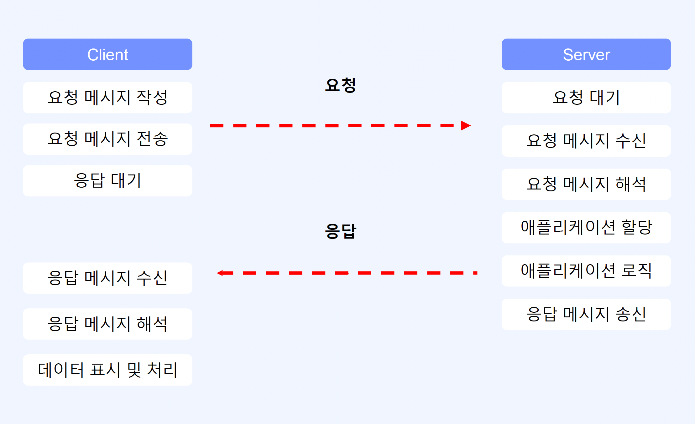
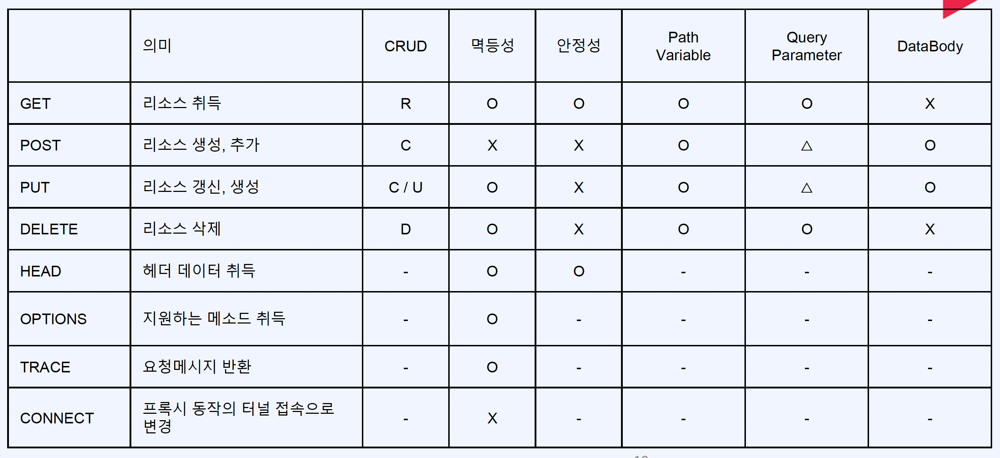
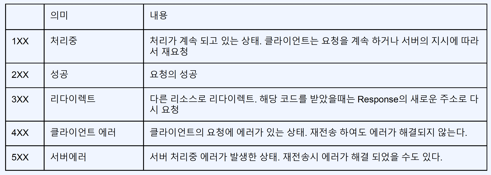
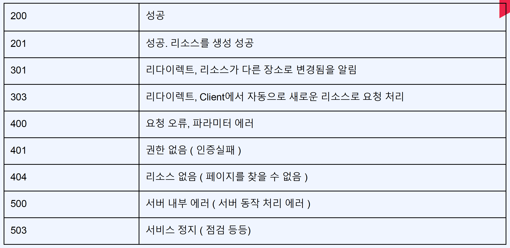

# Ch01. OT
- [1. WEB 개론](#ch01-01-web-개론)
- [2. REST API 개론](#ch01-02-rest-api-개론)
- [3. Spring Boot와 Spring Web 소개](#ch01-03-spring-boot와-spring-web-소개)

--------------------------------------------------------------------------------------------------------------------------------
# Ch01-01. WEB 개론
## WEB이란?
- Word Wide Web, WWW, W3
1. Web Site
2. User Interface(Chrome, Safari)
3. API(Application Programming Interface) * Web Service

- HTTP(Hypertext Transfer Protocol)
> - 어플리케이션 컨트롤(통신을 위한 약속)
> - [Method] GET, POST, PUT, DELETE, OPTIONS, HEAD, TRACE, CONNECT
- URI(Uniform Resource Identifier)
> 리소스 식별자
- HTML(Hyper Text Markup Language)
> 하이퍼미디어 포맷, XML 바탕

## HTTP
1. HTTP로 RFC 2616에서 규정된 Web에서 데이터를 주고받는 프로토콜
2. HTML, XML, JSON, Image, Voice, Video, Javascript, PDF 등 컴퓨터에서 다룰 수 있는 것은 모두 전송 할 수 있다
3. TCP 기반 REST의 특징을 모두 구현하고 있는 Web 기반의 프로토콜

### HTTP Process

- 멱등성: 서버에 여러번 요청해도 데이터 결과가 같은 것(상태, ROW)
- 안전성: 특정한 데이터에 요쳥 했을때 데이터에 변화가 없는지(리소스가 변경이 되는지)
- Client > Server
> - URI, HTTP
- Server > Client
> - HTML, JSON

### HTTP Result Code

- 201: Put Method

--------------------------------------------------------------------------------------------------------------------------------
# Ch01-02. REST API 개론
## REST
REST(Reprensentational State Transfer, `자원의 상태 전달`)
1. Cleint, Server
> 분리되어져 있어야 한다.
2. Stateless
> 요청에 대해서 클라이언트의 상태가 서버에 저장을 하지 않는다.
3. Cache
> 클라이언트는 서버의 응답을 캐시 할 수 있어야 한다.
4. 계층화(Layered System)
> 방화벽, 게이트웨이, Proxy 다계층 형태를 구성할 수 있어야 하며, 확장 할 수 있어야 한다.
5. 인터페이스 일관성
> 아키텍쳐 단순화, 작은 단위로 분리하여서, 클라이언트, 서버가 독립적으로 개선될 수 있어야 한다.
6. Code On Demand(optional)
> 자바 애플릿, 자바스크립트 플래시 등 특정 기능을 서버가 클라이언트에 코드를 전달하여 실행 할 수 있어야 한다.

### 인터페이스 일관성
1. 자원 식별
> - URI: https://foo.co.kr/user/100
> > - Resource: user
> > - Identifer: 100
2. 메세지를 통한 리소스 조작
> - 다양한 방식 데이터 전송(HTML, XML, JSON, TEXT), Header 부분에 Content-Type
3. 자기 서술적 메세지
> - 요청하는 데이터가 어떻게 처리 되어져야 하는지, HTTP Method
4. 애플리케이션 상태에 대한 엔진으로서 하이퍼미디어
> - 요청에 대한 데이터만 내리는 것이 아닌 관련된 리소스에 대한 Link 정보(RESTful하다) 다만 리소스를 한번에 내리는 것은 주로 사용하지 안흔ㄴ다

## URI 설계
1. URI(Uniform Resource Identifer)
> - 인터넷에 특정 자원을 나타내는 주소값, 해당 값은 유일
ex) https://www.foo.co.kr/resource/sample/1
2. URL(Uniform Resource Locator)
> - 인터넷 상에서의 자원, 특정 파일이 어디에 있는지 식별하는 주소
ex) https://www.foo.co.kr/sample1.pdf
- URL은 URI의 하위 개념
### URI 설계원칙(RFC-3986)
- `/`는 계층을 관계를 나타내는대 사용
- !마지막 `/` 포함하지 않는다
- `-` 가독성
- !`_` 사용 X
- 소문자
- !파일 확장자 X
- !프로그래밍 언어 의존 확장자 사용 X (.do)
- !구현에 의존적인 경로 사용 X (/servlet)
- !`세션 ID` 포함 X
- !`Method` 명 사용 X
- 명사에 단수형보다는 복수형
- 컨트롤러 이름으로는 동사나 동사구
- 경로 부분 중 변화는 부분은 유일한 값으로 대체
- !CRUD기능을 나타내는 것은 URI 사용 X
- URI Query Parameter Design (?model=q7)
- 서브 도메인은 일관성 있게 (foo.co.kr, api.foo.co.kr)
- 클라이어느 개발자 포털 서브 도메인은 일관성 있게

--------------------------------------------------------------------------------------------------------------------------------
# Ch01-03. Spring Boot와 Spring Web 소개
## Spring Boot 소개
- Spring 2.6.x
- Spring Boot는 단순히 실행되며 프로덕션 제품 수준, 스프링ㄱ ㅣ반
- Spring 구성이 거의 필요하지 않다(XML, X)
- java -jar 실행, Java 어플리케이션
### 주요 목표
- Spring 빠른 개발
- 기본값 설정
- 대규모 프로젝트에 공통적인 비 기능 제공
- XML 구성 요구사항이 전혀 없음

- Build Tool: Maven, Gradle
- Servlet Containers: Tomcat 9.0 / Servlet 4.0
