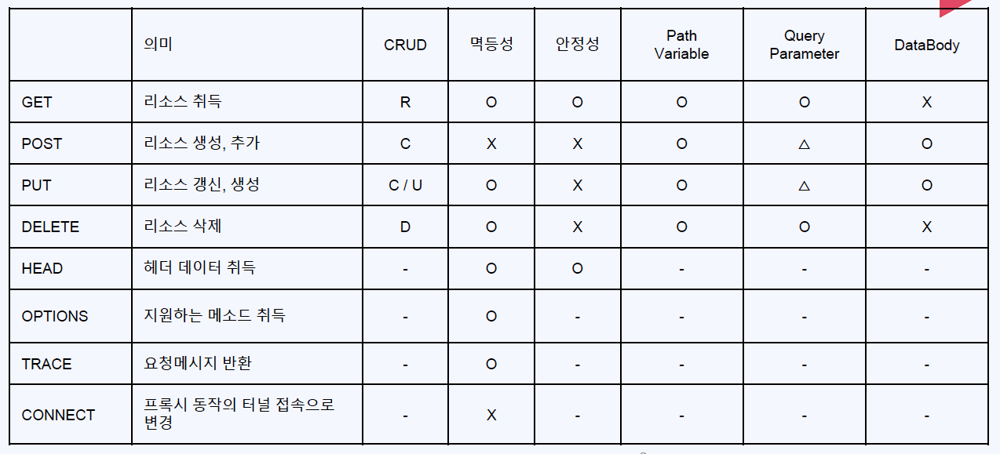

# Ch02. REST API
- [1. REST API - GET - 01](#ch02-01-rest-api---get---01)
- [2. REST API - GET - 02](#ch02-02-rest-api---get---02)
- [3. REST API - GET - 03](#ch02-03-rest-api---get---03)
- [5. REST API - POST - 01](#ch02-04-rest-api---post---01)
- [4. REST API - POST - 02](#ch02-05-rest-api---post---02)
- [6. REST API - PUT](#ch02-06-rest-api---put)
- [7. REST API - DELETE](#ch02-07-rest-api---delete)

--------------------------------------------------------------------------------------------------------------------------------
# Ch02-01. REST API - GET - 01
## HTTP Method

## 프로젝트 만들기
- Prject: Gradle-Groovy, JDK11, SpringBoot2.7.7, JAR
- Meta data: com.example.rest-api
- Dependency: SpringWeb, Lombok

## 실습(rest-api)
```java
package com.example.restapi.controller;

@RestController
@RequestMapping("/api")
public class RestApiController {

    @GetMapping(path = "/hello")
    public String hello() {
        var html = "<html> <body> <h1> Hello Spring Boot </h1> </body></ht®ml>";
        return html;

    }
}
```
> - plan/text 형식으로 보냈지만, `브라우저에서 해석`하기 나름(HTML, XML, JSON)
> > 통신이란 결국에 문자를 전송하는 것이다. (이후 `미디어포멧` 등)

## 정리
- `@RestController`
- `@RequestMapping(path= "<~~>")`


--------------------------------------------------------------------------------------------------------------------------------
# Ch02-02. REST API - GET - 02
## GET
- 리소스 취득, Path Varible

### Path Variable
주소내에 정보를 전달하는 방법
> ex) https://www.foo.bar/user-id/100
> > 주소에 대한 노출 및 변경에 대한 보안(현업에서는 권한 등으로 조절)

## 실습(rest-api)
```java
@Slf4j
@RestController
@RequestMapping("/api")
public class RestApiController {

    @GetMapping(path = "/hello")
    public String hello() {
        var html = "<html> <body> <h1> Hello Spring Boot </h1> </body></ht®ml>";
        return html;
    }

    @GetMapping("/echo/{message}")
    public String echo(
            @PathVariable(name = "message") String msg
    ) {
        log.info("echo message: {}", msg);
        // TODO 대문자로 변환해서 RET
        msg = msg.toUpperCase();
        // String 타입의 변수 외에 다른 타입 받아보기

        // boolean, integer

        return msg;
    }
}

```

## 정리
- `@PathVariable(name = "<주소의 {NAME}>")`: PathVariable 변수 매칭

## 참고 - 사용 port 확인
```cmd
netstat -ano | findstr 8080
taskkill /f /pid <pid>
```
```sh
netstat -tnlp | grep <:PORT>
```


--------------------------------------------------------------------------------------------------------------------------------
# Ch02-03. REST API - GET - 03
## GET - QueryParameter
특정 정보의 필터링을 걸때 사용한다
- ex) https://www.foo.bar/book?category=IT&issuedYear=2023&issued-month=01&issued-month=01&issued_day=31
- `?`로 시작하고, 이어주는 형태는 `&`로 묶어준다

## 실습(rest-api)
```java
@Slf4j
@RestController
@RequestMapping("/api")
public class RestApiController {
    // http://localhost:8080/api/book?category=IT&issuedYear=2023&issued-month=01&issued_day=31
    @GetMapping("/book")
    public void queryParam(
        @RequestParam String category,
        @RequestParam String issuedYear,
        @RequestParam(name = "issued-month") String issuedMonth,
        @RequestParam String issued_day
    ) {
        log.info("query param category: {}", category);
        log.info("query param issued year: {}", issuedYear);
        log.info("query param issued month: {}", issuedMonth);
        log.info("query param issued day: {}", issued_day);
    }

    // http://localhost:8080/api/book2?category=IT&issuedYear=2023&issuedMonth=01&issuedDay=31
    @GetMapping("/book2")
    public void queryParamDto(
            BookQueryParam bookQueryParam
    ) {
        log.info("book param: {}", bookQueryParam);
    }
}
```

## 정리
- `@RequestParam(name = "<name>")`
> '_', '-'의 경우, 변수명에 '-'는 지정되지 않으므로 name을 활용할 수 있다
> > 단, JAVA의 규칙인 카멜케이스를 따르도록 한다.
- Dto로 받을때 그냥 `BookQueryParam bookQueryParam` 로 지정해서 받을 수 있다


--------------------------------------------------------------------------------------------------------------------------------
# Ch02-04. REST API - POST - 01
- QueryParameter도 가능하지만 Post메소드는 `DataBody`를 활용함
- `@RequestBody` Put, POST
## HTTP body
- HTTP Header, body
> `Body에 메세지`: Data(TEXT, HTML, JSON 등)
## JSON
- String, Number(소수점, int, double, float), Boolean, `{}`Object, `[]`Array

## 실습(rest-api)
- Talend API Tester (Chrome Extends) 설치
- Request
> POST:  `http://localhost:8080/api/post`
```JSON
 {
  "name": "Spring Boot",
  "number": "100",
  "category": "JAVA"
}
```

- Code
```java
package com.example.restapi.controller;
@Slf4j
@RestController
@RequestMapping("/api")
public class PostApiController {

    @PostMapping("/post")
    public BookRequest post (
        @RequestBody BookRequest bookRequest
    ) {
        log.info("POST request: {}", bookRequest);
        return bookRequest;
    }
}

package com.example.restapi.model;
@Data
@AllArgsConstructor
@NoArgsConstructor
public class BookRequest {
    private String name;
    private String number;
    private String category;
}

```


--------------------------------------------------------------------------------------------------------------------------------
# Ch02-05. REST API - POST - 02
- POST Request 과제

## Snake Case, Camel Case
- Snake Case
> - `_`로 구분
- Camel Case
> - 시작 소문자, 대문자로 구분
### 결론
> - `서비스 하다보면 JSON은 Snake Case를 많이 쓰기도 함`
> - `JSON 사용시 Reference Type 사용`

## 설정
- Intellij
> Help > Edit VM Opt
> > 
```exe.vmoptions
-Xms2048m
-Xmx4096m
-Dfile.encoding=UTF-8
-Dconsole.encoding=UTF-8
```

## 실습(rest-api)
- Request
```txt
POST `http://localhost:8080/api/user`
// Content-Type: application/json
// Content-Encoding: characterset=utf-8
```
- Data
```JSON
{
    "user_name": "홍길동",
    "user_age": 10,
    "email": "hong@gmail.com"
}
```
- Code
```java
package com.example.restapi.controller;
@Slf4j
@RestController
@RequestMapping("/api")
public class PostApiController {
    @PostMapping("/user")
    public UserRequest user(
            @RequestBody UserRequest userRequest
    ) {
        log.info("USER request: {}", userRequest);
        return userRequest;
    }
}

package com.example.restapi.model;
@Data
@NoArgsConstructor
@AllArgsConstructor
@JsonNaming(value = PropertyNamingStrategies.SnakeCaseStrategy.class)
//@JsonNaming(value = PropertyNamingStrategy.SnakeCaseStrategy.class) //Deprecated
public class UserRequest {
    private String userName;
    private Integer userAge;
    private String email;
}
```

## 정리
- Json: SnakeCase `@JsonNaming(value = PropertyNamingStrategies.SnakeCaseStrategy.class)`


--------------------------------------------------------------------------------------------------------------------------------
# Ch02-06. REST API - PUT
- 리소스 `갱신`, 생성
- 멱등하다
- Put Request

## `is - boolean`
- is는 boolean을 뜻해서 isKorean의 Set 메소드는 setKorean이 된다
> `Reference Type`을 사용하면 된다
## Logback
- Buffer 기반 방식 System.out은 성능저하

## 실습(rest-api)
- Request
> PUT : `http://localhost:8080/api`
```json
{
    "user_name": "홍길동",
    "user_age": 10,
    "email": "hong@gmail.com",
  	"is_korean": true
}
```
- Code
```java
package com.example.restapi.controller;
@Slf4j
@RestController
@RequestMapping("/api")
public class PutApiController {

    @PutMapping
    public void put(
            @RequestBody UserRequest userRequest
            ) {
        log.info("userRequest : {}", userRequest);
    }
}


package com.example.restapi.model;
@Data
@NoArgsConstructor
@AllArgsConstructor
@JsonNaming(value = PropertyNamingStrategies.SnakeCaseStrategy.class)
//@JsonNaming(value = PropertyNamingStrategy.SnakeCaseStrategy.class) //Deprecated
public class UserRequest {
    private String userName;
    private Integer userAge;
    private String email;
    private Boolean isKorean; // default: false
}
```
## 정리
- put은 갱신
- boolean Type의 변수의 이름에 is가 들어가면 is가 생략되고 set method 명이 생성된다
> Reference Type을 사용하면 된다
- boolean default: false
- logback buffer 장점


--------------------------------------------------------------------------------------------------------------------------------
# Ch02-07. REST API - DELETE
- 멱등하다: 있어도 삭제, 없어도 삭제된 상태 (결과가 같다)
- Delete Request

## 실습(rest-api)
- Request
> DELETE: `http://localhost:8080/api/user/홍길동/del`
- Code
```java
package com.example.restapi.controller;

import com.example.restapi.model.BookQueryParam;
import lombok.extern.slf4j.Slf4j;
import org.springframework.web.bind.annotation.*;

@Slf4j
@RestController
@RequestMapping("/api")
public class RestApiController {
    @DeleteMapping(path = {
            "/user/{userName}/delete"
            , "/user/{userName}/del"
        }
    )
    public void delete(
            @PathVariable String userName
    ) {
        log.info("user-name : {}", userName);
    }
}
```

## 정리
- DELETE Method: 삭제, 멱등(결과 같음), 안전 X(행 수정)
- `@~Mapping(path = "<name>")`: path을 명시적으로 사용하면 여러가지 주소 배열로 사용가능