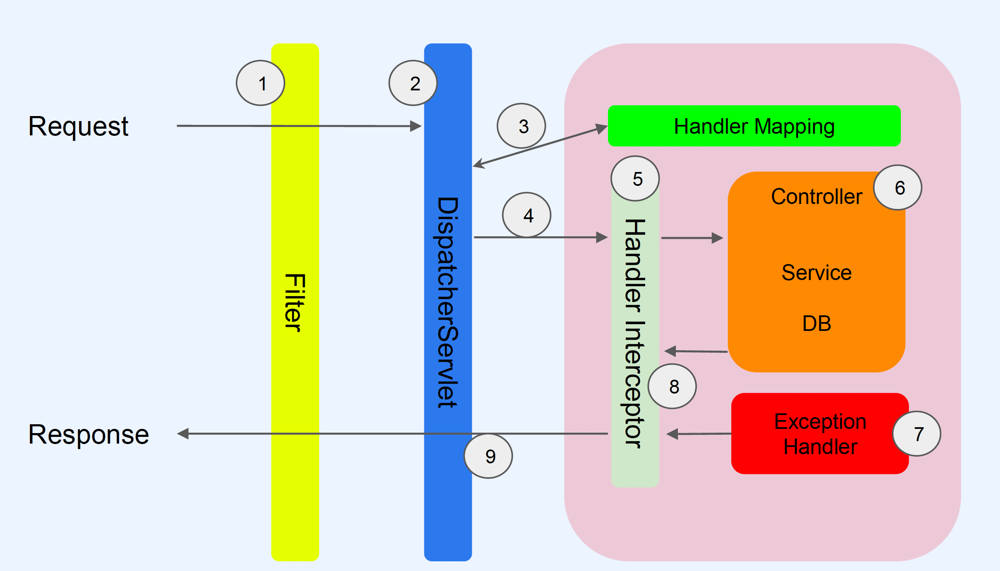
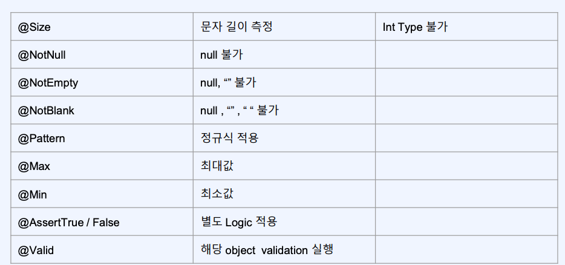
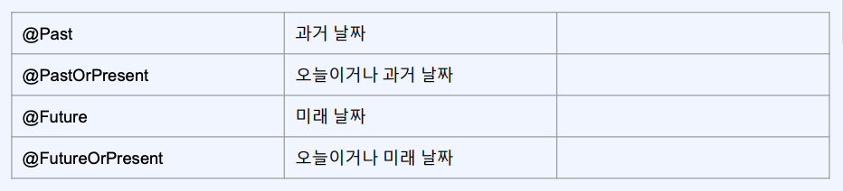

# Ch03. SpringBoot Web
WEB, REST API, Spring Boot Web, Memory DB, Mysql, JPA, Spring Web(Filter, AOP)  
https://github.com/steve-developer/fastcampus-2023-part01/tree/main/PART1
- [1. SpringBoot Web에서 응답 만드는 방법 - Response Entity](#ch03-01-spring-boot-web에서-응답-만드는-방법---response-entity)
- [2. SpringBoot의 다양한 기능 살펴보기](#ch03-02-spring-boot---다양한-기능-살펴보기-object-mapper)
- [3. SpringBoot에서의 예외처리 소개 - 1](#ch03-03-spring-boot---예외처리-소개---1)
- [3. SpringBoot에서의 예외처리 소개 - 2](#ch03-03-spring-boot---예외처리-소개---2)
- [4. SpringBoot 예외처리 실전 - 1](#ch03-04-spring-boot---예외처리-실전---1)
- [5. SpringBoot 예외처리 실전 - 2](#ch03-05-spring-boot---예외처리-실전---2)
- [6. SpringBoot Validation 소개](#ch03-06-spring-boot-validation-소개)
- [7. SpringBoot Validation 적용 - 1](#ch03-07-spring-boot-validation-실전-적용---1)
- [8. SpringBoot Validation 적용 - 2](#ch03-08-spring-boot-validation-실전-적용---2)
- [9. SpringBoot Validation 적용 - 3](#ch03-09-spring-boot-validation-실전-적용---3)


--------------------------------------------------------------------------------------------------------------------------------
# Ch03-01. Spring Boot Web에서 응답 만드는 방법 - Response Entity
## 응답
- String
> 일반 Text Type 응답
- Object
> Json, 200 OK
- `ReponseEntity`
> Body의 내용을 Object로 설정, 상황에 따라서 HttpStatus Code 설정
- `@ReponseBody`
> RestController가 아닌 곳(Controller)에서 Json 응답

## 실습 (restapi)
```java
package com.example.restapi.controller;
// http://localhost:8080/api/v1
@Slf4j
//@Controller
@RestController
@RequestMapping("/api/v1")
public class ResponseApiController {

    @GetMapping("")
//    @RequestMapping(path = "", method = RequestMethod.GET)
//    @ResponseBody
    public UserRequest user() {
    // public ResponseEntity<UserRequest> user() {
        var user = new UserRequest();
        user.setUserName("홍길동");
        user.setUserAge(10);
        user.setEmail("hong@gmail.com");

        log.info("user: {}", user);
        /*
        var response = ResponseEntity
                .status(HttpStatus.BAD_REQUEST)
                .header("x-custom", "hi")
                .body(user);

        return response;
        */
        return user;
    }
}

package com.example.restapi.model;
@Data
@NoArgsConstructor
@AllArgsConstructor
@JsonNaming(value = PropertyNamingStrategies.SnakeCaseStrategy.class)
//@JsonNaming(value = PropertyNamingStrategy.SnakeCaseStrategy.class) //Deprecated
public class UserRequest {
    private String userName;
    private Integer userAge;
    private String email;
    private Boolean isKorean; // default: false
}

```
## 정리
- @RestController: JSON 방식 응답형태를 나타낼때
- `ResponseEntitiy<T>`: 예외를 발생했을때 사용
- 보통은 Object를 반환 `@ResponseBody`


--------------------------------------------------------------------------------------------------------------------------------
## Ch03-02. Spring Boot - 다양한 기능 살펴보기 Object Mapper
## `ObjectMapper`(Jackson, Gson)
- JSON - DTO: 직렬화, 역직렬화
- Jackson Library(springboot), Gson

## 실습 (resapi)
- test
```java
package com.example.restapi;
@SpringBootTest
class RestapiApplicationTests {
	@Autowired
	ObjectMapper objectMapper;

	@Test
	void contextLoads() throws JsonProcessingException {

		UserRequest user = new UserRequest();
		user.setUserName("홍길동");
		user.setUserAge(10);
		user.setEmail("hong@gmail.com");
		user.setIsKorean(true);

		String json = objectMapper.writeValueAsString(user);
		System.out.println(json);

		UserRequest dto = objectMapper.readValue(json, UserRequest.class);
		System.out.println(dto);
	}
}

```

## 정리
- Springboot는 기본적으로 `ObjectMapper`를 사용
- `String: objectMapper.writeValueAsString(Object value)` 직렬화(dto -> json)
- `OBject: objectMapper.readValue(String content, Class<T> valueType)` 역직렬화(json -> dto)
> - `dto > json 변환`은 `get<Methodname> 명칭`으로 변환된다  
> - `json > dto 변환`은 `set<MethodName> 명칭`으로 변환된다
- `@JsonIgnore` json으로 사용하지 않는 Getter 지정  
- `@JsonProperty("user_email")` Json property key 지정
> getter를 대신할 수 도있음
- ObjectMapper는 Reflection으로 동작


--------------------------------------------------------------------------------------------------------------------------------
# Ch03-03. Spring Boot - 예외처리 소개 - 1
## Exception

- `Filter` > `DispatcherServlet` > [ Handler Mapping > Handler Interceptor > Controller > Exception Handler ]
- Exception Handler 에서 예외처리를 하고 Service는 비지니스 로직만 집중

## 실습 (exception)
```java
package com.example.exception.controller;
@Slf4j
@RestController
@RequestMapping("/api")
public class RestApiController {

    @GetMapping("")
    public void hello() {
        throw new RuntimeException("run time exception call");
        /*List<String> list = List.of("hello");
        String element = list.get(1);

        log.info("element: {}", element);*/
    }
}

package com.example.exception.exception;
@Slf4j
@RestControllerAdvice
public class RestApiExceptionHandler {

    @ExceptionHandler(value = { IndexOutOfBoundsException.class })
    public ResponseEntity outOfBound(IndexOutOfBoundsException e) {
        log.error("IndexOutOfBoundsException", e);
        return ResponseEntity.status(200).build();
    }

    @ExceptionHandler(value = { NoSuchElementException.class })
    public ResponseEntity noSuchElement(NoSuchElementException e) {
        log.error("", e);
        Api<Object> response = Api.builder()
                .resultCode(String.valueOf(HttpStatus.NOT_FOUND.value()))
                .resultMessage(HttpStatus.NOT_FOUND.getReasonPhrase())
                .build();

        return ResponseEntity.status(HttpStatus.NOT_FOUND)
                .body(response);
    }
}
```

## 정리
- `@RestControllerAdvice`, `@ExceptionHandler(Class<? extends Throwable>[] value())`
> - 응답 > `ReponseEntity<T>`
> > `ReponseEntity.status(<HttpStatusCode>).build()`
> - @ExceptionHandler는 구체화된 에러가 먼저 우선순위


--------------------------------------------------------------------------------------------------------------------------------
# Ch03-03. Spring Boot - 예외처리 소개 - 2
## RestApiBController - 지역예외 Handler
- `@~ControllerAdvice(basePackages, baseClasses = "<name>")`

## 실습 (exception)
- 부분 에러처리
```java
package com.example.exception.controller;
@Slf4j
@RestController
@RequestMapping("/api/b")
public class RestApiBController {

    @GetMapping("/hello")
    public void hello() {
        throw new NumberFormatException("number format exception");
    }

    @ExceptionHandler(value = { NumberFormatException.class })
    public ResponseEntity numberFormatException(NumberFormatException e) {
        log.error("RestApiBController NumberFormatException", e);
        return ResponseEntity.status(HttpStatus.OK).build();
    }
}

```
- @RestControllerAdvice basePackages 지정
```java
@RestControllerAdvice(basePackages = "com.example.exception.controller")
public class RestApiExceptionHandler {
```
```java
String[] basePackages() default {};
Class<?>[] basePackageClasses() default {};
```

## 정리
- 해당 controller에서 @ExceptionHandler 지정가능, 부분 에러처리 (추천X)
- @~ControllerAdvice(basePackages or basePackageClasses = "<>")


--------------------------------------------------------------------------------------------------------------------------------
# Ch03-04. Spring Boot - 예외처리 실전 - 1
- 클라이언트 입장에서 `정상 요청흐름`과 `에러 요청흐름` `결과 형식 맞추기`
- `Api<T>` 응답

## 실습 (exception)
```java
package com.example.exception.model;
@Data
@NoArgsConstructor
@AllArgsConstructor
@Builder
@JsonNaming(value = PropertyNamingStrategies.SnakeCaseStrategy.class)
public class Api<T> {
    private T data;
    private String resultCode;
    private String resultMessage;
}

@Data
@NoArgsConstructor
@AllArgsConstructor
@Builder
@JsonNaming(value = PropertyNamingStrategies.SnakeCaseStrategy.class)
public class UserResponse {
    private String id;
    private String name;
    private Integer age;
}


package com.example.exception.controller;
@RestController
@RequestMapping("/api/user")
public class UserApiController {
    private static List<UserResponse> userList = List.of(
            UserResponse.builder()
                    .id("1")
                    .age(10)
                    .name("홍길동")
                    .build(),
            UserResponse.builder()
                    .id("2")
                    .age(10)
                    .name("유관순")
                    .build()
    );

    @GetMapping("id/{userId}")
    public Api<UserResponse> getUser(@PathVariable String userId) {
        UserResponse user = userList.stream()
                .filter(it -> it.getId().equals(userId))
                .findFirst().get();

        Api<UserResponse> response = Api.<UserResponse>builder()
                .data(user)
                .resultCode(String.valueOf(HttpStatus.OK.value()))
                .resultMessage(HttpStatus.OK.name())
                .build();

        return response;
    }
}

package com.example.exception.exception;
@Slf4j
@RestControllerAdvice(basePackages = "com.example.exception.controller")
@Order(1)
public class RestApiExceptionHandler {
    // ~

    @ExceptionHandler(value = { NoSuchElementException.class })
    public ResponseEntity noSuchElement(NoSuchElementException e) {
        log.error("", e);
        Api<Object> response = Api.builder()
                .resultCode(String.valueOf(HttpStatus.NOT_FOUND.value()))
                .resultMessage(HttpStatus.NOT_FOUND.getReasonPhrase())
                .build();

        return ResponseEntity.status(HttpStatus.NOT_FOUND)
                .body(response);
    }
}
```
- result
```json
{
    "data": null,
    "result_code": "404",
    "result_message": "Not Found"
}
```


--------------------------------------------------------------------------------------------------------------------------------
# Ch03-05. Spring Boot - 예외처리 실전 - 2
- ExceptionHandler 순서 지정 `@Order`

## 실습 (exception)
```java
package com.example.exception.exception;
@Slf4j
@RestControllerAdvice
public class GlobalExceptionHandler {

    @ExceptionHandler(value = {Exception.class})
    public ResponseEntity<Api> exception(Exception e) {
        log.error("", e);
        Api<Object> response = Api.builder()
                .resultCode(String.valueOf(HttpStatus.INTERNAL_SERVER_ERROR.value()))
                .resultMessage(HttpStatus.INTERNAL_SERVER_ERROR.getReasonPhrase())
                .build();

        return ResponseEntity
                .status(HttpStatus.INTERNAL_SERVER_ERROR)
                .body(response);
    }
}

```

## 정리
- `@Order`
> - @Order int value() default Ordered.LOWEST_PRECEDENCE; 
> > default: Integer.MAX_VALUE
> - 순서가 낮을수록 우선순위가 높다


--------------------------------------------------------------------------------------------------------------------------------
# Ch03-06. Spring Boot Validation 소개
## Validation
1. spring-boot-starter-validation
2. [bean validation spec](https://beanvalidation.org/2.0/spec/#builtinconstraints)
3. 정규식
> ex 휴대폰 번호 정규식: `"^\\d{2,3}-\\d{3,4}-\\d{4}$"`
- 검증 코드와 서비스 코드

1. 유호성 검증 코드 길이 길다
2. service logic 방해
3. 어디서 검증되었는지 찾기 어렵다
4. 검증로직이 변경되는 경우, 테스트 및 전체로직이 흔들릴 수 있다

### Annotation




--------------------------------------------------------------------------------------------------------------------------------
# Ch03-07. Spring Boot Validation 실전 적용 - 1
## Project
- validation
```
com.example.validation
JDK11, Jar
Dependency
> Lombok, Spring Web, Validation
```
## 실습 (validation)
```java
package com.example.validation.model;
@Data
@NoArgsConstructor
@AllArgsConstructor
@Builder
@JsonNaming(value = PropertyNamingStrategies.SnakeCaseStrategy.class)
public class UserRegisterRequest {
    @NotBlank     // name != null & name != "" & name != " "
    private String name;

    @NotBlank
    @Size(min = 1, max = 12)
    private String password;

    @NotNull
    @Min(1)
    @Max(100)
    private Integer age;

    @Email
    private String email;

    @Pattern(regexp = "^\\d{2,3}-\\d{3,4}-\\d{4}$", message = "휴대폰 번호 양식에 맞지 않습니다.")
    private String phoneNumber;

    @FutureOrPresent
    private LocalDateTime registerAt;
}


package com.example.validation.controller;
@Slf4j
@RestController
@RequestMapping("/api/user")
public class UserApiController {

    /**
     * MethodArgumentNotValidException
     * @param userRegisterRequest
     * @return
     */
    @PostMapping("")
    public UserRegisterRequest register(
            @Valid
            @RequestBody
                    UserRegisterRequest userRegisterRequest
    ) {
        log.info("init : {}", userRegisterRequest);

        return userRegisterRequest;
    }
}
```
- Request Json
```json
{
  "name": "hong",
  "password": "1234",
  "age": 20,
  "email": "hong@gmail.com",
  "phone_number": "010-1111-2222",
  "register_at": "2025-01-01T13:05:10",
  "birthDayYearMonth": "1991-07"
}
```

## 정리
- BeanValidation
> - `@NotNull, @NotBlank @FutureOrPresent`, 
> - `@Pattern(regexp = "<regexp>", message)`
- `@Valid`
> `MethodArgumentNotValidException`


--------------------------------------------------------------------------------------------------------------------------------
# Ch03-08. Spring Boot Validation 실전 적용 - 2
- !클라이언트에서 200 OK 문제, 형식
- MethodArgumentNotValidException > ExHandler
- Controller: `Return Api<UserRegisterRequest>`
- ExHandler: `Return Responseentity<Api>`

## 실습 (validation)
- 응답 Api 공통형식
```java
package com.example.validation.model;
@Data
@NoArgsConstructor
@AllArgsConstructor
@Builder
@JsonNaming(value = PropertyNamingStrategies.SnakeCaseStrategy.class)
public class Api<T> {
    private String resultCode;
    private String resultMessage;
    @Valid
    private T data;
    private Error error;

    @Data
    @NoArgsConstructor
    @AllArgsConstructor
    @Builder
    @JsonNaming(value = PropertyNamingStrategies.SnakeCaseStrategy.class)
    public static class Error {
        private List<String> errorMessage;
    }
}
```
- Code
```java
package com.example.validation.controller;
@Slf4j
@RestController
@RequestMapping("/api/user")
public class UserApiController {

    /**
     * MethodArgumentNotValidException
     * @param userRegisterRequest
     * @return
     */
    @PostMapping("")
    public Api<UserRegisterRequest> register(
            @Valid
            @RequestBody
            Api<UserRegisterRequest> userRegisterRequest
    ) {
        log.info("init : {}", userRegisterRequest);
        UserRegisterRequest body = userRegisterRequest.getData();
        Api<UserRegisterRequest> response = Api.<UserRegisterRequest>builder()
                .resultCode(String.valueOf(HttpStatus.OK.value()))
                .resultMessage(HttpStatus.OK.getReasonPhrase())
                .data(body)
                .build();
        return response;
    }
}

package com.example.validation.exception;
@Slf4j
@RestControllerAdvice
public class ValidationExceptionHandler {

    @ExceptionHandler(value = {MethodArgumentNotValidException.class})
    public ResponseEntity<Api> validationException(MethodArgumentNotValidException exception) {
        log.error("", exception);

        List<String> errorMessageList = exception.getFieldErrors().stream()
                .map(it -> {
                    String format = "%s: { %s } 은 %s";
                    String message = String.format(format, it.getField(), it.getRejectedValue(), it.getDefaultMessage());
                    return message;
                }).collect(Collectors.toList());

        Api.Error error = Api.Error
                .builder()
                .errorMessage(errorMessageList)
                .build();

        Api<Object> errorResponse = Api.builder()
                .resultCode(String.valueOf(HttpStatus.BAD_REQUEST.value()))
                .resultMessage(HttpStatus.BAD_GATEWAY.getReasonPhrase())
                .error(error)
                .build();
        return ResponseEntity
                .status(HttpStatus.BAD_REQUEST)
                .body(errorResponse);
    }
}


```
> Return: Api<UserRegisterreuqest>
- Request Json
```json
{
  "result_code": "",
  "result_message": "",
  "data": {
    "name": "hong",
    "password": "1234",
    "age": 20,
    "email": "hong@gmail.com",
    "phone_number": "010-1111-2222",
    "register_at": "2025-01-01T13:05:10",
    "birthDayYearMonth": "1991-07"
  },
  "error": {
    "error_message": [
    ]
  }
}
```

## 정리
- 요청 `Api<T> ` 응답 `Api<T> or ReponseEntity<Api<T>> : error` 
> - ExceptionHandler를 통한 Validation Error 처리: MethodArgumentNotValidException
> - cf, BindResult (직접 처리)


--------------------------------------------------------------------------------------------------------------------------------
# Ch03-09. Spring Boot Validation 실전 적용 - 3
- Custom Validation
- 두 개 이상 복합조건 검증만들기 `@AssertTrue`
- Cusotom Annotation & Custom Validator 만들기
> - `@AssertTrue(message = "<msg>")`
> - `@Constraint(validatedBy = { "<Custom Class>" })` Annotation
> - `public interface ConstraintValidator<A extends Annotation, T> {    }` Class Impl

## 실습 (validation)
```java
public class UserRegisterRequest {
    //~
    private String name;
    private String nickName;

    @PhoneNumber
    private String phoneNumber;

    @AssertTrue(message = "name or nickName은 반드시 1개가 존재해야 합니다")
    public boolean isNameCheck() {
        if (Objects.nonNull(name) && !name.isBlank()) {
            return true;
        }
        if (Objects.nonNull(nickName) && !nickName.isBlank()) {
            return true;
        }
        return false;
    }
}

package com.example.validation.annotation;
@Constraint(validatedBy = { PhoneNumberValidator.class })
@Target({ElementType.FIELD})
@Retention(RetentionPolicy.RUNTIME)
public @interface PhoneNumber {
    String message() default "휴대폰 번호 양식에 맞지 않습니다 ex) 000-0000-0000";

    String regexp() default "^\\d{2,3}-\\d{3,4}-\\d{4}$";

    Class<?>[] groups() default { };

    Class<? extends Payload>[] payload() default { };
}


package com.example.validation.validator;
public class PhoneNumberValidator implements ConstraintValidator<PhoneNumber, String> {
    private String regexp;

    @Override
    public void initialize(PhoneNumber constraintAnnotation) {
        this.regexp = constraintAnnotation.regexp();
    }

    @Override
    public boolean isValid(String value, ConstraintValidatorContext context) {
        boolean result = Pattern.matches(regexp, value);
        return result;
    }
}

```

## 정리
- Custom Validation
1. `@AssertTrue(message = "<msg>"")` : boolean
2. Custom Annotation
> - `@Constraint(validatedBy = {<~Validator.class>})` @Target @Retention
> - `~Validator ConstraintValidator<A extends Annotation, T extends Object>`