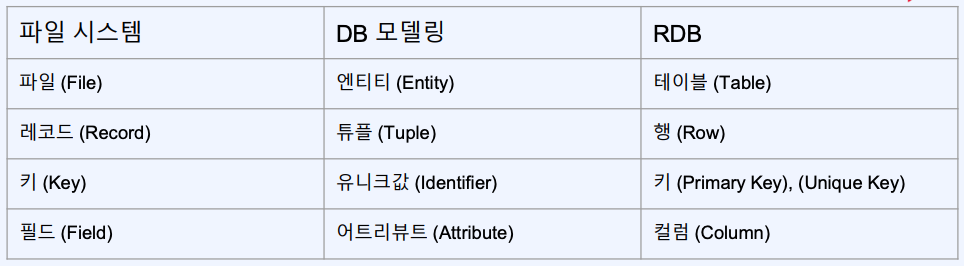
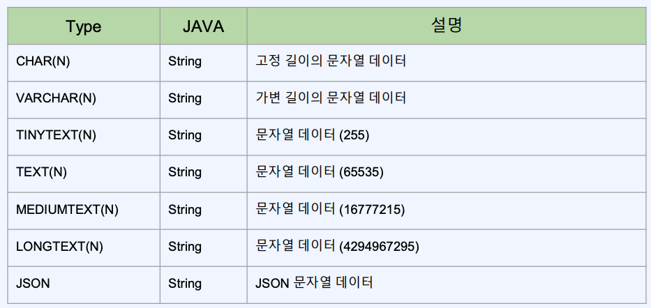
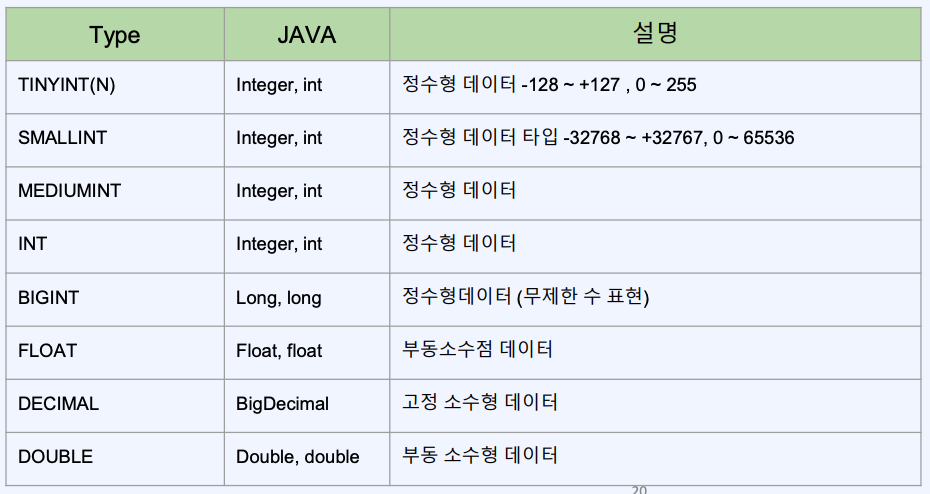
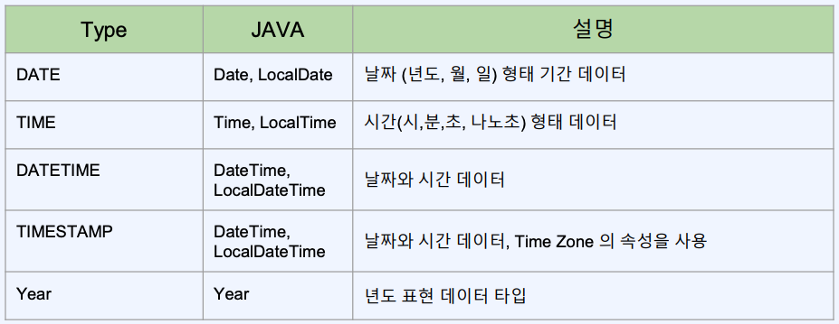
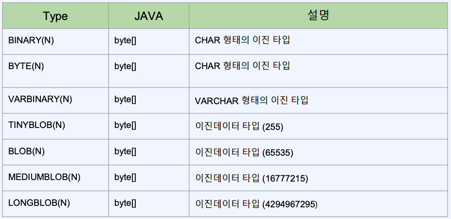

# ch05. MySQL
- [1. 데이터베이스 설치 및 설정](#ch05-01-데이터베이스-설치-및-설정)
- [2. Mysql 쿼리 배우기 - 1](#ch05-02-간단한-mysql-배우기---1-sql-쿼리-알아보기)
- [3. Mysql 쿼리 배우기 - 2](#ch05-03-간단한-mysql-배우기---2-sql-쿼리-실습)
- [4. Mysql 쿼리 배우기 - 3](#ch05-04-간단한-mysql-배우기---3-sql-쿼리-실습)
- [5. Mysql 쿼리 배우기 - 4](#ch05-05-간단한-mysql-배우기---4-sql-쿼리-실습)

--------------------------------------------------------------------------------------------------------------------------------
# ch05-01. 데이터베이스 설치 및 설정
## Docker 를 이용한 Mysql 설치
- Docker Desktop
- Workbench(Mysql)

## 실습 (docker-compose)
### docker-compsoe Project
### mysql/docker-compose.yaml
```yaml
version: "3"
services:
  db:
    image: mysql:8.0.26
    restart: always
    command:
      - --lower_case_table_names=1
      - --character-set-server=utf8mb4
      - --collation-server=utf8mb4_unicode_ci
    container_name: mysql
    ports:
      - "3306:3306"
    environment:
      - MYSQL_DATABASE=mydb
      - MYSQL_ROOT_PASSWORD=root1234!!
      - TZ=Asia/Seoul
    volumes:
      - /Users/admin/study/signature/tools/mysql:/var/lib/mysql
```
> Run
```sh
# mac
docker-compose -f /Users/admin/study/signature/ws/docker-compose/mysql/mysql/docker-compose.yaml up -d
# win
docker-compose -f C:\study\signature\signature_backend\docker-compose\mysql_win\mysql\docker-compose.yaml up -d
```


--------------------------------------------------------------------------------------------------------------------------------
# ch05-02. 간단한 MySQL 배우기 - 1 SQL 쿼리 알아보기
## SQL
관계형 데이터베이스 관리 시스템의 데이터를 관리하기 위해 설계된 특수 목적의 프로그래밍 언어
## DDL (Data Definition Language)
- CREATE, ALTER, DROP, RENAME, COMMENT, TRUNCATE
## DML (Data Manipulation Language)
- SELECT, INSERT, UPDATE, DELETE
## DCL (Data Control Language)
- GRANT, REVOKE, COMMIT, ROLLBACK



--------------------------------------------------------------------------------------------------------------------------------
# ch05-03. 간단한 MySQL 배우기 - 2 SQL 쿼리 실습
## 데이터베이스 생성
```sql
CREATE DATABASE [DB명]
```

## 테이블의 생성
```sql
CREATE TABLE [테이블명]
(
  -- [컬럼명] [타입] [컬럼속성] [Default] [Comment]
  -- ...
  -- PRIMARY KEY([기본키 컬럼])
)
```
> - 컬럼속성: not null 등

## INSERT
```sql
INSERT INTO [테이블 이름] 
(
  -- [컬럼이름1], ...
) 
VALUES
(
  -- [컬럼1의 값], ...
)
```

## UPDATE
```sql
UPDATE [테이블 이름] 
SET 
-- [컬럼 이름] = 값
WHERE -- [조건절]
```

## SELECT
```sql
SELECT [선택할 필드]
FROM -- [테이블 이름] AS [별칭]
WHERE [조건절]
```


--------------------------------------------------------------------------------------------------------------------------------
# ch05-04. 간단한 MySQL 배우기 - 3 SQL 쿼리 실습
CREATE DATABASE, CREATE TABLE, INSERT, UPDATE, DELETE
## 실습 (mysql)
```sql
CREATE TABLE `user` (
  `id` bigint NOT NULL AUTO_INCREMENT,
  `name` varchar(45) COLLATE utf8mb4_unicode_ci NOT NULL,
  `age` int DEFAULT '1',
  `email` varchar(100) COLLATE utf8mb4_unicode_ci DEFAULT '',
  PRIMARY KEY (`id`)
) ENGINE=InnoDB AUTO_INCREMENT=8 DEFAULT CHARSET=utf8mb4 COLLATE=utf8mb4_unicode_ci
```
```sql
INSERT INTO `user`
(
  `name`,`age`,`email`
)
VALUES
(
  '홍길동', 777, 'hong@gmail.com'
);

SELECT * FROM user;

UPDATE `user`
SET
name = '강감찬'
WHERE age >= 777 AND name = '홍길동';

DELETE FROM `user` where name = '강감찬';
```


--------------------------------------------------------------------------------------------------------------------------------
# ch05-05. 간단한 MySQL 배우기 - 4 SQL 쿼리 실습
## 데이터 타입




- JSON
> 내부 값 검색 가능
- cf, JAVA 
> null != 0은 다르기에 primitive type보다는 Integer 등을 사용
- DATE, TIME, DATETIME, TIMESTAMP
> DATETIME과 TIMESTAMP의 차이는 Time zone을 가지고 있는지(TIMESTAMP만 Time zone을 가지고 있음)