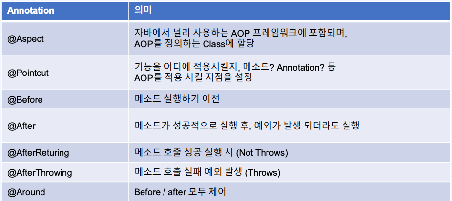
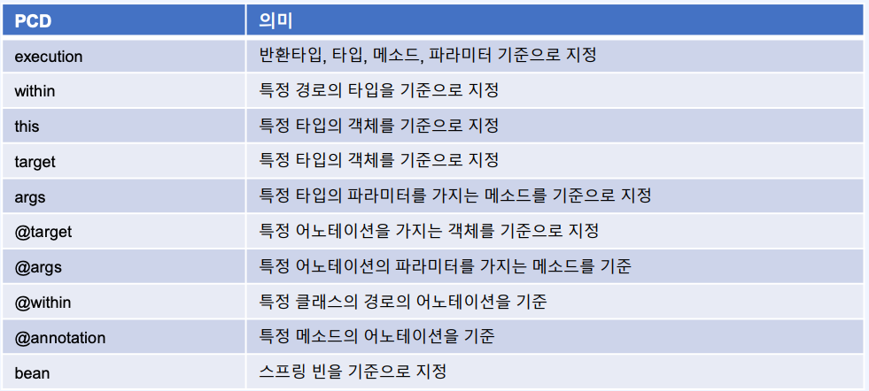

# ch09. Spring Boot Web 활용
- [1. Filter와 Interceptor](#ch09-01-filter와-interceptor)
- [2. Interceptor 적용](#ch09-02-interceptor-적용)
- [3. Spring AOP](#ch09-03-spring-aop)
- [4. Spring AOP Pointcut 문법](#ch09-04-spring-aop-pointcut-문법)


--------------------------------------------------------------------------------------------------------------------------------
# ch09-01. Filter와 Interceptor
## Filter
- Web Context - Filter(보통 변환)  
- Spring - HandlerInterceptor(인증 등의 작업)

## Project - filter 생성
```
Gradle - groovy
com.example.filter
JDK11
Lombok, Spring Web
```

## 실습 (filter)
- Filter 적용해보기
```java
package com.example.filter.controller;
@Slf4j
//@OpenApi
@RestController
@RequestMapping("/api/user")
public class UserApiController {

    @OpenApi
    @PostMapping("")
    public UserRequest register(
            @RequestBody UserRequest userRequest
//            HttpEntity http
    ) {
        log.info("{}", userRequest);
        throw new NumberFormatException("");
//        log.info("{}", http.getBody());
//        return userRequest;
    }

    @GetMapping("/hello")
    public void hello() {
        log.info("hello");

    }
}

package com.example.filter.model;
@Getter
@Setter
@NoArgsConstructor
@AllArgsConstructor
@Builder
@ToString
@JsonNaming(PropertyNamingStrategies.SnakeCaseStrategy.class)
public class UserRequest {
    private String name;
    private String phoneNumber;
    private String email;
    private Integer age;
}

package com.example.filter.filter;
public class LoggerFilter implements Filter {
    @Override
    public void doFilter(ServletRequest request, ServletResponse response, FilterChain chain) throws IOException, ServletException {
//        진입전
        log.info(">>>>> 진입");
        var req = new ContentCachingRequestWrapper((HttpServletRequest) request);
        var res = new ContentCachingResponseWrapper((HttpServletResponse) response);

        chain.doFilter(req, res);

        var reqJson = new String(req.getContentAsByteArray());
        log.info("req : {}", reqJson);
        var resJson = new String(res.getContentAsByteArray());
        log.info("res : {}", resJson);

        log.info("<<<<< 리턴");
//        진입후
        res.copyBodyToResponse();
    }

```
> - Talent API
> > User Register

## 정리
- Client 정보 확인
> `HttpEntity getBody()`
> > 어떠한 정보를 전달했는지 Filter로 확인해보자 
- `<I> Filter`
```java
@Override
public void doFilter(ServletRequest request, ServletResponse response, FilterChain chain) throws IOException, ServletException {
    chain.doFilter(req, res); // filter 실행
}
```
> - `ContentCachingRequest/ResponseWrapper` getContentAsByteArray() res.copyBodyToResponse()
> > > byte[] req.getContentAsByteArray()  But Response는 캐싱되어지지만 Res에 다시 쓰여지지 않으므로 `res.copyBodyToResponse()` 메서드를 호출해주어야 한다  


--------------------------------------------------------------------------------------------------------------------------------
# ch09-02. Interceptor 적용
## Interceptor
- Handler Mapping 이후에 어떠한 Controller로 보내줄 것인지 결정권한

## 실습 (filter)
- Interceptor 특정 어노테이션을 가지고 있을 경우만
```java
package com.example.filter.interceptor;
@Component
public class OpenApiInterceptor implements HandlerInterceptor {
    @Override
    public boolean preHandle(HttpServletRequest request, HttpServletResponse response, Object handler) throws Exception {
        log.info("pre handler");
        // controller 전달, false 전달하지 않는다
        HandlerMethod handlerMethod = (HandlerMethod) handler;

        OpenApi methodLevel = handlerMethod.getMethodAnnotation(OpenApi.class);
        OpenApi classLevel = handlerMethod.getBeanType().getAnnotation(OpenApi.class);
        if (methodLevel != null) {
            log.info("methodLevel");
            return true;
        }
        if (classLevel != null) {
            log.info("classLevel");
            return true;
        }

        log.info("open api가 아닙니다 : {}", request.getRequestURI());
        return false;
    }

    @Override
    public void postHandle(HttpServletRequest request, HttpServletResponse response, Object handler, ModelAndView modelAndView) throws Exception {
        log.info("post handle");
        // HandlerInterceptor.super.postHandle(request, response, handler, modelAndView);
    }

    @Override
    public void afterCompletion(HttpServletRequest request, HttpServletResponse response, Object handler, Exception ex) throws Exception {
        // HandlerInterceptor.super.afterCompletion(request, response, handler, ex);
        log.info("after completion");
    }
}
package com.example.filter.config;
@Configuration
public class WebConfig implements WebMvcConfigurer {
    @Autowired
    private OpenApiInterceptor openApiInterceptor;

    @Override
    public void addInterceptors(InterceptorRegistry registry) {
        registry.addInterceptor(openApiInterceptor)
                .addPathPatterns("/**");
        /*
        registry.addInterceptor()
                .order()
        */
    }
}

@Target(value = { ElementType.METHOD, ElementType.TYPE })
@Retention(RetentionPolicy.RUNTIME)
public @interface OpenApi {
}

public class UserApiController {

    @OpenApi
    @PostMapping("")
    public UserRequest register(
            @RequestBody UserRequest userRequest
//            HttpEntity http
    ) {
        log.info("{}", userRequest);
        throw new NumberFormatException("");
//        log.info("{}", http.getBody());
//        return userRequest;
    }

    @GetMapping("/hello")
    public void hello() {
        log.info("hello");

    }
}
```
> - Talent API
> > User Register

## 정리
- `<I>HandlerInterceptor`
- `~Config impl WebMvcConfigurer`
> > public void addInterceptors(InterceptorRegistry registry)
> > > - registry.addInterceptor(openApiInterceptor)
                .addPathPatterns("/**");
```java
public class OpenApiInterceptor implements HandlerInterceptor {
    @Override
    public boolean preHandle(HttpServletRequest request, HttpServletResponse response, Object handler) throws Exception { }
    @Override
    public void postHandle(HttpServletRequest request, HttpServletResponse response, Object handler, ModelAndView modelAndView) throws Exception { }
    @Override
    public void afterCompletion(HttpServletRequest request, HttpServletResponse response, Object handler, Exception ex) throws Exception { }
}
```
> - preHandler controller: 진입전 권한부여(boolean)
> > @Annotation or Header 등으로 검증
> - postHandler: 화면에 연결
> - afterCompletion: 완료된 이후


--------------------------------------------------------------------------------------------------------------------------------
# ch09-03. Spring AOP
## AOP(Aspect Orieneted Programming)
- 관점지향 프로그래밍
- 스프링 어플리케이션은 대부분 특별한 경우를 제외하고 `Web Layer, Business Layer, Data Layer`로 정의
- Web Layer
> Rest API, Client 중심 로직
- Business Layer
> 내부 정책에 따른 logic
- Data Layer
> 데이터 베이스 연동
### AOP Annotation

> Before > [AfterReturning/AfterThrowing] > After
### 포인트컷 지시자(Pointcut Desinators) AOP PCD


## 실습
- LogFilter Disable
### TimerAop
```gradle
    implementation 'org.springframework.boot:spring-boot-starter-aop'
```
```java
package com.example.filter.aop;
@Aspect
@Component
public class TimerAop {

    @Pointcut(value = "within(com.example.filter.controller.UserApiController)")
    public void timerPointcut() {

    }

    @Before(value = "timerPointcut()")
    public void before(JoinPoint joinPoint) {
        System.out.println("before");
    }

    @After(value = "timerPointcut()")
    public void after(JoinPoint joinPoint) {
        System.out.println("after");
    }

    @AfterReturning(value = "timerPointcut()", returning = "result")
    public void afterReturning(JoinPoint joinPoint, Object result) {
        System.out.println("after returning");
    }

    @AfterThrowing(value = "timerPointcut()", throwing = "ex")
    public void afterThrowing(JoinPoint joinPoint, Throwable ex) {
        System.out.println("after throwing");
    }

    @Around(value = "timerPointcut()")
    public void around(ProceedingJoinPoint joinPoint) throws Throwable {
        System.out.println("메소드 실행 이전");
        Arrays.stream(joinPoint.getArgs()).forEach(it -> {
            if (it instanceof UserRequest) {
                var tempUser = (UserRequest) it;
                var phoneNumber = tempUser.getPhoneNumber().replace("-", "");
                tempUser.setPhoneNumber(phoneNumber);
            }
        });

        // 암복호화 / 로깅
        var newObjs = Arrays.asList(
                new UserRequest()
        );

        var stopWatch = new StopWatch();
        stopWatch.start();
        joinPoint.proceed(newObjs.toArray());
        stopWatch.stop();

        System.out.println("총 소요된 시간 : " + stopWatch.getTotalTimeMillis() + "ms");

        System.out.println("메소드 실행 이후");
    }
}

public class UserApiController {
    @OpenApi
    @PostMapping("")
    public UserRequest register(
            @RequestBody UserRequest userRequest
//            HttpEntity http
    ) {
        log.info("{}", userRequest);
        throw new NumberFormatException("");
//        log.info("{}", http.getBody());
//        return userRequest;
    }
}
```
> - Talent API
> > User Register

## 정리
- `@Aspect`
> - `@Pointcut(value - "지시자: within(~))`
> - `@Around(value = "<pointcut_method_name>")` / `@Before/@After`
```java
public void around(ProceedingJoinPoint joinPoint) throws Throwable
    joinPoint.getArgs(); // method args
    joinPoint.proceed(<obj_args>); // method 실행
}
```
> - `@AfterReturning(value = "timerPointcut()", returning = "result")/@AfterThrowing(value = "timerPointcut()", throwing = "ex")`
```java
@AfterReturning(value = "timerPointcut()", returning = "result")
public void afterReturning(JoinPoint joinPoint, Object result) { }

@AfterThrowing(value = "timerPointcut()", throwing = "ex")
public void afterThrowing(JoinPoint joinPoint, Throwable ex) { }
```


--------------------------------------------------------------------------------------------------------------------------------
# ch09-04. Spring AOP Pointcut 문법
## Pointcut 지시자 PCD(PointCut Designators)

### `execution`
"execution([접근제한자-생략가능] [리턴타입] [패키지지정] [클래스지정] [메소드지정] [매개변수지정])"
- 접근제한자
> private, public, 생략
- 리턴타입
> *, void, !void
- 패키지 지정
> com.example.controller, com.example.*, com.example.., com.example..impl  
- 클래스 지정
> Foo, *Sample  
execution(public * com.exmaple.service.*Sample)
- 메서드 지정
> set*(..), *(..): 모든 메서드 > 동작 X StackOverFlow, foo(..)
- 매개변수 지정
> (..): N개 매개변수, (*): 매개변수가 1개
### `within`
- 특정 경로의 타입을 기준으로 지정, 패키지
> ex) within(com.example.dto.*) / within(com.example.dto..*) / within(com.example.dto.UserService)
### this / target
> ex) this(com.exmaple.dto.ifs.UserUfs)
### args
> ex) execution(* setId(..) && args*id)
### `@target / @args / @within / @annotation`: 해당 어노테이션이 붙은 클래스/매개변수/클래스/메소드
> ex) @target(com.~.PhoneNumber)
### bean
> ex) bean(userService): UserService bean의 모든 메서드