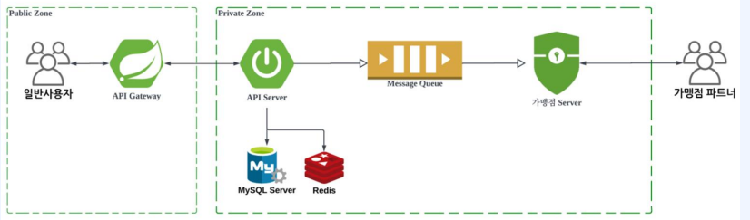

# Ch07. 실전 프로젝트 6: 가맹점 서버 개발
- [1. Spring Security 소개](#ch07-01-spring-security-소개)
- [2. Spring Security를 통한 가맹점 서버 개발 - 1](#ch07-02-spring-security를-통한-가맹점-서버개발---1)
- [3. Spring Security를 통한 가맹점 서버 개발 - 2](#ch07-03-spring-security를-통한-가맹점-서버-개발---2)
- [4. 가맹점 유저 가입 개발](#ch07-04-가맹점-유저-가입-개발)
- [5. Spring Security에서의 가맹점 유저 로그인 처리](#ch07-05-spring-security에서의-가맹점-유저-로그인-처리)
- [6. Spring Security에서의 상요자 정보 확인하기](#ch07-06-spring-security에서의-사용자-정보-확인하기)


--------------------------------------------------------------------------------------------------------------------------------
# Ch07-01. Spring Security 소개
## Spring Security
> 스프링 기반의 어플리케이션에서의 `인증`과 `권한부여`를 구현해둔 보안 프레임워크
- 주요 기능
1. 인증: 사용자가 자신의 신원을 증명하고 로그인
2. 권한부여: 인증된 사용자에게 특정 작업 또는 리소스 접근 권한 부여
3. 세션관리
4. 보안설정: 보안 관련 구성을 통하여, URL 또는 리소스에 대한 보안 설정
5. 보안이벤트처리: 인증 및 권한 에러에 대한 이벤트 핸들링


--------------------------------------------------------------------------------------------------------------------------------
# Ch07-02. Spring Security를 통한 가맹점 서버개발 - 1

- 가맹점 관리자 서버
> - 일반 사용자 > API Gateway
> - API Server
> > MySql Server / Redis(Todo)
> - Message Qeuue(Todo)
> - 가맹점 Server > 가맹점 파트너
- store-admin Module 추가
- Spring Security Doc
> https://spring.io/projects/spring-security#overview

## 실습 (Mysql, service:store-admin)
### docker-compose: Mysql
```sh
$ cd /Users/admin/study/signature/ws/Course3_WEB_DB_JPA/ch05_Mysql/docker-compose/mysql
$ docker-compose -f docker-compose.yaml up
```

### store-admin Module 추가
- store-admin Module Info
> - Java11 - Gradle - Groovy
> - Parent: service
> - GroupId: org.delivery
> - ArifactId: store-admin

- settings.gradle
```gradle
rootProject.name = 'service'
~
include 'store-admin'
```
> include 'store-admin'

- api build.gradle > store-admin build.gradle
> jjwt 만 제외 (lombok, web, swager, data-jpa, project(':db'))

- StoreAdminApplicaiton.class
```java
package org.delivery.storeadmin;

@SpringBootApplication
public class StoreAdminApplication {
    public static void main(String[] args) {
        SpringApplication.run(StoreAdminApplication.class, args);
    }
}

```
> `@SpringBootApplicaiton`, `SpringApplication`.run()

- api application.yml > store-admin application.yml
```yaml
server:
  port: 8081
spring:
  application:
    name: store-admin
  rabbitmq:
    host: localhost
    port: 5672
    username: admin
    password: admin123!@#
  jpa:
    properties:
      hibernate:
        dialect: org.hibernate.dialect.MySQL8Dialect
    hibernate:
      ddl-auto: validate
  datasource:
    url: jdbc:mysql://localhost:3306/delivery?userSSL=false&useUnicode=true&PublicKeyRetrieval=true
    driver-class-name: com.mysql.cj.jdbc.Driver
    username: root
    password: root1234!!
logging:
  level:
    org.hibernate.SQL: DEBUG
    org.hibernate.orm.jdbc.bind: TRACE
#    org.hibernate.type.descriptor.sql: TRACE
#    org.hibernate.type.BasicTypeRegistry: WARN
```
> server.port, spring.application.name

- Dependecny: spring-boot-starter-security 추가
> `implementation 'org.springframework.boot:spring-boot-starter-security'`

- Swagger 접속
> http://localhost:8081/swagger-ui/index.html  
> - id/pw 인증 페이지, (Todo)설정을 통해 인증/비인증 페이지 등 설정


--------------------------------------------------------------------------------------------------------------------------------
# Ch07-03. Spring Security를 통한 가맹점 서버 개발 - 2
- JPA, Spring Security 적용
- StoreUser table, entity 적용

## 실습 (service:store-admin, db)
```java
// jpa
package org.delivery.storeadmin.config.jpa;

@Configuration
@EntityScan(basePackages = "org.delivery.db")
@EnableJpaRepositories(basePackages = "org.delivery.db")
public class JpaConfig {
}

// SecurityConfig
package org.delivery.storeadmin.config.security;

@Configuration
@EnableWebSecurity
public class SecurityConfig {

  private List<String> SWAGGER = List.of(
            "/swagger-ui.html",
            "/swagger-ui/**",
            "/v3/api-docs/**"
    );

  @Bean
  public SecurityFilterChain filterChain(HttpSecurity security) throws Exception {
    httpsecurity
      .csrf().disable
      .authorizeHttpRequests(it -> {
        it
          .requestMatchers(
            PathRequest.toStaticeResources().atCommonLocations()
          ).permitAll()

          .mvcMatchers(
            SWAGGER.toArray(new String[0])
          ).permitAll()

          .mvcMatchers(
            "/open-api/**"
          ).permitAll()

          .anyRequest().authenticated()
          ;
      })
      .formLogin(Customizer.withDefaults())
      ;

      return httpsecurity.build();
  }
}
```

### 정리
- JPA
> `@EntityScan/EnableJpaRepository(basePackages = "~")`
- SpringSecurity 
> - `@EnableWebSecurity`
> > - `public SecurityFilterChain filterChain(HttpSecurity httpsecurity)`
> > - `httpsecurity`
> > > - csrf().disable()  
> > > - formLogin(Customizer.withDefaults())  
> > > - httpsecurity.build()
- `authorizeHttpReqeusts(Customizer<AuthorizationManagerRequestMatcherRegistry>)`
> - .requestMatchers(PathRequest.toStaticResources().atCommonLocations()).permitAll()  
> - .mvcMatchers(String... patterns).permitAll
> - .anyRequest().authenticated()  

### 실행
- localhost:8081/swagger-ui/index.html
- localhost:8081/

### StoreUser Table, Entity 적용
- store_user table
- store >- store_user
```sql
CREATE TABLE IF NOT EXISTS `delivery`.`store_user` (
  `id` BIGINT(32) NOT NULL AUTO_INCREMENT,
  `store_id` BIGINT(32) NOT NULL,
  `email` VARCHAR(100) NOT NULL,
  `password` VARCHAR(100) NOT NULL,
  `status` VARCHAR(50) NOT NULL,
  `role` VARCHAR(50) NULL,
  `registered_at` DATETIME NULL,
  `unregistered_at` DATETIME NULL,
  `last_login_at` DATETIME NULL,
  PRIMARY KEY (`id`),
  INDEX `idx_store_id` (`store_id` ASC) VISIBLE
  )
ENGINE = InnoDB; 
```

- code
```java
package org.delivery.db.storeuser;
@SuperBuilder
@EqualsAndHashCode(callSuper = true)
@Data
@NoArgsConstructor
@AllArgsConstructor
@Entity
@Table(name = "store_user")
public class StoreUserEntity extends BaseEntity {
    @Column(nullable = false)
    private Long storeId;
    @Column(length = 100, nullable = false)
    private String email;
    @Column(length = 100, nullable = false)
    private String password;
    @Column(length = 50, nullable = false)
    @Enumerated(EnumType.STRING)
    private StoreUserStatus status;
    @Column(length = 50, nullable = false)
    @Enumerated(EnumType.STRING)
    private StoreUserRole role;
    private LocalDateTime registeredAt;
    private LocalDateTime unregisteredAt;
    private LocalDateTime lastLoginAt;
}

// StoreUserStatus, StoreUserRole
package org.delivery.db.storeuser.enums;
@AllArgsConstructor
public enum StoreUserStatus {
    REGISTERED("등록"),
    UNREGISTERED("해지")
    ;
    private String description;
}

@AllArgsConstructor
public enum StoreUserRole {
    MASTER("마스터"),
    ADMIN("관리자"),
    USER("일반유저")
    ;
    private String description;
}

package org.delivery.db.storeuser;
public interface StoreUserRepository extends JpaRepository<StoreUserEntity, Long> {
    // select * from store_user where email = ? and status = ? order by id desc limit 1
    Optional<StoreUserEntity> findFirstByEmailAndStatusOrderByIdDesc(String email, StoreUserStatus status);
}
```

### 실행
- StoreAdminApplication


--------------------------------------------------------------------------------------------------------------------------------
# Ch07-04. 가맹점 유저 가입 개발
- StoreUser 가입(Register) 개발
- Business Flow
- StoreUserRegisterRequest 
> - OpenApiController 
> - Business.register (toEntity, register)
> - Service.register(PasswordEncoder, repository) > StoreUserResponse

## 실습 (service:store-admin)
- Code
```java
package org.delivery.storeadmin.domain.storeuser.service;
@RequiredArgsConstructor
@Service
public class StoreUserService {
    private final StoreUserRepository storeUserRepository;
    private final PasswordEncoder passwordEncoder;

    public StoreUserEntity register(
            StoreUserEntity storeUserEntity
    ) {
        storeUserEntity.setStatus(StoreUserStatus.REGISTERED);
        storeUserEntity.setPassword(passwordEncoder.encode(storeUserEntity.getPassword()));
        storeUserEntity.setRegisteredAt(LocalDateTime.now());
        return storeUserRepository.save(storeUserEntity);
    }

    public Optional<StoreUserEntity> getRegisterUser(String email) {
        return storeUserRepository.findFirstByEmailAndStatusOrderByIdDesc(email, StoreUserStatus.REGISTERED);
    }
}

package org.delivery.storeadmin.config.security;
public class SecurityConfig {
  // ~

  @Bean
  public PasswordEncoder passwordEncoder() {
      // hash 로 암호화, 단방향
      return new BCryptPasswordEncoder();
  }
}

@RequiredArgsConstructor
@RestController
@RequestMapping("/open-api/store-user")
public class StoreUserOpenApiController {
    @PostMapping("")
    public StoreUserResponse register(
            @Valid
            @RequestBody StoreUserRegisterRequest request
            ) {
        StoreUserResponse response = storeUserBusiness.register(request);
        return response;
    }
}

package org.delivery.storeadmin.domain.storeuser.controller.model;
@Data
@NoArgsConstructor
@AllArgsConstructor
@Builder
public class StoreUserResponse {
    private UserResponse user;
    private StoreResponse store;

    @Data
    @NoArgsConstructor
    @AllArgsConstructor
    @Builder
    public static class UserResponse {
        private Long id;
        private String email;
        private StoreUserStatus status;
        private StoreUserRole role;
        private LocalDateTime registeredAt;
        private LocalDateTime unregisteredAt;
        private LocalDateTime lastLoginAt;
    }

    @Data
    @NoArgsConstructor
    @AllArgsConstructor
    @Builder
    public static class StoreResponse {
        private Long id;
        private String name;
    }

}

@Data
@NoArgsConstructor
@AllArgsConstructor
public class StoreUserRegisterRequest {
    @NotBlank
    private String storeName;
    @NotBlank
    private String email;
    @NotBlank
    private String password;
    @NotBlank
    private StoreUserRole role;
}

package org.delivery.storeadmin.domain.storeuser.buiness;
@RequiredArgsConstructor
@Service
public class StoreUserBusiness {

  private final StoreUserConverter storeUserConverter;
  private final StoreUserService storeUserService;
  private final StoreRepository storeRepository; // TODO SERVICE 로 변경하기

  public StoreUserResponse register(
          StoreUserRegisterRequest request
  ) {
      var storeEntity = storeRepository.findFirstByNameAndStatusOrderByIdDesc(request.getStoreName(), StoreStatus.REGISTERED);
      var entity = storeUserConverter.toEntity(request, storeEntity.get());
      var newEntity = storeUserService.register(entity);
      var response = storeUserConverter.toResponse(newEntity, storeEntity.get());
      return response;
  }
}

package org.delivery.storeadmin.domain.storeuser.converter;
@RequiredArgsConstructor
@Service
public class StoreUserConverter {

    public StoreUserEntity toEntity(
        StoreUserRegisterRequest request,
        StoreEntity storeEntity
    ) {
        // var storeName = request.getStoreName();
        // var storeEntity = storeRepository.findFirstByNameAndStatusOrderByIdDesc(storeName, StoreStatus.REGISTERED);

        return StoreUserEntity.builder()
                .email(request.getEmail())
                .password(request.getPassword())
                .role(request.getRole())
                .storeId(storeEntity.getId()) // TODO NULL 일때 에러 체크 확인 필요
                .build();
    }

    public StoreUserResponse toResponse(
            StoreUserEntity storeUserEntity,
            StoreEntity storeEntity
    ) {
        return StoreUserResponse.builder()
                .user(
                        StoreUserResponse.UserResponse.builder()
                                .id(storeUserEntity.getId())
                                .email(storeUserEntity.getEmail())
                                .status(storeUserEntity.getStatus())
                                .role(storeUserEntity.getRole())
                                .registeredAt(storeUserEntity.getRegisteredAt())
                                .unregisteredAt(storeUserEntity.getUnregisteredAt())
                                .lastLoginAt(storeUserEntity.getLastLoginAt())
                                .build()
                )
                .store(
                        StoreUserResponse.StoreResponse.builder()
                                .id(storeEntity.getId())
                                .name(storeEntity.getName())
                                .build()
                )
                .build();
    }
}

package org.delivery.db.storeuser;
public interface StoreRepository extends JpaRepository<StoreEntity, Long> {
    // ~
    
    // select * from store where name = ? and status ? order by id desc limit 1
    Optional<StoreEntity> findFirstByNameAndStatusOrderByIdDesc(String name, StoreStatus status);
}
```
> - SpringSecurity `@Bean public PasswordEncoder passwordEncoder() { return new BCryptPasswordEncoder(); }`: hash 암호화

### 실행
- localhost:8081/swagger-ui/index.html
> - store-user-open-api-controller
> > /open-api/store-user
```json
{
  "storeName": "스타개미 강남점",
  "email": "master@gmail.com",
  "pasword": "1234",
  "role": "MASTER"
}
```


--------------------------------------------------------------------------------------------------------------------------------
# Ch07-05. Spring Security에서의 가맹점 유저 로그인 처리
- Spring Security formLogin: `UserDetails`
## 실습 (service:store-amdin)
###  Security Login
- Mysql
> SELECT * FROM delivery.store_user;
> - master@gmail.com

- AuthorizationService
```java
package org.delivery.storeadmin.domain.authorization;
@RequiredArgsConstructor
@Service
public class AuthorizationService implements UserDetailsService {
  private final StoreUserService storeUserService;

  @Over
  public UserDetails loadUserByUsername(String name) throw UsernameNotFoundException {
    Optional<StoreUserEntity> storeUserEntity = storeUserService.getRegisterUser(username);
    return storeUserEntity.map(it -> {
        UserDetails user = User.builder()
                .username(it.getEmail())
                .password(it.getPassword())
                .roles(it.getRole().toString())
                .build();
        return user;
    })
    .orElseThrow(() -> new UsernameNotFoundException(username));
  }
}
```
> - impl `UserDetailsService`: `loadByUserByUsername`, `UserDetails`: `User`.builder().build()
> > username, password, roles는 필수

### 실행
- localhost:8081/
> Login: master@gmail.com/1234 
> - JESSIONID

### 가맹점 Page
- build.gralde
```gradle
  implementation 'org.springframework.boot:spring-boot-starter-security'
  implementation 'org.springframework.boot:spring-boot-starter-thymeleaf'
  // https://mvnrepository.com/artifact/org.thymeleaf.extras/thymeleaf-extras-springsecurity5
  implementation group: 'org.thymeleaf.extras', name: 'thymeleaf-extras-springsecurity5', version: '3.0.4.RELEASE'
```
> spring-boot-starter-security, thmeleaf, `thymeleaf-extras-springsecurity5(UserDetails 등 security Model 접근)`
- /resource/template/main.html
```html
<!DOCTYPE html>
<html lang="kor" xmlns:th="http://www.thymeleaf.org" xmlns="http://www.w3.org/1999/html">
<head>
    <meta charset="UTF-8">
    <title>Title</title>
</head>
<body>
    <h1>MAIN PAGE</h1>

    <h1 th:text="${#authentication.name}"></h1></br>
</body>
</html>
```
> xmlns:th="http://www.thymeleaf.org", th:text="`${#authentication}`"

- Security Page Code
```java
package org.delivery.storeadmin.presentation;
@Controller
@RequestMapping("")
public class PageController {

    @RequestMapping(path = {"", "/main"})
    public ModelAndView main() {
        return new ModelAndView("main");
    }

    @RequestMapping("/order")
    public ModelAndView order() {
        return new ModelAndView("order/order");
    }
}
```
- /resource/template/order/order.html

### 실행
- localhost:8081/
> Login: master@gmail.com/1234 
> > main.html

--------------------------------------------------------------------------------------------------------------------------------
# Ch07-06. Spring Security에서의 사용자 정보 확인하기
- UserDetails를 상속받아 사용자 정보 추가하기

## 실습(service: store-admin)
- UserSession, AuthorizationService 
```java
// UserSession, AuthorizationService 
package org.delivery.storeadmin.domain.authorization.model;
@Data
@NoArgsConstructor
@AllArgsConstructor
@Builder
public class UserSession implements UserDetails {

    // user
    private Long userId;
    private String email;
    private String password;
    private StoreUserStatus status;
    private StoreUserRole role;
    private LocalDateTime registeredAt;
    private LocalDateTime unregisteredAt;
    private LocalDateTime lastLoginAt;

    // store
    private Long storeId;
    private String storeName;

    @Override
    public Collection<? extends GrantedAuthority> getAuthorities() {
        return List.of(new SimpleGrantedAuthority(this.role.toString()));
    }

    @Override
    public String getPassword() {
        return this.password;
    }

    @Override
    public String getUsername() {
        return this.email;
    }

    @Override
    public boolean isAccountNonExpired() {
        return this.status == StoreUserStatus.REGISTERED;
    }

    @Override
    public boolean isAccountNonLocked() {
        return this.status == StoreUserStatus.REGISTERED;
    }

    @Override
    public boolean isCredentialsNonExpired() {
        return this.status == StoreUserStatus.REGISTERED;
    }

    @Override
    public boolean isEnabled() {
        return true;
    }
}

package org.delivery.storeadmin.domain.authorization;
public class AuthorizationService implements UserDetailsService {
  private final StoreUserService storeUserService;
  private final StoreRepository storeRepository;

  @Override
  public UserDetails loadUserByUsername(String username) throws UsernameNotFoundException {
      Optional<StoreUserEntity> storeUserEntity = storeUserService.getRegisterUser(username);
      Optional<StoreEntity> storeEntity = storeRepository.findFirstByIdAndStatusOrderByIdDesc(storeUserEntity.get().getStoreId(), StoreStatus.REGISTERED);

      return storeUserEntity.map(it -> {
                  UserSession userSession = UserSession.builder()
                          .userId(it.getId())
                          .email(it.getEmail())
                          .password(it.getPassword())
                          .status(it.getStatus())
                          .role(it.getRole())
                          .registeredAt(it.getRegisteredAt())
                          .unregisteredAt(it.getUnregisteredAt())
                          .lastLoginAt(it.getLastLoginAt())
                          .storeId(storeEntity.get().getId())
                          .storeName(storeEntity.get().getName())
                          .build();
          return userSession;
      })
      .orElseThrow(() -> new UsernameNotFoundException(username));
  }
```
> - `implements UsertDetails  `
> > - return List.of(new `SimpleGrantedAuthority`(this.role.toString()));

- main.html
```html
<!DOCTYPE html>
<html lang="kor" xmlns:th="http://www.thymeleaf.org" xmlns="http://www.w3.org/1999/html">
<head>
    <meta charset="UTF-8">
    <title>Title</title>
</head>
<body>
    <h1>MAIN PAGE</h1>

    <h1 th:text="${#authentication.name}"></h1></br>
    <h1 th:text="${#authentication.principal.storeName}"></h1></br>
    <h1 th:text="${#authentication.principal.role}"></h1></br>
    <h1 th:text="${#authentication}"></h1></br>
</body>
</html>
```
> - `#authentication.principal`

- RestAPI StoreUser Code
```java
package org.delivery.storeadmin.domain.storeuser.controller;
@RequiredArgsConstructor
@RestController
@RequestMapping("/api/store-user")
public class StoreUserApiController {

    private final StoreUserConverter storeUserConverter;

    @GetMapping("/me")
    public StoreUserResponse me(
            @Parameter(hidden = true)
            @AuthenticationPrincipal UserSession userSession
    ) {
        return storeUserConverter.toResponse(userSession);
    }
}


package org.delivery.storeadmin.domain.storeuser.converter;
@RequiredArgsConstructor
@Service
public class StoreUserConverter {

    // ~
    public StoreUserResponse toResponse(UserSession userSession) {
        return StoreUserResponse.builder()
                .user(
                        StoreUserResponse.UserResponse.builder()
                                .id(userSession.getUserId())
                                .email(userSession.getEmail())
                                .status(userSession.getStatus())
                                .role(userSession.getRole())
                                .registeredAt(userSession.getRegisteredAt())
                                .unregisteredAt(userSession.getUnregisteredAt())
                                .lastLoginAt(userSession.getLastLoginAt())
                                .build()
                )
                .store(
                        StoreUserResponse.StoreResponse.builder()
                                .id(userSession.getStoreId())
                                .name(userSession.getStoreName())
                                .build()
                )
                .build();
    }
}
```
> - `public class UserSession implements UserDetails`
> - `@AuthenticationPrincipal UserSession userSession`
> - `public class AuthorizationService implements UserDetailsService`
> > - `public UserDetails loadUserByUsername(String username)` RET usersession

### 실행
- Swagger /api/store-user/me