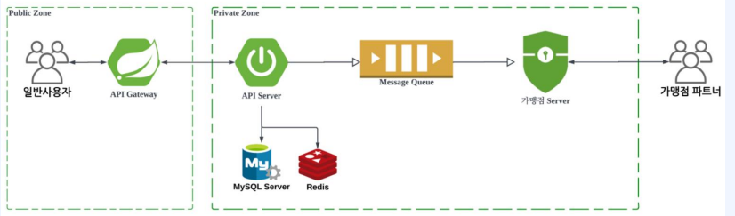
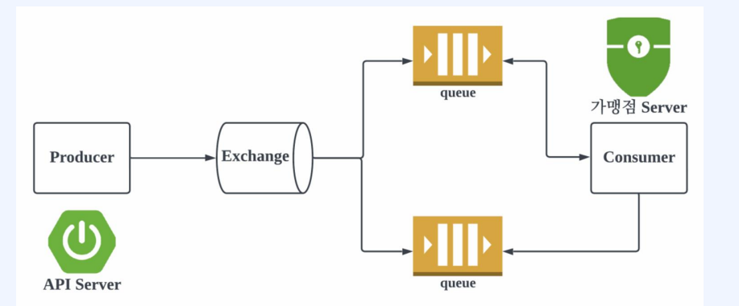
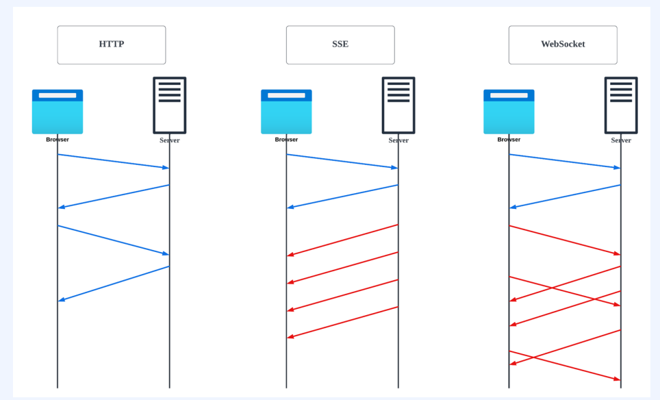

# Ch08. 비동기 주문 개발
- [1. 비동기 처리란?](#ch08-01-비동기-처리란)
- [2. 비동기를 위한 Message Queue](#ch08-02-비동기를-위한-message-queue)
- [3. Docker에 RabbitMQ 설정하기](#ch08-03-docker에-rabbit-mq-설정하기)
- [4. Producer 개발하기 - 1](#ch08-04-producer-개발하기---1)
- [5. Producer 개발하기 - 2](#ch08-05-producer-개발하기---2)
- [6. Consumer 개발하기](#ch08-06-consumer-개발하기)
- [7. SSE Server Send Events란?](#ch08-07-sseserver-send-events-란)
- [8. SSE를 통한 사용자 주문 Push 알림 개발하기 - 1](#ch08-08-sse를-통한-사용자-주문-push-알림-개발하기---1)
- [9. SSE를 통한 사용자 주문 Push 알림 개발하기 - 2](#ch08-09-sse를-통한-사용자-주문push-알림-개발하기---2)
- [10. SSE를 통한 사용자 주문 Push 알림 개발하기 - 3](#ch08-10-sse를-통한-사용자-주문push-알림-개발하기---3)
- [11. SSE를 통한 사용자 주문 Push 알림 개발하기 - 4](#ch08-11-sse를-통한-사용자-주문push-알림-개발하기---4)


--------------------------------------------------------------------------------------------------------------------------------
# Ch08-01. 비동기 처리란?
## 비동기 처리란?

> 사용자 접수완료, 가맹점 수락 구간을 비동기 처리 
- `Message Queue`
> - `Push, Polling 방식`


--------------------------------------------------------------------------------------------------------------------------------
# Ch08-02. 비동기를 위한 Message Queue
## `RabbitMQ`
- 오픈 소스 메세지 브로커 소프트웨어
1. `메세지 브로커`는 `송신자와 수신자` 간의 효율적인 메세지 전달을 중개하는 역할
2. `AMQP(Advanced Message Queueing Protocl)를 기반` 작동, 대규모 분산 시스템
3. `프로듀서`, `컨슈머`간의 비동기적인 통신을 이용
4. 프로듀서는 메세지를 RabbitMQ에 보내고, RabbitMQ는 이를 큐에 저장, 컨슈머는 메세지를 가져와 처리
> - 비동기 처리를 지원하여 `시스템의 확장성, 유언성`을 높임
> - 다양한 기능을 제공 메세지 라우팅, 메세지 필터링, 우선순위 지정
> - 그외 AMQP기반 QUEUE
> > Apache ActiveMQ, ApacheQpid, AWS SQS


--------------------------------------------------------------------------------------------------------------------------------
# Ch08-03. Docker에 Rabbit MQ 설정하기
## 실습 (Docker - RabbitMQ SET)
- rabbitmq/docker-compose.yaml
```yaml
version: '3.7'
services:
  rabbitmq:
    image: rabbitmq:latest
    ports:
      - "5672:5672" # rabbit amqp port
      - "15672:15672" # manage port
    environment:
      - RABBITMQ_DEFAULT_USER=admin       # 기본사용자 이름
      - RABBITMQ_DEFAULT_PASS=admin123!@# # 기본사용자 비밀번호
```
> `$ docker-compose -f /Users/admin/study/signature/ws/docker-compose/rabbitmq/docker-compose.yaml up`
- rabbitMQ Container console: 관리자 페이지 설정
> `$ rabbitmq-plugins enable rabbitmq_management`
- rabbitMQ 관리자 페이지 접속
> `localhost:15672`

## RabbitMQ

- `Publisher`, `Exchange`, `Queue`, `Cusumer`
> - Exchange: 라우팅 역할
> - Consumer: queue와 양방향 가능


--------------------------------------------------------------------------------------------------------------------------------
# Ch08-04. Producer 개발하기 - 1
- Project RabbitMQ 설정(Producer)
> > RabbitConfig, application.yml, Producer
## 실습(service: api)
- dependencies 추가
>  `implementation 'org.springframework.boot:spring-boot-starter-amqp'`
- RabbitMqConfig
```java
package org.delivery.api.config.rabbitmq;

@Configuration
public class RabbitMqConfig {

	@Bean
	public DirectExchange directExchange() {
		return new DirectExchange("delivery.exchange");
	}

	@Bean
	public Queue queue() {
		return new Queue("delivery.queue");
	}

	@Bean
	public Binding binding(DirectExchange directExchange, Queue queue) {
		return BindingBuilder.bind(queue).to(directExchange).with("delivery.key");
	}

	// end queue 설정
	@Bean
	public RabbitTemplate rabbitTemplate(
			ConnectionFactory connectionFactory,
			MessageConverter messageConverter
	) {
		RabbitTemplate rabbitTemplate = new RabbitTemplate(connectionFactory);
		rabbitTemplate.setMessageConverter(messageConverter);
		return rabbitTemplate;
	}

	@Bean
	public MessageConverter messageConverter(ObjectMapper objectMapper) {
		return new Jackson2JsonMessageConverter(objectMapper);
	}
}
```
> - `DirectExchange`, `Queue`: `new ~("<name>")`
> - `Binding`
> > `BindingBuilder.bind(<queue<).to(<directExchange>).with("<key>")`
> - `RabbitTeamplte`: `new RabbitTemplate(ConnectionFactory), .setMessageConverter(<messageConverter>)`
> > 발행 및 convert  
> - `MessageConverter`: `new Jackson2JsonMessageConverter(<objectMapper>)` 
- application.yaml
```yaml
spring:
  rabbitmq:
    host: localhost
    port: 5672
    username: admin
    password: admin123!@#
```
> - `spring.rabbitmq`
> > host, port, username, password

- Producer
```java
package org.delivery.api.common.rabbitmq;

@RequiredArgsConstructor
@Component
public class Producer {

  private final RabbitTemplate rabbitTemplate;

  public void producer(String exchange, String routeKey, Object object) {
      rabbitTemplate.convertAndSend(exchange, routeKey, object);
  }
}


package org.delivery.api.config.health;

@Slf4j
@RequiredArgsConstructor
@RestController
@RequestMapping("/open-api")
public class HealthOpenApiController {
	private final Producer producer;

  @GetMapping("/heath")
  public void health() {
      log.info("health call");
      producer.producer("delivery.exchange", "delivery.key", "hello");
  }
}
```
> - Producer
> > - `rabbiyTemplate.convertAndSend("<exchange>", "<routeKey>", "<object>")`: 발행, Object - Json

## 실행
- Swagger /open-api/health 
- RabbitMQ Manager
> - localhost:15672 
> - Connections, Queues(Get Messages)

## 정리
- RabbitMQ Config
> - DirectExchange, Queue: `new ~("<name>");`
> - MessageConverter: new Jackson2JsonMessageConverter(objectMapper);
> - RabbitTemplate: new ~(connectionFactory); rabbittemplate.setMessageConverter(mc);
> - Binding: `BindingBuilder.bind(queue).to(directExchange).with("<key>")`
- ConnectionFactory
> - app.yml: spring.rabbitmq.host/port/username/password
- Producer
> - `rabbitTemplate.convertAndSend("<exchange>", "<routeKEy>", "<object>")`


--------------------------------------------------------------------------------------------------------------------------------
# Ch08-05. Producer 개발하기 - 2
- Common 모듈 추가
- MQ 공통 Object(Model) 추가: UserOrderMessage :userOrderId
> - UserOrder시 비동기로 가맹점에게 주문내역 전송

## 실습(service:common, api)
- Producer 지우기
```java
package org.delivery.api.config.health;
public class HealthOpenApiController {

  @GetMapping("/heath")
  public void health() {
      log.info("health call");
  }
}
```
### common Module 만들기
- JDK11, Gradle(Groovy), Parent:service, GroupId: org.delivery, ArtifactId: common
- build.gradle (db > common)
```gradle
plugins {
	id 'java's
}

group 'org.delivery'
version '1.0-SNAPSHOT'

java {
	sourceCompatibility = '11'
}

configurations {
	compileOnly {
			extendsFrom annotationProcessor
	}
}

repositories {
    mavenCentral()
}

dependencies {
	implementation 'org.projectlombok:lombok:1.18.22'
	compileOnly 'org.projectlombok:lombok'
	annotationProcessor 'org.projectlombok:lombok'

//    testImplementation 'org.junit.jupiter:junit-jupiter-api:5.8.1'
//    testRuntimeOnly 'org.junit.jupiter:junit-jupiter-engine:5.8.1'
}

test {
	useJUnitPlatform()
}
jar {
	enabled = true
}
```
> - bootJar 삭제
> - dependencies: lombok(configuration: annotationProcessor), Jar

- UserOrderMessage - model
```java
// package-info.java
package org.devliery.common;

package org.devliery.common.message.model;
@Data
@NoArgsConstructor
@AllArgsConstructor
@Builder
public class UserOrderMessage {
    private Long userOrderId;
}

```
> private Long userOrderId;

### api
- UserOrderProducer(Service), UserOrderBusiness 주문시 mq 추가
- build.gradle - common 추가
> `implementation project(:common)`
- Code
```java
package org.delivery.api.domain.userorder.producer;
@RequiredArgsConstructor
@Service
public class UserOrderProducer {
	private final Producer producer;
	private final static String EXCHANGE = "delivery.exchange";
	private final static String ROUTE_KEY = "delivery.key";

	public void sendOrder(UserOrderEntity userOrderEntity) {
		sendOrder(userOrderEntity.getId());
	}

	public void sendOrder(Long userOrderId) {
		UserOrderMessage message = UserOrderMessage.builder()
						.userOrderId(userOrderId)
						.build();
		producer.producer(EXCHANGE, ROUTE_KEY, message );
	}
}

// UserOrderBusiness
public class UserOrderBusiness {
	private final UserOrderProducer userOrderProducer;

	// 1. 사용자, 메뉴 id
	// 2. userOrder 생성
	// 3. userOrderMenu 생성
	// 4. 응답 생성
	public UserOrderResponse userOrder(User user, UserOrderRequest body) {
		// ~

		// 비동기로 가맹점에 주문 알리기
		userOrderProducer.sendOrder(newUserOrderEntity);

		// response
		return userOrderConverter.toResponse(newUserOrderEntity);
	}
}
```
> - Producer 메세지 전송구현: UserOrderEntity  
> - UserOrder 주문시 mq에 전송


--------------------------------------------------------------------------------------------------------------------------------
# Ch08-06. Consumer 개발하기
- 가맹점 Server에서 비동기 주문 수신

## 실습(service: store-admin)
- build.gralde
```gradle
implementation project(':common')
implementation 'org.springframework.boot:spring-boot-starter-amqp'
```
- config.ObjectMapperconfig, RabbitMqConfig
```java
package org.delivery.storeadmin.config.objectmapper;
@Configuration
public class ObjectMapperConfig {
    @Bean
    public ObjectMapper objectMapper() {
        ObjectMapper objectMapper = new ObjectMapper();
        objectMapper.registerModule(new Jdk8Module()); // JDK 8 버전 이후 클래스
        objectMapper.registerModule(new JavaTimeModule()); // LDT
        objectMapper.configure(DeserializationFeature.FAIL_ON_UNKNOWN_PROPERTIES, false); // 모르는 json field에 대해서는 무시한다.
        objectMapper.configure(SerializationFeature.FAIL_ON_EMPTY_BEANS, false);

        // 날짜 관련 직렬화
        objectMapper.disable(SerializationFeature.WRITE_DATES_AS_TIMESTAMPS);
        // 스네이크 케이스
        objectMapper.setPropertyNamingStrategy(new PropertyNamingStrategies.SnakeCaseStrategy());

        return objectMapper;
    }
}

package org.delivery.storeadmin.config.rabbitmq;
@Configuration
public class RabbitMqConfig {

	@Bean
	public MessageConverter messageConverter(ObjectMapper objectMapper) {
		return new Jackson2JsonMessageConverter(objectMapper);
	}
}
```
> MessageConverter
- application.yml
```yaml
spring:
  rabbitmq:
    host: localhost
    port: 5672
    username: admin
    password: admin123!@#
```
> spring.rabbitmq.host, port, username, password (`ConnectionFactory 생성`)

- domain.userorder.consumer.UserOrderConsumer
```java
package org.delivery.storeadmin.domain.userorder.consumer;
@Component
public class UserOrderConsumer {
  @RabbitListener(queues = "delivery.queue")
  public void userOrderConsumer(
			UserOrderMessage userOrderMessage
  ) {
		log.info("message queue>> {}", userOrderMessage);
  }
}
```
> `@RabbitListener(queue = "delivery.queue")` 메소드(Object object)

### cf, common 오류 수정
- build.gradle
```gradle
compileOnly 'org.projectlombok:lombok:1.18.22'
annotationProcessor 'org.projectlombok:lombok:1.18.22'
```
> lombok 버전 지정

## 실행
- store-admin, api 실행
- api(:8080): swagger-ui 로그인 후, /api/user-order(주문)
> `"store_menu_id_list" : [1]`
- store-admin: console log 확인

## 정리
- RabbitMQ 수신
> - 공통 수신객체 Model import
> - ObjectMapper 설정 및 RabbitMQ ObjectMapper 설정(MessageConverter)
> - RabbitMQ ConnectionFactory생성(app.yml)
> - Consumer 객체 Component등록(`@RabbitListener(queue="<queue_name>")`)
> - 주의 common 과 수신 Module에 Lombok 버전 동일하게 맞춰야됨


--------------------------------------------------------------------------------------------------------------------------------
# Ch08-07. SSE(Server-Send Events) 란?
## `SSE`
- `Server-Send Events`의 약어로, `단방향 통신`을 통해 `서버에서 클라이언트`로 `실시간 이벤트를 전송하는 웹 기술`
1. 일반적인 웹 소켓과 비교, SSE는 단방향 통신, `추가적인 설정 없이 웹 브라우저에 내장된 기술`
2. 서버에서 클라이언트로만 `단방향`
3. `텍스트 기반 형식(JSON, XML)`으로 데이터 전송, `이벤트`는 `data, event, id, retry` 같은 필드로 구성된 텍스트 형태로 클라이언트에 전송
4. HTTP 연결을 재사용



--------------------------------------------------------------------------------------------------------------------------------
# Ch08-08. SSE를 통한 사용자 주문 Push 알림 개발하기 - 1
- `SSE` 연결하여 서버에서 클라이언트로 연결받기
- Browse `EventSource`
## 실습(service: store-admin)
```java
package org.delivery.storeadmin.domain.sse.controller;
import org.springframework.web.servlet.mvc.method.annotation.SseEmitter;
@Slf4j
@RequiredArgsConstructor
@RestController
@RequestMapping("/api/sse")
public class SseApiController {

	private static final Map<String, SseEmitter> userConnection = new ConcurrentHashMap<>();

	@GetMapping(path="/connect", produces = MediaType.TEXT_EVENT_STREAM_VALUE)
	public ResponseBodyEmitter connect(
			@Parameter(hidden = true)
			@AuthenticationPrincipal UserSession userSession
	) {
		SseEmitter emitter = new SseEmitter(1000L * 60); //ms (Timeout 설정)
		userConnection.put(userSession.getUserId().toString(), emitter);

		emitter.onTimeout(() -> {
				log.info("on timeout");
				// 클라이언트와 타임아웃이 일어났을때
				emitter.complete();
		});

		emitter.onCompletion(() -> {
				log.info("on completion");
				// 클라이언트와 연결이 종료 됬을때 하는 작업
				userConnection.remove(userSession.getUserId().toString());
		});

		// 최초 연결시 응답 전송
		SseEmitter.SseEventBuilder event = SseEmitter.event()
						.name("onopen")
						;
		try {
				emitter.send(event);
		} catch (IOException e) {
				emitter.completeWithError(e);
		}
		return emitter;
	}

	@GetMapping("/push-event")
	public void pushEvent(
			@Parameter(hidden = true)
			@AuthenticationPrincipal UserSession userSession
	) {
		// 기존에 연결된 유저 찾기
		SseEmitter emitter = userConnection.get(userSession.getUserId().toString());

		SseEmitter.SseEventBuilder event = SseEmitter.event()
						.data("hello"); // event("이름")에 없이 보낼때 `onmessage`
		try {
				emitter.send(event);
		} catch (IOException e) {
				emitter.completeWithError(e);
		}
	}
}
```
> - `SseEmitter`
```java
Map<String, SseEmitter> userConnection = new ConcurrentHashMap() //String, SseEmitter  

- emitter.onTimeout(<Runnable>)
- emitter.onCompletion(<Runnable>)
- emitter.send(SseEventBuilder ev)
- emitter.complete() > onCompletion()
- emitter.completeWithError(e)
- SseEmitter.event().name("onopen"): SseEmitter.SseEventBuilder

@GetMapping path="/connect", produces = MediaType.TEXT_EVENT_STREAM_VALUE // text/event-stream (@Parameter(hidden=true) @AuthenticationPrinciapl UserSession user)  
    SseEmitter emitter = new SseEmitter(timeoutL): ms  
    emitter.onTimeout(emitter.complete()), onCompletion()  
    최초 연결시 응답 전송: SseEmitter.SseEventBuilder event = SseEmitter.event().name("onpen")
    emitter.send(event)
> 최초연결시 name: onopen으로


- SseEmitter.event().data("hello")
@GetMapping("/push-event") (@Parameter(hidden = true) @AuthenticationPrincipal UserSession userSession)
	SseEmitter emitter = userConnection.get(userSession.getUserId().toString());
	SseEmitter.SseEventBuilder event = SseEmitter.event()
					.data("hello"); // event.name("이름")에 없이 보낼때 `onmessage`?
	try {
		emitter.send(event);
	} catch (IOException e) {
		emitter.completeWithError(e);
	}
}
```

- main.html
```html
<script>
	const url = "http://localhost:8081/api/sse/connect";    // 접속주소
	const eventSource = new EventSource(url);               // sse 연결

	eventSource.onopen = event => {
			// 최초 응답
			console.log("sse connection");
			console.log(event)
	}

	eventSource.onmessage = event => {
			console.log("receive data : " + event.data);
	}
</script>
```
> - `new EventSource(url)`
> > `eventSource.onopen((event) => ~)`, `eventSource.onmessage((event => ~))`

## 실행
- store-admin :8081 (Login)
> > sse connection
- Swagger /api/ssee/push-event

## 정리
- SSE
> - Server
> > - `new SseEmitter(<timeout>)`
> > > - sseEmitter.onTimeout/onCompletion/send/completeWithError()
> > > - `SseEmitter.event().data("<data>")`
- JS `EventSource("<url>")`
> - `eventSource.onopen/onmessage`
> > event/.data()


--------------------------------------------------------------------------------------------------------------------------------
# Ch08-09. SSE를 통한 사용자 주문	Push 알림 개발하기 - 2
- SseEmitter를 통한 Push 알림
> - UserSseConnection(Model)
> > SeeConnectionPool(ConnectionPoolIfs)
> - SseApiController
## 실습(service: )
- UserSseConnection
```java
package org.delivery.storeadmin.domain.sse.connection.model;
@Getter
@ToString
@EqualsAndHashCode
public class UserSseConnection {

    private final String uniqueKey;
    private final SseEmitter sseEmitter;
    private final ObjectMapper objectMapper;
    private final ConnectionPoolIfs<String, UserSseConnection> connectionPoolIfs;

    private UserSseConnection(
            String uniqueKey,
            ConnectionPoolIfs<String, UserSseConnection> connectionPoolIfs,
            ObjectMapper objectMapper
    ) {

        // 초기화
        this.uniqueKey = uniqueKey;
        this.sseEmitter = new SseEmitter(60 * 1000L);
        this.connectionPoolIfs = connectionPoolIfs;
        this.objectMapper = objectMapper;

        // on completion
        this.sseEmitter.onCompletion(() -> {
            // connection pool remove
        });

        // on timeout
        this.sseEmitter.onTimeout(() -> {
            this.sseEmitter.complete();
            connectionPoolIfs.onCompletionCallback(this);
        });

        // onopen 메세지
        this.sendMessage("onopen", "connect");
    }

    public static UserSseConnection connect(
            String uniqueKey,
            ConnectionPoolIfs<String, UserSseConnection> connectionPoolIfs,
            ObjectMapper objectMapper
    ) {
        return new UserSseConnection(uniqueKey, connectionPoolIfs, objectMapper);
    }

    public void sendMessage(String eventName, Object data) {
        try {
            String json = this.objectMapper.writeValueAsString(data);
            SseEmitter.SseEventBuilder event = SseEmitter.event()
                    .name(eventName)
                    .data(json);
            this.sseEmitter.send(event);
        } catch (IOException e) {
            this.sseEmitter.completeWithError(e);
        }
    }

    public void sendMessage(Object data) {
			try {
            String json = this.objectMapper.writeValueAsString(data);
            SseEmitter.SseEventBuilder event = SseEmitter.event()
                    .data(json);
            this.sseEmitter.send(event);
        } catch (IOException e) {
            this.sseEmitter.completeWithError(e);
        }
    }
}
```
> - String uniqueKey, SseEmitter emitter, ConnectionPoolIfs connectionPool, ObjectMapper objectMapper  
> - onTimeout시 connectionPool callBack

- ConnectionPoolIfs, SseConnectionPool
```java
package org.delivery.storeadmin.domain.sse.connection.ifs;
public interface ConnectionPoolIfs<T, R> {
    void addSession(T key, R session);

    R getSession(T uniqueKey);

    void onCompletionCallback(R session);
}

package org.delivery.storeadmin.domain.sse.connection;
@Slf4j
@Component
public class SseConnectionPool implements ConnectionPoolIfs<String, UserSseConnection> {
    private static final Map<String, UserSseConnection> connectionPool = new ConcurrentHashMap<>();

    @Override
    public void addSession(String uniqueKey,UserSseConnection userSseConnection) {
        connectionPool.put(uniqueKey, userSseConnection);
    }

    @Override
    public UserSseConnection getSession(String uniqueKey) {
        return connectionPool.get(uniqueKey);
    }

    @Override
    public void onCompletionCallback(UserSseConnection session) {
        log.info("call back connection pool completion : {}", session);
        connectionPool.remove(session.getUniqueKey());
    }
}
```

- SseApiController
```java
public class SseApiController {
	private final SseConnectionPool sseConnectionPool;
  private final ObjectMapper objectMapper;

	@GetMapping(path="/connect", produces = MediaType.TEXT_EVENT_STREAM_VALUE)
    public ResponseBodyEmitter connect(
            @Parameter(hidden = true)
            @AuthenticationPrincipal UserSession userSession
    ) {
        log.info("login user {}", userSession);
        var userSessionConnection = UserSseConnection.connect(
                userSession.getStoreId().toString(),
                sseConnectionPool,
                objectMapper
        );

        sseConnectionPool.addSession(userSessionConnection.getUniqueKey(), userSessionConnection);
        return userSessionConnection.getSseEmitter();

    }

    @GetMapping("/push-event")
    public void pushEvent(
            @Parameter(hidden = true)
            @AuthenticationPrincipal UserSession userSession
    ) {
        var userSessionConnection = sseConnectionPool.getSession(userSession.getStoreId().toString());
        Optional.ofNullable(userSessionConnection)
                .ifPresent(it -> {
                    it.sendMessage("hello world");
                });
    }
}
```
## 실행
- store-admin Login 후 /api/sse/push-event

## 정리
- 기존의 Controller에서 SseEmitter 설정을 UserSessionConnection 객체를 통한 설정으로 변경
> - UserSessionConnection(uniqueKey, objectMapper, connectionPoolIFs)
> > - 생성자시 최기화 + f: sseEmitter: SseEmiter 생성
> > > - connectionPoolIfs는 Component객체이므로 Api에서 주입받음
> > > - sse.onTimeout()시 connectionPoolIfs.onCompletionCallback(this)
> - SseConnectionPool(connectionPool): `Map<String, UserSseConnection> connectionPool`
- SseApiController
> - UserSeseConnection 객체생성
> - SseConnectionPool.addSession(uniqueKey, usersessionConnection)


--------------------------------------------------------------------------------------------------------------------------------
# Ch08-10. SSE를 통한 사용자 주문	Push 알림 개발하기 - 3
- 사용자 주문 알림 왔을 때 주문수락을 위한 알림을 위한 개발  
- Business Logic
> - UserOrderMessage: userOrderId  
> - UserOrderEntity > UserOrderMenu > StoreMenu (store_id 구해야하는 문제점)
## 실습(Mysql, service: api, db, store-admin)
### Mysql
- user_order에 store테이블 관계 설정(store -< user_order 1:N)
> - user_order: store_id ( BIGINT(32) Not Null): 개발단계 truncate > 테이블 수정

### api, db
- Code
```java
package org.delivery.api.domain.userorder.~;
// # API - userorder
// UserOrderEntity - storeId 추가 ( 1:N Relation 설정, store_id 컬럼추가)
public class UserOrderEntity extends BaseEntity {
	// ~
	@Column(nullable = false)
	private Long storeId;
}
// UserOrderRequest - storeId 추가, storeMenuList (주문 Req)
package org.delivery.api.domain.userorder.controller.model;
public class UserOrderRequest {
    @NotNull
    private Long storeId;
    // ~

}
// UserOrderConverter - storeId 추가
@Converter
public class UserOrderConverter {
    public UserOrderEntity toEntity(
            // ~
            Long storeId
    ) {
        // ~
				return UserOrderEntity.builder()
                // ~
                .storeId(storeId)
                .build();
    }
}
// UserOrderBusiness - toEntity(Long storeId ~)
package org.delivery.api.domain.userorder.business;
public class UserOrderBusiness {
	public UserOrderResponse userOrder(User user, UserOrderRequest body) {
		// ~ 
		// 여기서 반영
		UserOrderEntity userOrderEntity = userOrderConverter.toEntity(user, body.getStoreId(), storeMenuEntityList);
	}
}
```
### 실행
- ApiApp: 주문
> `store_id: 1, store_menu_id: [2]`
> > user_order 테이블 store_id

### store-admin
```java
package org.delivery.storeadmin.domain.userorder.service;
@RequiredArgsConstructor
@Service
public class UserOrderService {
    private final UserOrderRepository userOrderRepository;

    public Optional<UserOrderEntity> getUserOrder(Long id) {
        return userOrderRepository.findById(id);
    }
}

package org.delivery.storeadmin.domain.userorder.business;
@RequiredArgsConstructor
@Service
public class UserOrderBusiness {
    private final UserOrderService userOrderService;
    private final SseConnectionPool sseConnectionPool;

    /**
     * 주문
     * 주문 내역 찾기
     * 스토어 찾기
     * 연결된 세션 찾아서
     * push
     */
    public void pushUserOrder(UserOrderMessage userOrderMessage) {
        UserOrderEntity userOrderEntity = userOrderService.getUserOrder(userOrderMessage.getUserOrderId()).orElseThrow(
                () -> new RuntimeException("사용자 주문내역 없음")
        );
        // user order entity
        // user order menu
        // user order menu > store menu
        // response
        // push

        UserSseConnection userConnection = sseConnectionPool.getSession(userOrderEntity.getStoreId().toString());

        // 주문 메뉴, 가격, 상태
        // 사용자에게 Push
        // userConnection.sendMessage();
    }
}

// UserOrderResponse, UserOrderConverter
package org.delivery.storeadmin.domain.userorder.controller.model;
@Data
@NoArgsConstructor
@AllArgsConstructor
@Builder
public class UserOrderResponse {
    private Long id;
    private Long storeId;
    private Long userId;
    private UserOrderStatus status;
    private BigDecimal amount;
    private LocalDateTime orderedAt;
    private LocalDateTime acceptedAt;
    private LocalDateTime cookingStartedAt;
    private LocalDateTime deliveryStartedAt;
    private LocalDateTime receivedAt;
}

package org.delivery.storeadmin.domain.userorder.converter;
@Service
public class UserOrderConverter {

    public UserOrderResponse toResponse(UserOrderEntity userOrderEntity) {
        return UserOrderResponse.builder()
                .id(userOrderEntity.getUserId())
                .userId(userOrderEntity.getUserId())
                .storeId(userOrderEntity.getStoreId())
                .status(userOrderEntity.getStatus())
                .amount(userOrderEntity.getAmount())
                .orderedAt(userOrderEntity.getOrderedAt())
                .acceptedAt(userOrderEntity.getAcceptedAt())
                .cookingStartedAt(userOrderEntity.getCookingStartedAt())
                .deliveryStartedAt(userOrderEntity.getDeliveryStartedAt())
                .receivedAt(userOrderEntity.getReceivedAt())
                .build();
    }
}

// ## storemenu
package org.delivery.storeadmin.domain.storemenu.service;
@RequiredArgsConstructor
@Service
public class StoreMenuService {
    private final StoreMenuRepository storeMenuRepository;

    public StoreMenuEntity getStoreMenuWithThrow(Long id) {
        return storeMenuRepository.findFirstByIdAndStatusOrderByIdDesc(id, StoreMenuStatus.REGISTERED)
                .orElseThrow(() -> new RuntimeException("store menu not found"));
    }
}


package org.delivery.storeadmin.domain.storemenu.controller.model;
@Data
@NoArgsConstructor
@AllArgsConstructor
@Builder
public class StoreMenuResponse {
    private Long id;
    private String name;
    private BigDecimal amount;
    private StoreMenuStatus status;
    private String thumbnailUrl;
    private int likeCount;
    private int sequence;
}

package org.delivery.storeadmin.domain.storemenu.converter;
@Service
public class StoreMenuConverter {
    public StoreMenuResponse toResponse(StoreMenuEntity storeMenuEntity) {
        return StoreMenuResponse.builder()
                .id(storeMenuEntity.getId())
                .name(storeMenuEntity.getName())
                .status(storeMenuEntity.getStatus())
                .amount(storeMenuEntity.getAmount())
                .thumbnailUrl(storeMenuEntity.getThumbnailUrl())
                .likeCount(storeMenuEntity.getLikeCount())
                .sequence(storeMenuEntity.getSequence())
                .build();
    }

    public List<StoreMenuResponse> toResponse(List<StoreMenuEntity> list) {
        return list.stream()
                .map(this::toResponse)
                .collect(Collectors.toList());
    }
}

// ## userordermenu
package org.delivery.storeadmin.domain.userordermenu.service;
@RequiredArgsConstructor
@Service
public class UserOrderMenuService {
    private final UserOrderMenuRepository userOrderMenuRepository;

    public List<UserOrderMenuEntity> getUserOrderMenuList(Long userOrderId) {
        return userOrderMenuRepository.findAllByUserOrderIdAndStatus(userOrderId, UserOrderMenuStatus.REGISTERED);
    }
}
```


--------------------------------------------------------------------------------------------------------------------------------
# Ch08-11. SSE를 통한 사용자 주문 Push 알림 개발하기 - 4
## 실습(service: store-admin)
```java
@RequiredArgsConstructor
@Service
public class UserOrderBusiness {
    private final UserOrderService userOrderService;
    private final UserOrderConverter userOrderConverter;
    private final SseConnectionPool sseConnectionPool;
    private final UserOrderMenuService userOrderMenuService;
    private final StoreMenuService storeMenuService;
    private final StoreMenuConverter storeMenuConverter;

    /**
     * 주문
     * 주문 내역 찾기
     * 스토어 찾기
     * 연결된 세션 찾아서
     * push
     */
    public void pushUserOrder(UserOrderMessage userOrderMessage) {
        // user order entity
        UserOrderEntity userOrderEntity = userOrderService.getUserOrder(userOrderMessage.getUserOrderId()).orElseThrow(
                () -> new RuntimeException("사용자 주문내역 없음")
        );

        // user order menu
        List<UserOrderMenuEntity> userOrderMenuList = userOrderMenuService.getUserOrderMenuList(userOrderEntity.getId());

        // user order menu > store menu
        List<StoreMenuResponse> storeMenuReponseList = userOrderMenuList.stream()
                .map(it -> {
                    return storeMenuService.getStoreMenuWithThrow(it.getStoreMenuId());
                })
                .map(it -> {
                    return storeMenuConverter.toResponse(it);
                })
                .collect(Collectors.toList());
        UserOrderResponse userOrderResponse = userOrderConverter.toResponse(userOrderEntity);

        // response
        UserOrderDetailResponse push = UserOrderDetailResponse.builder()
                .userOrderResponse(userOrderResponse)
                .storeMenuResponses(storeMenuReponseList)
                .build();

        UserSseConnection userConnection = sseConnectionPool.getSession(userOrderEntity.getStoreId().toString());

        // 주문 메뉴, 가격, 상태
        // 사용자에게 Push
        userConnection.sendMessage(push);

    }

}

package org.delivery.storeadmin.domain.userorder.controller.model;
@Data
@NoArgsConstructor
@AllArgsConstructor
@Builder
public class UserOrderDetailResponse {
    private UserOrderResponse userOrderResponse;
    private List<StoreMenuResponse> storeMenuResponseList;
}

public class UserOrderConsumer {
	private final UserOrderBusiness userOrderBusiness;

	@RabbitListener(queues = "delivery.queue")
	public void userOrderConsumer(
					UserOrderMessage userOrderMessage
	) {
			log.info("message queue>> {}", userOrderMessage);
			userOrderBusiness.pushUserOrder(userOrderMessage);
	}
}
```
> - API에서 비동기로 보낸 UserOrderMessage 가지고 관리자 사용자에게 Push알림
> - UserOrderEntity > UserOrderMenu > StoreMenu > UserOrderDetailResponse > push
> > userorder 주문하여 테스트
- main.html
```html
<!DOCTYPE html>
<html lang="en">
<head>
    <meta charset="UTF-8">
    <meta name="viewport" content="width=device-width, initial-scale=1.0">
    <title>주문 관리</title>
    <script src="https://cdn.jsdelivr.net/npm/vue@2.6.14/dist/vue.js"></script>
    <script src="https://cdn.jsdelivr.net/npm/axios/dist/axios.min.js"></script>

    <style>
        table {
            border-collapse: collapse;
            width: 100%;
        }

        th, td {
            padding: 8px;
            text-align: left;
            border-bottom: 1px solid #ddd;
        }

        .button-container button {
            margin-right: 8px;
        }
    </style>

</head>
<body>
<div id="app">
    <table>
        <thead>
        <tr>
            <th>주문번호</th>
            <th>주문내용</th>
            <th>상태</th>
            <th>액션</th>
        </tr>
        </thead>
        <tbody>
        <tr v-for="order in orders" :key="order.user_order_response.id">
            <td>{{ order.user_order_response.id }}</td>
            <td>
                <ul>
                    <li v-for="item in order.store_menu_response_list" :key="item.id">
                        {{ item.name }} {{ item.amount }}
                    </li>
                </ul>
            </td>
            <td>{{ order.user_order_response.status }}</td>
            <td class="button-container">
                <button @click="acceptOrder(order)">주문수락</button>
                <button @click="startCooking(order)">조리시작</button>
                <button @click="startDelivery(order)">배달시작</button>
            </td>
        </tr>
        </tbody>
    </table>
</div>

<script>
    new Vue({
        el: "#app",
        data: {
            orders: [] // 서버로부터 받은 주문 데이터를 저장할 배열
        },
        methods: {
            acceptOrder(order) {
                console.log("주문수락:", order);
            },
            startCooking(order) {
                console.log("조리시작:", order);
            },
            startDelivery(order) {
                console.log("배달시작:", order);
            },
            pushData(order){
                this.orders.unshift(order);
            }
        },
        mounted() {
            // SSE 연결
            const url = "http://localhost:8081/api/sse/connect";    // 접속주소
            const eventSource = new EventSource(url);               // sse 연결

            eventSource.onopen = event => {
                console.log("sse connection")
            }

            eventSource.onmessage = event => {
                console.log("receive : "+event.data);
                const data = JSON.parse(event.data);
                this.pushData(data);
            }
        }
    });
</script>
</body>
</html>
```

## 실행
- store-admin, api App Run
> - 관리자페이지(:8081), 사용자 주문(:8080)
- 사용자 주문(store_id: 1, store_menu_id: 2)