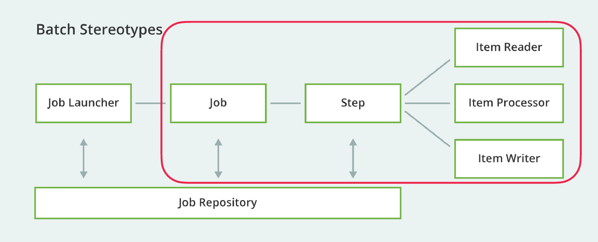
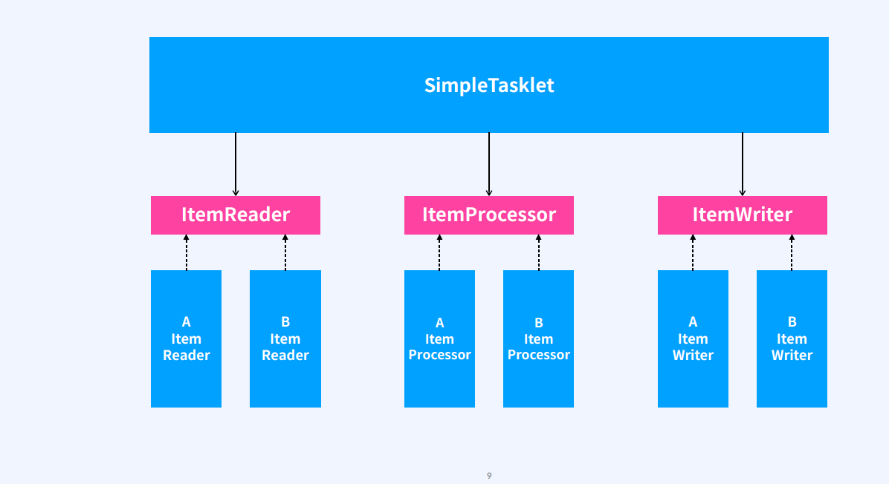
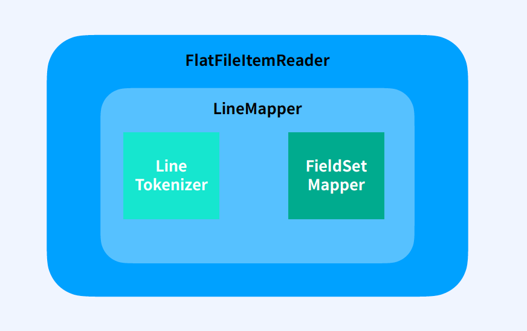
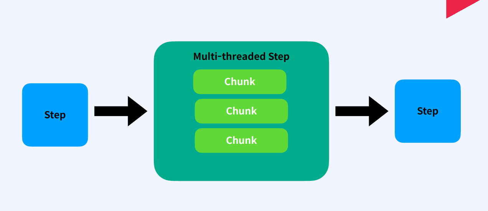
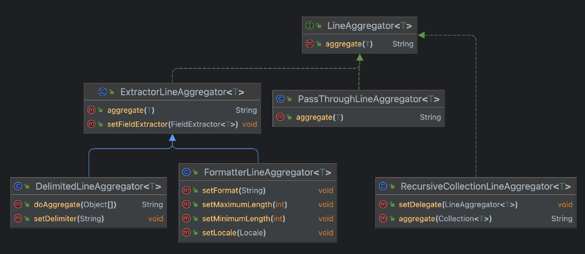
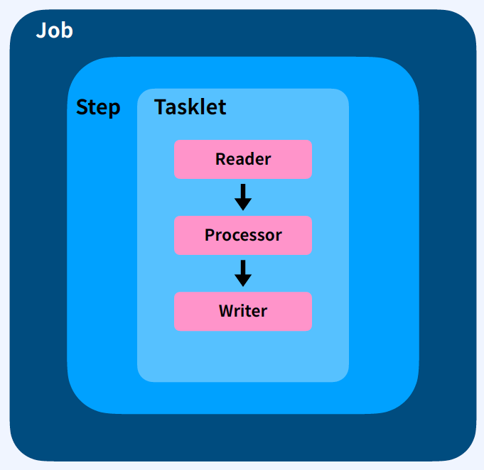
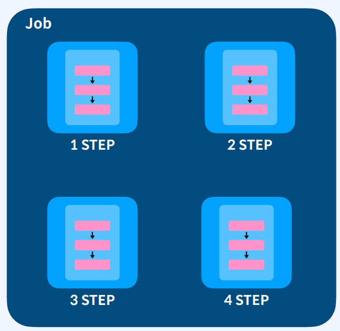
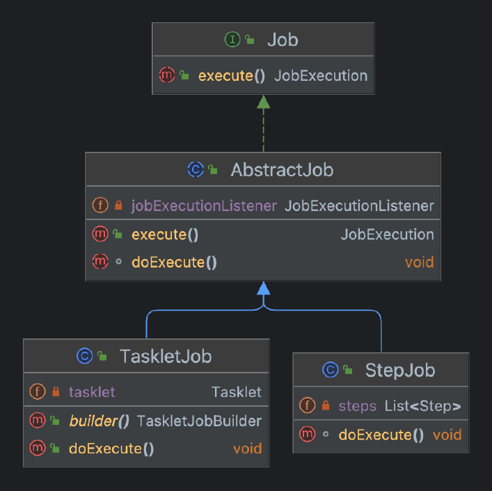

# Course6. 대용량 데이터를 다루는 배치처리
- [ch00. OT](#ch00-ot)
- [ch01. Spring Batch 원리와 철학 이해](#ch01-01-배치-프로그램이란-무엇인가)
- [ch02. 프로젝트 세팅 및 원시 배치 프로그래밍 구현하기](#ch01-02-프로젝트-세팅-및-원시적인-배치-프로그램-구현하기---기반-구현본-구현)
- [ch03. 스프링 배치처럼 개선하기](#ch01-03-스프링-배치처럼-개선하기)
- [ch04. 단계가 있는 배치 만들기](#ch01-04-단계가-있는-배치-만들기)


--------------------------------------------------------------------------------------------------------------------------------
# Ch00. OT
## Spring Batch 
- 
- 
- 
- 
- 


--------------------------------------------------------------------------------------------------------------------------------


# Ch01. Spring Batch 원리와 철학 이해
# Ch01-01. 배치 프로그램이란 무엇인가
## 스프링 배치란?
엔터프라이즈 시스템의 운영에 필요한 견고한 배치 애플리케이션을 개발할 수 있도록 설계뙨 가볍고 다양한 기능을 가진 배치 프레임워크
## 스프링 배치 특징
- Spring
> DI, IoC, 서비스 추상화, AOP
> > IoC(Inversion of Control): 객체의 생명주기를 클라이언트 구현 객체가 직접 관리, 외부 코드(라이브러리)를 호출하더라도 해당 코드의 구현 객체가 직접 관리
- 대용량 데이터 처리
> 최적화, Chunk 기반 처리
- 성능
> 파티셔닝, 병렬, 최적화
- 견고성
> 예외 상황에 대한 방어 코드 지원
- 신뢰성
> 로깅 및 추적, 작업 처리 통계, 트랜잭션 관리 등


--------------------------------------------------------------------------------------------------------------------------------
# Ch01-02. 프로젝트 세팅 및 (원시적인) 배치 프로그램 구현하기 - 기반 구현/본 구현
## batch-campus
Customer 객체로 로그인 시간이 365일 지난 계정을 휴면계정으로 전환하기
- com.
- gradle
> data-jpa, lombok, h2
- Code
> - Customer: @Entity
> - CustomerRepository extends JpaRepository<Customer, Long>
> - <I> EmailProvider 
> > void send(~);
> > - Fake Impl EmailProvider
> - JobExecution batchStatus, startTime, endTime
> - enum BatchStatus: STARTING, COMPLETE, FAILED
> - DormantBatchJob
> > customerRepository, emailProvider  
> > JobExecution execute()
```java
// /customer
@Entity
@NoArgsConstructor
@Getter
@ToString
public class Customer {
    @Id @GeneratedValue(strategy = GenerationType.AUTO)
    private Long id;
    private String name;
    private String email;
    private LocalDateTime createAt;
    private LocalDateTime loginAt;
    private Status status;

    public Customer(String name, String email) {
        this.name = name;
        this.email = email;
        this.createAt = LocalDateTime.now();
        this.loginAt = LocalDateTime.now();
        this.status = Status.NORMAL;
    }

    public void setLoginAt(LocalDateTime loginAt) {
        this.loginAt = loginAt;
    }

    public void setStatus(Status status) {
        this.status = status;
    }

    public enum Status {
        NORMAL,
        DORMANT;
    }
}

// customer
public interface CustomerRepository extends JpaRepository<Customer, Long> {
}

// ~/
public interface EmailProvider {
    void send(String emilAddress, String title, String body);

    @Slf4j
    class Fake implements EmailProvider {
        @Override
        public void send(String emailAddress, String title, String body) {
            log.info("{} email 전송 완료! {} : {} ", emailAddress, title, body);
        }
    }
}

// batch
@Getter
@ToString
public enum BatchStatus {
    STARTING,
    FAILED,
    COMPLETED;
}

// batch
@Getter
@Setter
@ToString
public class JobExecution {
    private BatchStatus status;
    private LocalDateTime startTime;
    private LocalDateTime endTime;
}

// ~/
@Component
public class DormantBatchJob {
    private final CustomerRepository customerRepository;
    private final EmailProvider emailProvider;

    public DormantBatchJob(CustomerRepository customerRepository) {
        this.customerRepository = customerRepository;
        this.emailProvider = new EmailProvider.Fake();
    }

    public JobExecution execute() {
        final JobExecution jobExecution = new JobExecution();
        jobExecution.setStatus(BatchStatus.STARTING);
        jobExecution.setStartTime(LocalDateTime.now());

        int pageNo = 0;

        try {

            while (true) {
                // 1. 유저를 조회한다.
                final PageRequest pageRequest = PageRequest.of(pageNo, 1, Sort.by("id").ascending());
                Page<Customer> page = customerRepository.findAll(pageRequest);

                final Customer customer;
                if (page.isEmpty()) {
                    break;
                } else {
                    pageNo++;
                    customer = page.getContent().get(0);
                }

                // 2. 휴면계정 대상을 추출 및 변환한다.
                final boolean isDormantTarget = LocalDate.now()
                        .minusDays(365)
                        .isAfter(customer.getLoginAt().toLocalDate());
                if (isDormantTarget) {
                    customer.setStatus(Customer.Status.DORMANT);
                } else {
                    continue;
                }

                // 3. 휴면계정으로 상태를 변경한다.
                customerRepository.save(customer);

                // 4. 메일을 보낸다
                emailProvider.send(customer.getEmail(), "휴먼전환 안내메일입니다", "내용");
            }
            jobExecution.setStatus(BatchStatus.COMPLETED);
        } catch (Exception e) {
            jobExecution.setStatus(BatchStatus.FAILED);
        }
        jobExecution.setEndTime(LocalDateTime.now());
        emailProvider.send("admin@fastcampus.com",
                "배치 완료 알림",
                "DormantBatchJob이 수행되었습니다." + jobExecution.getStatus());

        return jobExecution;
    }
}
```
> static PageRequest.of(int page, int size[, Sort sort])  
> repositorty.findAll(pageable)
- Test
```java
@SpringBootTest
class DormantBatchJobTest {

    @Autowired
    private CustomerRepository customerRepository;
    @Autowired
    private DormantBatchJob dormantBatchJob;

    /*@BeforeEach
    public void setup() {
        customerRepository.deleteAll();
    }*/

    @Test
    @DisplayName("로그인 시간이 일년을 경과한 고객이 세명이고, 일년 이내에 로그인한 고객이 다섯명이면 3명의 고객이 휴면전환대상이다")
    @Transactional
    void test1() {
        // given
        saveCustomer(366);
        saveCustomer(366);
        saveCustomer(366);

        saveCustomer(364);
        saveCustomer(364);
        saveCustomer(364);
        saveCustomer(364);
        saveCustomer(364);

        // when
        final JobExecution result = dormantBatchJob.execute();

        // then
        long dormantCount = customerRepository.findAll()
                .stream()
                .filter(it -> it.getStatus() == Customer.Status.DORMANT)
                .count();

        assertThat(dormantCount).isEqualTo(3);
        assertThat(result.getStatus()).isEqualTo(BatchStatus.COMPLETED);
    }


    @Test
    @DisplayName("고객이 열명이 있지만 모두다 휴면전환대상이면 휴면전환 대상은 10명이다.")
    @Transactional
    void test2() {
        // given
        saveCustomer(400);
        saveCustomer(400);
        saveCustomer(400);
        saveCustomer(400);
        saveCustomer(400);
        saveCustomer(400);
        saveCustomer(400);
        saveCustomer(400);
        saveCustomer(400);
        saveCustomer(400);

        // when
        final JobExecution result = dormantBatchJob.execute();

        //then
        long dormantCount = customerRepository.findAll()
                .stream()
                .filter(it -> it.getStatus() == Customer.Status.DORMANT)
                .count();

        assertThat(dormantCount).isEqualTo(10);
        assertThat(result.getStatus()).isEqualTo(BatchStatus.COMPLETED);
    }

    @Test
    @DisplayName("고객이 없는 경우에도 배치는 정상동작해야한다")
    @Transactional
    void test3() {
        // when
        final JobExecution result = dormantBatchJob.execute();

        //then
        long dormantCount = customerRepository.findAll()
                .stream()
                .filter(it -> it.getStatus() == Customer.Status.DORMANT)
                .count();

        assertThat(dormantCount).isEqualTo(0);
        assertThat(result.getStatus()).isEqualTo(BatchStatus.COMPLETED);
    }

    @Test
    @DisplayName("배치가 실패하면 BatchStatus는 FAILED를 반환해야한다.")
    @Transactional
    void test4() {
        // given
        final DormantBatchJob dormantBatchJob = new DormantBatchJob(null);

        // when
        final JobExecution result = dormantBatchJob.execute();

        // then
        assertThat(result.getStatus()).isEqualTo(BatchStatus.FAILED);
    }

    private void saveCustomer(long loginMinusDays) {
        final String uuid = UUID.randomUUID().toString();

        final Customer test = new Customer(uuid, uuid + "@fastcampus.com");
        test.setLoginAt(LocalDateTime.now().minusDays(loginMinusDays));
        customerRepository.save(test);
    }
}
```


--------------------------------------------------------------------------------------------------------------------------------
# Ch01-03. 스프링 배치처럼 개선하기
## 목표
- `Job, Tasklet, Item` 3총사 역할 이해하기
- 문제점 인식, 개선
## Code Smell
- 뒤섞인 관심사
> - 이해하기 어렵다
> - 수정하기 어렵다
- 확장하기 어려운 구조
## 배치 비지니스 로직 시나리오
1. `Reads` a large number of records from a database, file, or queue
2. `Processes` the data in some fashion.
3. `Writes` back data in a modified form
## SRP, OCP
DormantBatchJob > Job 관심사 분리하기
- Job
> Tasklet, JobExecutionListener
- TaskLet 
> SimpleTasklet(ItemReader, ItemProcessor, ItemWriter)
- JobExecutionListener
> beforeJob(jobExecution), afterJob(jobExecution)

## 실습1 - batch-campus
관심사 분리 - Tasklet, JobExecutionListener
- code
```java
// batch
public interface Tasklet {
    void execute();
}
public interface JobExecutionListener {
    void beforeJob(JobExecution jobExecution);

    void afterJob(JobExecution jobExecution);
}

// application
@Component
public class DormantBatchTasklet implements Tasklet {
    private final CustomRepository customRepository;
    private final EmailProvider emailProvider;
    
    public DormantBatchTasklet(CustomRepository customRepository) {
        this.customerRepository = customerRepository;
        this.emailProvider = new EmailProvider.Fake();
    }

    @Override
    public void execute() {
        // 비지니스로직
        int pageNo = 0;
        // 1. 유저를 조회한다.
        final PageRequest pageRequest = PageRequest.of(pageNo, 1, Sort.by("id").ascending());
        Page<Customer> page = customerRepository.findAll(pageRequest);

        final Customer customer;
        if (page.isEmpty()) {
            break;
        } else {
            pageNo++;
            customer = page.getContent().get(0);
        }

        // 2. 휴면계정 대상을 추출 및 변환한다.
        final boolean isDormantTarget = LocalDate.now()
                .minusDays(365)
                .isAfter(customer.getLoginAt().toLocalDate());
        if (isDormantTarget) {
            customer.setStatus(Customer.Status.DORMANT);
        } else {
            continue;
        }

        // 3. 휴면계정으로 상태를 변경한다.
        customerRepository.save(customer);

        // 4. 메일을 보낸다
        emailProvider.send(customer.getEmail(), "휴먼전환 안내메일입니다", "내용");
    }
}

// batch - @component 제외 > @Configuration에서 bean 등록
public class Job {
    private final Tasklet tasklet;
    private final JobExecutionListener jobExecutionListener;

    public Job(Tasklet tasklet) {
        this(tasklet, null);
    }

    public Job(Tasklet tasklet, JobExecutionListener jobExecutionListener) {
        this.tasklet = tasklet;
        this.jobExecutionListener = Objects.requireNonNullElseGet(jobExecutionListener, () -> new JobExecutionListener() {
            @Override
            public void beforeJob(JobExecution jobExecution) {
            }

            @Override
            public void afterJob(JobExecution jobExecution) {
            }
        });
    }

    public JobExecution execute() {
        final JobExecution jobExecution = new JobExecution();
        jobExecution.setStatus(BatchStatus.STARTING);
        jobExecution.setStartTime(LocalDateTime.now());

        // 비지니스 로직 전처리
        jobExecutionListener.beforeJob(jobExecution);

        try {
            // 비지니스 로직
            tasklet.execute();
            jobExecution.setStatus(BatchStatus.COMPLETED);
        } catch (Exception e) {
            jobExecution.setStatus(BatchStatus.FAILED);
        }
        jobExecution.setEndTime(LocalDateTime.now());
        // 비지니스 로직 후처리
        jobExecutionListener.afterJob(jobExecution);


        return jobExecution;
    }
}

// JobExecutionListener
@Component
public class DormantBatchJobExecutionListener implements JobExecutionListener {
    private final EmailProvider emailProvider;

    public DormantBatchJobExecutionListener() {
        this.emailProvider = new EmailProvider.Fake();
    }

    @Override
    public void beforeJob(JobExecution jobExecution) {
        // no-op
    }

    @Override
    public void afterJob(JobExecution jobExecution) {
        emailProvider.send("admin@fastcampus.com",
                "배치 완료 알림",
                "DormantBatchJob이 수행되었습니다." + jobExecution.getStatus());
    }
}

@Configuration
public class DormantBatchConfiguration {
    @Bean
    public Job dormantBatchJob(
            DormantBatchTasklet dormantBatchTasklet,
            DormantBatchJobExecutionListener dormantBatchJobExecutionListener
    ) {
        return new Job(
            dormantBatchJobTasklet,
            dormantBatchJobExecutionListener
        );
    }
}
```
> Test 실행 및 생성자 수정

## 실습2 - batch-campus
- 비지니스의 3가지 단계로 분리
> Read, Process, Write
```java
// batch
public interface ItemReader<I> {
    I read()
}
public interface ItemProcessor<I, O> {
    O process(I item);
}

public interface ItemWriter<O> {
    void write(O item);
}

// batch
@Component
// Tasklet, DormantBatchItemReader/Process/Writer
public class SimpleTasklet<I,O> implements Tasklet {
    private final ItemReader<I> itemReader;
    private final ItemProcessor<I, O> itemProcessor;
    private final ItemWriter<O> itemWriter;

    public SimpleTasklet(ItemReader<I> itemReader, ItemProcessor<I, O> itemProcessor, ItemWriter<O> itemWriter) {
        this.itemReader = itemReader;
        this.itemProcessor = itemProcessor;
        this.itemWriter = itemWriter;
    }

    @Override
    public void execute() {
        while (true) {
            // read
            final I read = itemReader.read();
            if (read == null) break;

            // process
            final O process = itemProcessor.process(read);
            if(process == null ) continue;

            // writer
            itemWriter.write(process);
        }
    }
}

// application
@Component
public class DormantBatchItemReader implements ItemReader<Customer> {
    private final CustomerRepository customerRepository;
    private int pageNo = 0;

    public DormantBatchItemReader(CustomRepository customerRepository) {
        this.customerRepository = customerRepository;
    }

    @Override
    public Customer read() {
        // 1. 유저를 조회한다.
        final PageRequest pageRequest = PageRequest.of(pageNo, 1, Sort.by("id").ascending());
        Page<Customer> page = customerRepository.findAll(pageRequest);

        final Customer customer;
        if (page.isEmpty()) {
            pageNo = 0;
            return null;
        } else {
            pageNo++;
            customer = page.getContent().get(0);
        }

    }
}

@Component
public class DormantBatchItemProcessor implements ItemProcessor<Customer, Customer> {
    @Override
    public Customer process(Customer item) {
        final boolean isDormantTarget = LocalDate.now()
                .minusDays(365)
                .isAfter(item.getLoginAt().toLocalDate());
        if (isDormantTarget) {
            item.setStatus(Customer.Status.DORMANT);
            return item;
        } else {
            return null;
        }
    }
}

@Component
public class DormantBatchItemWriter implements ItemWriter<Customer> {
    private final CustomerRepository customerRepository;
    private final EmailProvider emailProvider;

    public DormantBatchItemWriter(CustomerRepository customerRepository) {
        this.customerRepository = customerRepository;
        this.emailProvider = new EmailProvider.Fake();
    }

    @Override
    public void write(Customer item) {
        customerRepository.save(item);
        emailProvider.send(item.getEmail(), "휴먼전환 안내메일입니다", "내용");
    }
}

public class Job {
    private final Tasklet tasklet;
    private final JobExecutionListener jobExecutionListener;

    public Job(Tasklet tasklet) {
        this(tasklet, null);
    }

    @Builder
    public Job(ItemReader<?> itemReader, ItemProcessor<?, ?> itemProcessor, ItemWriter<?> itemWriter, JobExecutionListener jobExecutionListener) {
        this(new SimpleTasklet(itemReader, itemProcessor, itemWriter), jobExecutionListener);
    }

    public Job(Tasklet tasklet, JobExecutionListener jobExecutionListener) {
        this.tasklet = tasklet;
        this.jobExecutionListener = Objects.requireNonNullElseGet(jobExecutionListener, () -> new JobExecutionListener() {
            @Override
            public void beforeJob(JobExecution jobExecution) {
            }

            @Override
            public void afterJob(JobExecution jobExecution) {
            }
        });
    }

    public JobExecution execute() {
        final JobExecution jobExecution = new JobExecution();
        jobExecution.setStatus(BatchStatus.STARTING);
        jobExecution.setStartTime(LocalDateTime.now());

        // 비지니스 로직 전처리
        jobExecutionListener.beforeJob(jobExecution);

        try {
            // 비지니스 로직
            tasklet.execute();
            jobExecution.setStatus(BatchStatus.COMPLETED);
        } catch (Exception e) {
            jobExecution.setStatus(BatchStatus.FAILED);
        }
        jobExecution.setEndTime(LocalDateTime.now());
        // 비지니스 로직 후처리
        jobExecutionListener.afterJob(jobExecution);


        return jobExecution;
    }
}

@Configuration
public class DormantBatchConfiguration {
    @Bean
    public Job dormantBatchJob(
            DormantBatchItemReader itemReader,
            DormantBatchItemProcessor itemProcessor,
            DormantBatchItemWriter itemWriter,
            DormantBatchJobExecutionListener listener
    ) {
        return Job.builder()
                .itemReader(itemReader)
                .itemProcessor(itemProcessor)
                .itemWriter(itemWriter)
                .jobExecutionListener(listener)
                .build();
    }
}
```
> Job과 Business 로직 분리, Builder Pattern  
> 스파게티 코드 > SRP, OCP


--------------------------------------------------------------------------------------------------------------------------------
# Ch01-04. 단계가 있는 배치 만들기
## 요구사항 - Step
1. 휴면 계정 전환 예정자 이메일 발송
2. 휴면 계정 전환
- job - Step
> - 
> - 
## Template Method Pattern 
- 
## 실습 - batch-campus
- Job: Interface로 변경
- AbstractJob impl Job
```java
// batch

public interface Job {
    JobExecution execute();
}

public abstract class AbstractJob implements Job {
    private final JobExecutionListener jobExecutionListener;

    public AbstractJob(JobExecutionListener jobExecutionListener) {
        this.jobExecutionListener = Objects.requireNonNullElseGet(jobExecutionListener, () -> new JobExecutionListener() {
            @Override
            public void beforeJob(JobExecution jobExecution) {
            }

            @Override
            public void afterJob(JobExecution jobExecution) {
            }
        });
    }

    @Override
    public JobExecution execute() {
        final JobExecution jobExecution = new JobExecution();
        jobExecution.setStatus(BatchStatus.STARTING);
        jobExecution.setStartTime(LocalDateTime.now());

        // 비지니스 로직 전처리
        jobExecutionListener.beforeJob(jobExecution);

        try {
            doExecute();
            jobExecution.setStatus(BatchStatus.COMPLETED);
        } catch (Exception e) {
            jobExecution.setStatus(BatchStatus.FAILED);
        }
        jobExecution.setEndTime(LocalDateTime.now());
        // 비지니스 로직 후처리
        jobExecutionListener.afterJob(jobExecution);

        return jobExecution;
    }

    public abstract void doExecute();
}
```
> TaskletJob과 StepJob 중복코드를 줄이기 위해 Abstract class AbstractJob 생성
> public abstract void doExecute()

### TaskletJob, StepJob
```java
// batch

public class TaskletJob extends AbstractJob {
    private final Tasklet tasklet;

    public TaskletJob(Tasklet tasklet) {
        super(null);
        this.tasklet = tasklet;
    }

    @Builder
    public TaskletJob(ItemReader<?> itemReader, ItemProcessor<?, ?> itemProcessor, ItemWriter<?> itemWriter, JobExecutionListener jobExecutionListener) {
        super(jobExecutionListener);
        this.tasklet = new SimpleTasklet(itemReader, itemProcessor, itemWriter);
    }

    @Override
    public void doExecute() {
        tasklet.execute();
    }
}

public class Step {
    private final Tasklet tasklet;

    public Step(Tasklet tasklet) {
        this.tasklet = tasklet;
    }

    @Builder
    public Step(ItemReader<?> itemReader, ItemProcessor<?, ?> itemProcessor, ItemWriter<?> itemWriter) {
        this.tasklet = new SimpleTasklet(itemReader, itemProcessor, itemWriter);
    }

    public void execute() {
        tasklet.execute();
    }
}

public class StepJob extends AbstractJob{
    private final List<Step> steps;

    public StepJob(List<Step> steps, JobExecutionListener jobExecutionListener) {
        super(jobExecutionListener);
        this.steps = steps;
    }

    @Override
    public void doExecute() {
        steps.forEach(Step::execute);
    }
}


public class StepJobBuilder {
    private final List<Step> steps;
    private JobExecutionListener jobExecutionListener;

    public StepJobBuilder() {
        this.steps = new ArrayList<>();
    }

    public StepJobBuilder start(Step step) {
        if (steps.isEmpty()) {
            steps.add(step);
        } else {
            steps.set(0, step);
        }
        return this;
    }

    public StepJobBuilder next(Step step) {
        steps.add(step);
        return this;
    }

    public StepJobBuilder listener(JobExecutionListener jobExecutionListener) {
        this.jobExecutionListener = jobExecutionListener;
        return this;
    }

    public StepJob build() {
        return new StepJob(steps, jobExecutionListener);
    }
}
```
>  organize
```
TaskletJob(tasklet)
StepJob(List<Step> steps, jobExecutionListener)
Step(tasklet)
StepJobBuilder build(): StepJob(steps, jobExecutionListener)
```

### Configuration
```java
// application/step
@Configuration
public class StepExampleBatchConfiguration {

    @Bean
    public Job stepExampleBatchJob(
            Step step1,
            Step step2,
            Step step3
    ) {
        return new StepJobBuilder()
                .start(step1)
                .next(step2)
                .next(step3)
                .build();
    }

    @Bean
    public Step step1() {
        return new Step(() -> System.out.println("step1"));
    }

    @Bean
    public Step step2() {
        return new Step(() -> System.out.println("step2"));
    }

    @Bean
    public Step step3() {
        return new Step(() -> System.out.println("step3"));
    }
}

// application/dormant
@Configuration
public class DormantBatchConfiguration {
    @Bean
    public Job dormantBatchJob(
            Step preDormantBatchStep,
            Step dormantBatchStep,
            DormantBatchJobExecutionListener listener
    ) {
        return new StepJobBuilder()
                .start(preDormantBatchStep)
                .next(dormantBatchStep)
                .build();
    }

    @Bean
    public Step preDormantBatchStep(
            AllCustomerItemRedaer itemReader,
            PreDormantBatchItemProcessor itemProcessor,
            PreDormantBatchItemWriter itemWriter
    ) {
        return Step.builder()
                .itemReader(itemReader)
                .itemProcessor(itemProcessor)
                .itemWriter(itemWriter)
                .build();
    }

    @Bean
    public Step dormantBatchStep(
            AllCustomerItemRedaer itemReader,
            DormantBatchItemProcessor itemProcessor,
            DormantBatchItemWriter itemWriter
    ) {
        return Step.builder()
                .itemReader(itemReader)
                .itemProcessor(itemProcessor)
                .itemWriter(itemWriter)
                .build();
    }

    // 휴면전환 예정 1주일전인 사람에게 메일을 발송한다
}

// application.dormant # 기존 ItemReader

@Component
public class AllCustomerItemRedaer implements ItemReader<Customer> {
    private final CustomerRepository customerRepository;
    private int pageNo = 0;

    public AllCustomerItemRedaer(CustomerRepository customerRepository) {
        this.customerRepository = customerRepository;
    }

    @Override
    public Customer read() {
        final PageRequest pageRequest = PageRequest.of(pageNo, 1, Sort.by("id").ascending());
        final Page<Customer> page = customerRepository.findAll(pageRequest);

        final Customer customer;
        if (page.isEmpty()) {
            pageNo = 0;
            return null;
        } else {
            pageNo++;
            return customer = page.getContent().get(0);
        }
    }
}

@Component
public class PreDormantBatchItemProcessor implements ItemProcessor<Customer, Customer> {
    @Override
    public Customer process(Customer customer) {
        LocalDate targetDate = LocalDate.now()
                .minusDays(365)
                .plusDays(7);
        if (targetDate.equals(customer.getLoginAt().toLocalDate())) {
            return customer;
        } else {
            return null;
        }
    }
}

@Component
public class PreDormantBatchItemWriter implements ItemWriter<Customer> {
    private final EmailProvider emailProvider;

    @Autowired
    public PreDormantBatchItemWriter() {
        this.emailProvider = new EmailProvider.Fake();
    }

    public PreDormantBatchItemWriter(EmailProvider emailProvider) {
        this.emailProvider = emailProvider;
    }

    @Override
    public void write(Customer customer) {
        emailProvider.send(
                customer.getEmail(),
                "곧 휴면계정으로 전환이 됩니다.",
                "휴면계쩡으로 사용되기를 원치 않으신다면 1주일 내에 로그인을 해주세요"
        );
    }
}
```
> 알람 일주일전 대상자 preDormantBatchStep: Step  
> 일년 이후 로그인 대상자 휴면계정 전환 dormantBatchStep: Step
> dormantBatchJob: Job

### testCode
```java
class PreDormantBatchItemProcessorTest {
    private PreDormantBatchItemProcessor preDormantBatchItemProcessor;

    @BeforeEach
    void setup() {
        preDormantBatchItemProcessor = new PreDormantBatchItemProcessor();
    }

    @Test
    @DisplayName("로그인 날짜가 오늘로부터 358일 전이면 customer를 반환해야 한다.")
    void test1() {
        // given
        final Customer customer = new Customer("minsoo", "minsoo@fastcampus.com");
        // 오늘 날짜는 2023.10.11 예정자는 2022.10.18
        customer.setLoginAt(LocalDateTime.now().minusDays(365).plusDays(7));

        // when
        final Customer result = preDormantBatchItemProcessor.process(customer);

        // then
        Assertions.assertThat(result).isEqualTo(customer);
        Assertions.assertThat(result).isNotNull();

    }

    @Test
    @DisplayName("로그인 날짜가 오늘로부터 358일 전이 아니면 null을 반환해야한다.")
    void test2() {
        // given
        final Customer customer = new Customer("minsoo", "minsoo@fastcampus.com");

        // when
        final Customer result = preDormantBatchItemProcessor.process(customer);

        // then
        Assertions.assertThat(result).isNull();
    }
}

class PreDormantBatchItemWriterTest {
    private PreDormantBatchItemWriter preDormantBatchItemWriter;

    @Test
    @DisplayName("1주일 뒤에 휴면계정전환 예정자라고 이메일을 전송해야 한다.")
    void test1() {
        // given
        final EmailProvider mockEmailProvider = mock(EmailProvider.class);
        this.preDormantBatchItemWriter = new PreDormantBatchItemWriter(mockEmailProvider);


        final Customer customer = new Customer("minsoo", "minsoo@fastcampus.com");
        // when
        preDormantBatchItemWriter.write(customer);

        // then
        verify(mockEmailProvider, atLeastOnce()).send(any(), any(), any());
    }
}

@SpringBootTest
class StepExampleBatchConfigurationTest {
    @Autowired
    private Job stepExampleBatchJob;

    @Test
    @DisplayName("StepJobTest")
    void test() {
        stepExampleBatchJob.execute();
    }
}

@SpringBootTest
class DormantBatchJobTest {
    @Autowired
    private CustomerRepository customerRepository;
    @Autowired
    private Job dormantBatchJob;

    // ~

    @Test
    @DisplayName("358전에 로그인한 고객에게 휴먼계정 예장자라고 메일을 발송해야한다")
    @Transactional
    void test5() {
        // given
        saveCustomer(358);
        saveCustomer(358);
        saveCustomer(358);
        saveCustomer(35);
        saveCustomer(35);

        // when
        // then
        dormantBatchJob.execute();
    }
}
```
> organize
```
# mock  
- mock(class)  
> final EmailProvider mockEmailProvider = mock(EmailProvider.class);
  this.preDormantBatchItemWriter = new PreDormantBatchItemWriter(mockEmailProvider);

- verify(T mock, mode: VerificationMode)  
> verify(mockEmailProvider, atLeastOnce()).send(any(), any(), any())
```