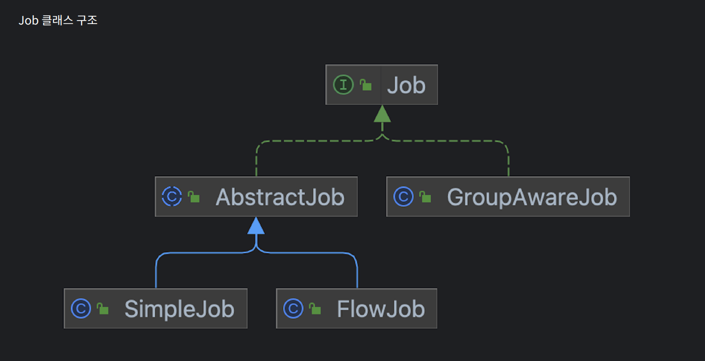
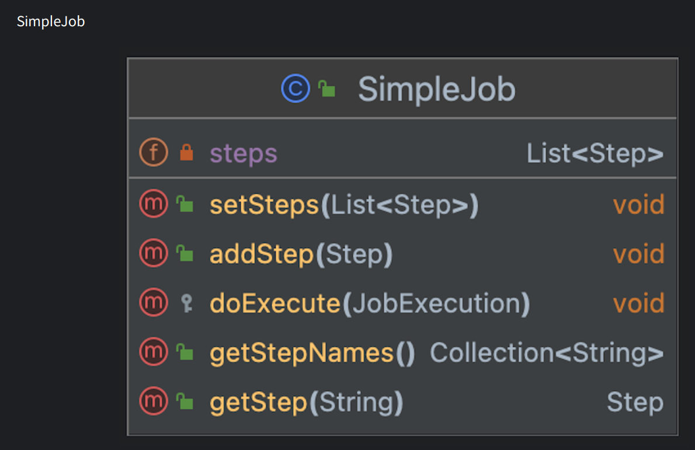
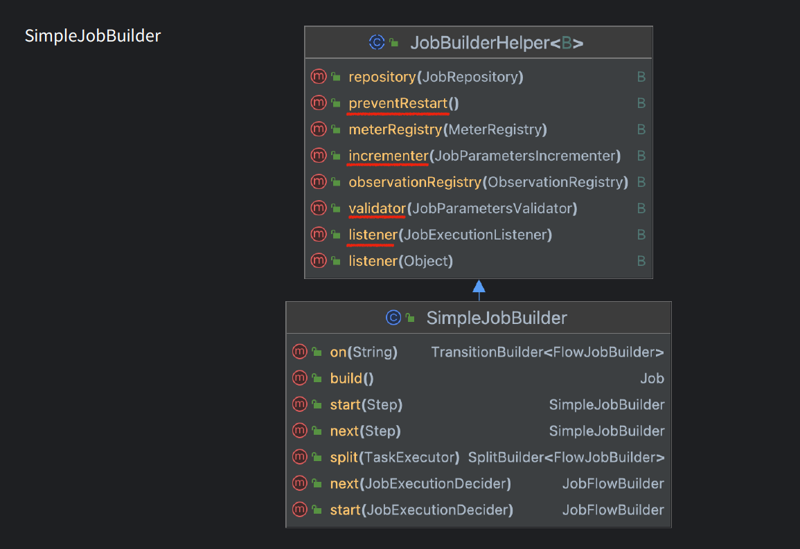
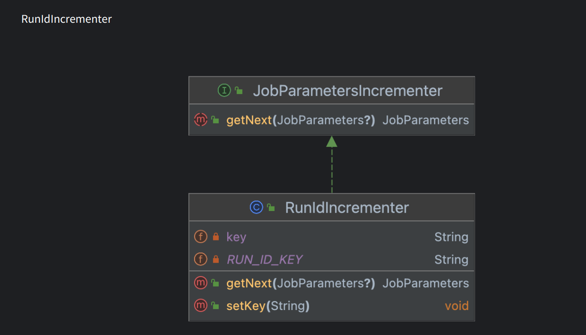
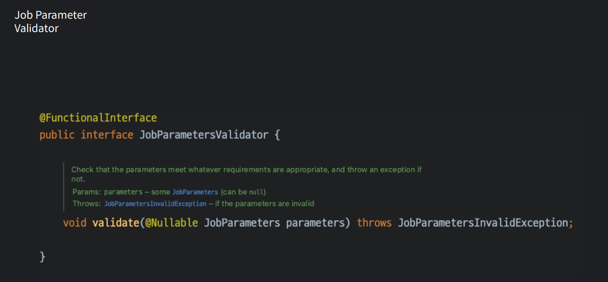
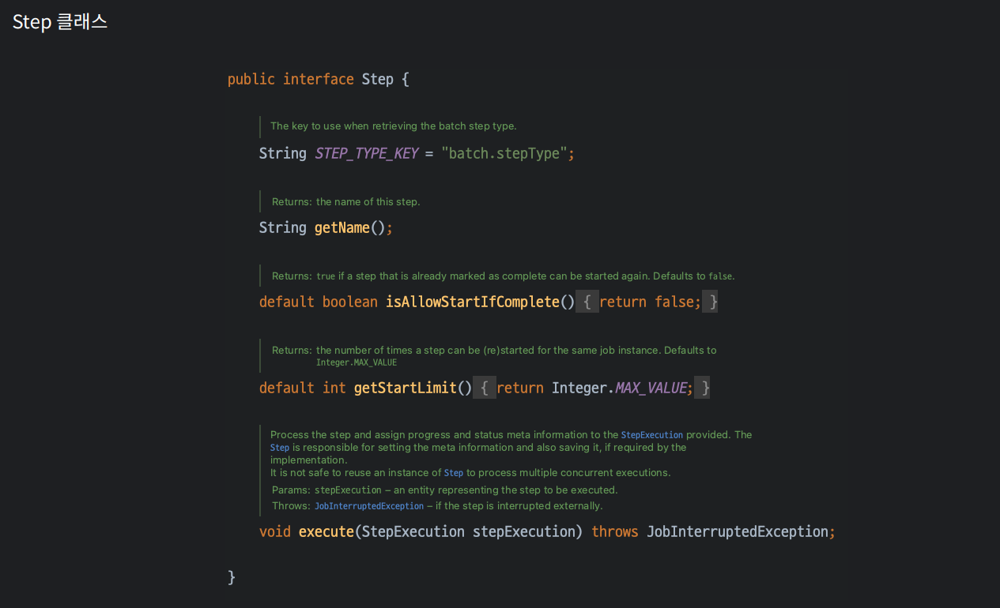
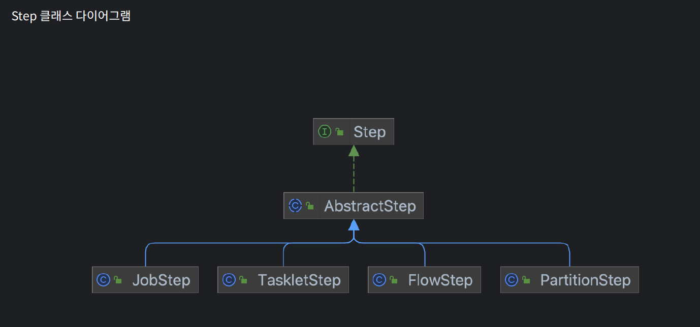
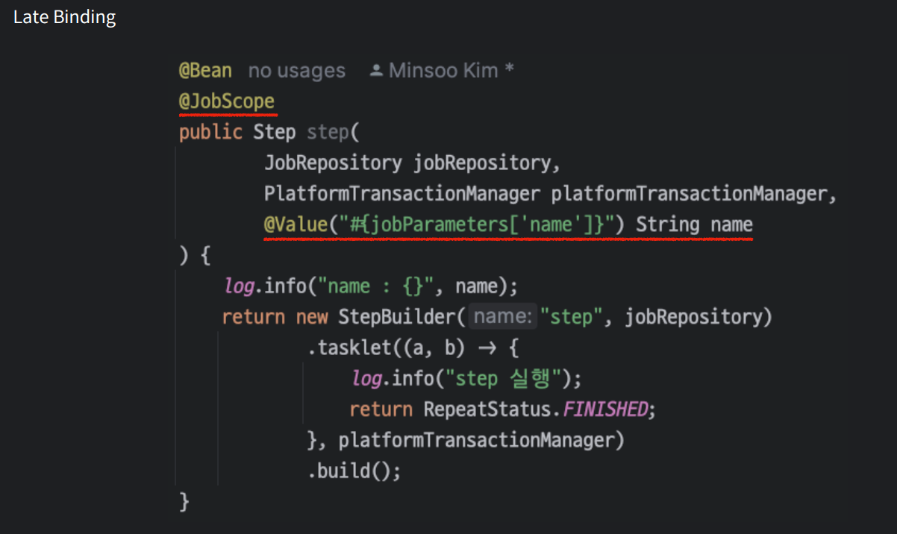

# Ch02. Spring Batch 적용
- [1-1. Spring Batch 도메인 용어 익히기](#ch02-01-01-spring-batch-도메인-용어-익히기)
- [1-2. Spring Batch 도메인 용어 익히기 - 적용](#ch02-01-02-spring-batch-도메인-용어-익히기---적용)
- [2. Job](#ch02-02-job)
- [3-1. Step](#ch02-03-01-step)
- [3-2. Step-기본적용](#ch02-03-02-step---기본적용)
- [3-3. Step - flow](#ch02-03-03-step---flow-적용)
- [4-1. ItemReader](#ch02-04-01-itemreader)
- [4-2. ItemReader - File](#ch02-04-02-itemreader---file)
- [4-3. ItemReader - Database](#ch02-04-03-itemreader---database)
- [5-1. ItemWriter](#ch02-05-01-itemwriter)
- [5-2. ItemWriter - 적용](#ch02-05-02-itemwriter---적용)
- [6. ItemProcessor](#ch02-06-itemprocessor)
- [7-1. 확장을 통한 성능 개선](#ch02-07-01-확장을-통한-성능-개선)
- [7-2. 확장 - MultiThread, Parallel](#ch02-07-02-확장을-통한-성능-개선---multi-threaded-parallel)
- [7-3. 확장 - Partitioning](#ch02-07-03-확장을-통한-성능-개선---partitioning)


---------------------------------------------------------------------------------------------------------------------------
# Ch02-01-01. Spring Batch 도메인 용어 익히기
## 배치 도메인
- Job
- JobInstance
- JobParameter
- JobExecution
- Step
- StepExecution
- ExecutionContext
- JobLauncher
- ItemReader/Processor/Writer
### Job
- `전체 배치 프로세스를 캡슐화한 도메인`
- 단순히 Step 인스턴스를 위한 컨테이너
- Job의 구성
> - Job의 이름
> - Step 정의 및 순서
> - 작업을 다시 시작할 수 있는지 여부
### JobInstance
- Job의 `논리적 실행 단위`를 나타내는 도메인
- 하나의 Job이 여러개의 JobInstance를 가짐
- 구성요소
> - Job 이름
> - 식별 파라미터
- BATCH_JOB_INSTANCE 테이블에 저장
### JobParameters
- `Job을 실행할때 함께 사용되는 파라미터 도메인`
- 하나의 Job에 존재할 수 있는 여러개의 JobInstance를 구분
- BATCH_JOB_EXECUTION_PARAMS 저장
### JobExeuction
- `Job의 단일 실행에 대한 도메인`
- Job 실행중에 실제로 일어난 일에 대한 기본 저장 메커니즘
- BATCH_JOB_EXECUTION 저장
### Step
- 배치 작업의 독립적이고, 순차적인 단계를 캡슐화한 도메인
- 하나의 Job은 한 개 이상의 Step을 가짐
### StepExecution
- Step의 단일 실행에 대한 도메인
- BATCH_STEP_EXECUTION
### ExecutionContext
- `Batch의 세션 역할을 하는 도메인`
- Job, Step의 상태를 가진다
- Key-Value 구조
- BATCH_JOB_EXECUTION_CONTEXT, STEP_JOB_EXECUTION_CONTEXT 저장
### JobRepsitory
- Job 저장소 도메인
- 배치의 상태를 DB에 저장함으로써 다양한 기능에 활용할 수 있음
### JobLauncher
- Job을 실행 시키는 도메인
### ItemReader/Processor/Writer


---------------------------------------------------------------------------------------------------------------------------
# Ch02-01-02. Spring Batch 도메인 용어 익히기 - 적용
## 실습 - batch-campus
1. Spring Batch 이용해서 Job 구현 (Step)
> - Step, PlatformTransactionManager를 이용해 Job 구현
> - Run Parameter 이용해 재실행(Mysql) Job: Key 변경 확인
> - Error 발생시켜 확인
- com.fastcampus.batchcampus
- build.gradle
```gradle
dependencies {
	implementation 'org.springframework.boot:spring-boot-starter-batch'
	implementation 'org.springframework.boot:spring-boot-starter-data-jpa'
	compileOnly 'org.projectlombok:lombok'
	runtimeOnly 'com.h2database:h2'
	runtimeOnly 'com.mysql:mysql-connector-j'
	annotationProcessor 'org.projectlombok:lombok'
	testImplementation 'org.springframework.boot:spring-boot-starter-test'
	testImplementation 'org.springframework.batch:spring-batch-test'
}
```
> `spring-boot-starter-batch`, data-jpa, lombok, h2, mysql
- application.yaml
```yaml
spring:
  batch:
    jdbc:
      initialize-schema: always
  datasource:
    driver-class-name: com.mysql.cj.jdbc.Driver
#    url: jdbc:mysql://localhost:3306/spring_batch
    url: jdbc:mysql://localhost:3306/spring_batch?userSSL=false&useUnicode=true&PublicKeyRetrieval=true
    username: root
    password: root1234!!
```
> `spring.batch.initialize-schema`: always  
> spring.datasource
- `JobConfiguration`
```java
@Slf4j
@Configuration
public class JobConfiguration {

    @Bean
    public Job job(JobRepository jobRepository, Step step) {
        return new JobBuilder("job", jobRepository)
                .start(step)
                .build();
    }

    @Bean
    public Step step(JobRepository jobRepository, PlatformTransactionManager platformTransactionManager) {
        return new StepBuilder("step", jobRepository)
                .tasklet((a, b) -> {
                    log.info("step 실패");
//                    throw new IllegalStateException("상태가 잘못되었습니다.");
                    return RepeatStatus.FINISHED;
                }, platformTransactionManager)
                .build();
    }
}
```
> `@Bean Job, Step: JobBuilder, StepBuilder`
- cf, @AutoConfiguration BatchAutoConfiguration
> @Bean JobLauncherApplicationRunner, DataSourceInitializerConfiguration, SpringBootBatchConfiguration  
> Job 실행, Database Schema, jobRepository


---------------------------------------------------------------------------------------------------------------------------
# Ch02-02. Job
## Job 이란?
- 전체 배치 프로세스를 캡슐화한 도메인
- 단순히 Step 인스턴스를 위한 컨테이너
- Job의 구성
> - Job의 이름
> - Step 정의 및 순서
> - 작업을 다시 시작할 수 있는지 여부
```java
public interface Job {

	String getName();

	/**
	 * Flag to indicate if this job can be restarted, at least in principle.
	 * @return true if this job can be restarted after a failure. Defaults to
	 * {@code true}.
	 */
	default boolean isRestartable() {
		return true;
	}

	/**
	 * Run the {@link JobExecution} and update the meta information, such as status and
	 * statistics, as necessary. This method should not throw any exceptions for failed
	 * execution. Clients should be careful to inspect the {@link JobExecution} status to
	 * determine success or failure.
	 * @param execution a {@link JobExecution}
	 */
	void execute(JobExecution execution);

	@Nullable
	default JobParametersIncrementer getJobParametersIncrementer() {
		return null;
	}

	default JobParametersValidator getJobParametersValidator() {
		return new DefaultJobParametersValidator();
	}

}
```
> isRestartable, execute
### Job 클래스 구조
- Job > AbstractJob / GroupWareJob
> 
> > `Template Method 패턴`
- SimpleJob
> 
### SimpleJobBuilder 
> 
> > `extends JobBuilderHelper<SimpleJobBuilder>`  
> > `abstract class JobBuilderHelper<B extends JobBuilderHelper<B>>`
### Restartability
- Default 설정으론 Job은 실패하면 재시작할 수 있음
- SimpleJobBuilder#preventRestart 를 설정하면 재시작할 수 없음
- 비지니스 성격상 판단에 맡김
### JobParametersIncrementer
- 시퀀스에서 다음 JobParameters 객체를 얻기 위한 인터페이스
- 주로 잡 파라미터의 변경없이 Job을 반복해서 실행하기 위해 사용
> 
> > RunIdIncrementer
### JobParametersValidator
- 입력 받은 잡 파라미터 검증
> 
> > DefaultJobParameterValidator
### JobExecutionListener
- 스프링 배치 생명주기 중 Job 실행 전/후 로직을 추가할 수 있는 기능 제공
- 주의
> jobExecution.getStatus() == BatchStatus.COMPLETED/FAILED 두 가지 다 정의해야 함


---------------------------------------------------------------------------------------------------------------------------
# Ch02-03-01. Step
## Step 이란?
- 배치 작업의 독립적이고, 순차적인 단계를 캡슐화한 도메인
> 
## Step 클래스 다이어그램
- Step
> 
## Tasklet, Chunk-oriented
```java
new StepBuilder("step2", jobRepository)
  .chunk(10, transactionManager)
```
### Tasklet 단점
> 처리해야할 개수는 많은데 하나씩 커밋
## Chunk-oriented Processing
- Spring Batch는 일반적으로 `Chunk-oriented` 스타일을 사용
- 읽은 항목의 수가 커밋 간격과 같으면 ItemWriter 가 전체 청크를 기록한 다음 트랜잭션을 커밋함
- (I)Tasklet > `ChunkOrientedTasklet`
## Commit Interval
- ChunkSize는 커밋 간격을 의미
> new StepBuilder(~).chunk(chunSize: Int, transactionManager)
> > 성능적 이점, Chunk 내에서 롤백
## Step Restart
- allowStartIfComplete: Step이 성공해도 재시작 허용
- startLimit: Step 시작 제한수
> new StepBuilder(~).allowStartIfComplete(true).startLimit(3)
## Skip
- 한 번의 실패가 Job, Step을 멈추게함
> .falutTolerant().skipLimit(10).skip(ClassCastException.class)  
>   .noSkip(IllegalStateException.class)
### SkipPolicy
- @FunctionalInterface boolean shouldSkip(Throwable t, long skipCount)
## Retry
- 특정 에러의 경우 다시 시도하면 성공하는 케이스가 있을 경우, 재시도함으로써 회복탄력성을 가짐
> .retry(~Exception.class)
### RetryPolicy
> 이미 많은 구현체 ex) CircuitBreakerRetryPolicy
## Rollback
- 롤백 유무 구성
> noRollback(~Exception.class)
## Intercepting Step
- Step은 다양한 Listener를 제공
> StepExecutionListener/ ChunkListener/ SkipListener/ ItemReaderListener / ...
## Late Binding
- 어플리케이션 구동 시점이 아닌 빈의 실행 시점에 적용
- 병렬 처리 시 개별의 Scope 빈이 할당되기에 Thread-safe
- 주로 잡파라미터 사용할때 이용
> @JobScope: Step  
> @StepScope: Tasklet, Item 3총사
> > 

## Sequential Flow / Conditional Flow
```
new JobBuilder(~)
  .start(step1)
    .on(*).to(step2)
  .from(step1)
    .on("FAILED").to(step3)
```
### Flow 속성
> on(String): ExitStatus의 반환물과 match  
> to(Step): on 조건에 만족하면 Step으로 이동  
> from: 이전에 등록한 단계로 돌아가서 새 경로를 시작
### Flow Stop
- Completed/ Failed/ Stopped
```
new JobBuilder(~)
  .start(step1)
    .on(*).to(step2)
  .from(step1)
    .on("FAILED").end()/.fail().stopAndRestart(step2)
```
> completed/fail/restart


---------------------------------------------------------------------------------------------------------------------------
# Ch02-03-02. Step - 기본적용
- code1: Tasklet, allowStartIfComplete/startLimit
```java
@Slf4j
@Configuration
public class JobConfiguration {
    
  @Bean
  public Job job(JobRepository jobRepository, Step step) {
    return new JobBuilder("job-chunk", jobRepository)
      .start(step)
      .build();
  }
  
  // allowStartIfComplete
  @Bean
  public Step step(JobRepository jobRepository, PlatformTransactionManager platformTransactionManager) {
    return new StepBuilder("step", jobRepository)
      .tasklet((StepContribution contribution, ChunkContext chunkContext) -> {
        log.info("step 실행");
        return RepeatStatus.FINISHED;
      }, platformTransactionManager)
      .allowStartIfComplete(true)
      .startLimit(5)
      .build();
  }
}
```
> 기본 Step  
> allowStartIfComplete, startLimit: default = 0  
> 5번까지 성공했어도 재실행 허용
- code2 - skip,skipLimit/ noRollback/ retry,retryLimit
```java
@Slf4j
@Configuration
public class JobConfiguration {

  @Bean
  public Job job(JobRepository jobRepository, Step step) {
    return new JobBuilder("job-chunk", jobRepository)
      .start(step)
      .build();
  }

  @Bean
  public Step step(JobRepository jobRepository, PlatformTransactionManager platformTransactionManager) {

    ItemReader<Integer> itemReader = new ItemReader<>() {
      private int count = 0;

      @Override
      public Integer read() {
        count++;
        log.info("Read {}", count);
        if (count == 20)
          return null;
//                if (count >= 15)
//                    throw new IllegalStateException("예외가 발생했어요.");
        return count;
      }
    };

    ItemProcessor<Integer, Integer> itemProcessor = new ItemProcessor<>() {
      @Override
      public Integer process(Integer item) throws Exception {
        if (item == 15) {
          throw new IllegalStateException();
        }
        return item;
      }
    };

    return new StepBuilder("step", jobRepository)
//                .tasklet(tasklet, platformTransactionManager)
      .<Integer, Integer>chunk(10, platformTransactionManager)
      .reader(itemReader)
      .processor(itemProcessor)
      .writer(read -> {})
      .faultTolerant()
//                .skip(IllegalStateException.class)
//                .skipLimit(5)
//                .skipPolicy((t, skipCount) -> t instanceof IllegalStateException && skipCount < 5)
//                .noRollback(IllegalStateException.class)
      .retry(IllegalStateException.class)
      .retryLimit(5)
      .build();
  }
}
```
> faultTolerant()/.skip(.class), skipLimit(count)/ .skipPolicy(t, skipCount)/ noRollback(.class)/ retry(.class), retrylimit(count)
- code3 - `@JobScope`, `@Value(<SPEL>)`
```java
@Slf4j
@Configuration
public class JobConfiguration {

  @Bean
  public Job job(JobRepository jobRepository, Step step) {
    return new JobBuilder("job-chunk", jobRepository)
      .start(step)
      .build();
  }

  @Bean
  @JobScope
  public Step step(JobRepository jobRepository,
      PlatformTransactionManager platformTransactionManager,
      @Value("#{jobParameters['name']}") String name
    ) {
      log.info("name: {}", name);
      return new StepBuilder("step", jobRepository)
        .tasklet((a, b) -> {
          return RepeatStatus.FINISHED;
        }, platformTransactionManager)
        .build();
  }
}
```
> @JobScope, @StepScope > ItemReader 등


---------------------------------------------------------------------------------------------------------------------------
# Ch02-03-03. Step - Flow 적용
## Flow 속성
- on(String): ExitStatus의 반환물과 Match
> - '*'
> - '?'
- to(step): on 조건에 만족하면 해당 step 이동
- from(step): 이전에 등록한 단계로 돌아가서 `새 경로를 시작`
## Flow Stop
- COMPLETE, FAILED, STOPPED

## 실습
- Code
```java
@Configuration
public class FlowConfiguration {

  @Bean
  public Job flowJob(
    JobRepository jobRepository,
    Step step1,
    Step step2,
    Step step3
  ) {
      /*return new JobBuilder("flowJob", jobRepository)
              .start(step1)
//                    .on("*").to(step2)
//                .from(step1)
//                    .on("FAILED").to(step3)
//                    .on("FAILED").end()
//                    .on("FAILED").fail()
              .end()
              .build();*/
    return new JobBuilder("flowJob", jobRepository)
      .start(step1)
        .on("COMPLETED").stopAndRestart(step2)
      .end()
      .build();
  }

  @Bean
  public Step step1(JobRepository jobRepository, PlatformTransactionManager platformTransactionManager) {
    return new StepBuilder("step1", jobRepository)
      .tasklet((a, b) -> {
        log.info("step1 실행");
        // if(1 == 1) throw new IllegalStateException("fail");
        return null;
      }, platformTransactionManager)
      .build();
  }

  @Bean
  public Step step2(JobRepository jobRepository, PlatformTransactionManager platformTransactionManager) {
      return new StepBuilder("step2", jobRepository)
        .tasklet((a, b) -> {
          log.info("step2 실행");
          return null;
        }, platformTransactionManager)
        .build();
  }

  @Bean
  public Step step3(JobRepository jobRepository, PlatformTransactionManager platformTransactionManager) {
      return new StepBuilder("step3", jobRepository)
        .tasklet((a, b) -> {
          log.info("step3 실행");
          return null;
        }, platformTransactionManager)
        .build();
  }
}
```
> organize
```
new JobBuilder("flowJob", jobRepository)
  .start(step)
    .on(pattern:String).to(step2)
  .from(step)
    .on(pattern:String).to(step3)/end()/fail()

- .from().on("FAILED").to(step3) 
> 실패의 경우 step3 를 실행
> jobExe: COMPLETED
> Step: step1: ABANDONED, step3: COMPLETED

- .from().on("FAILED").fail()
> jobExe: FAILED, Step: FAILED

- .from().on("FAILED").end()
> jobExe: COMPLETED, Step: FAILED
> > end(), fail()은 jobExecution 상태값

- .start(step1)
    .on("COMPLETED").stopAndRestart(step2)
> run 1 : 
> > JobExe: STOPPED, Step1: COMPLETED
> run2 :
> > JobExe: COMPLTED, Step1: COMPLETED Step2: COMPLETED
```

---------------------------------------------------------------------------------------------------------------------------
# Ch02-04-01. ItemReader
## Item 3총사
## ItemReader
## ItemReaderInterface
```java
@FunctionalInterface
public interface ItemReader<T> {

	/**
	 * Reads a piece of input data and advance to the next one. Implementations
	 * <strong>must</strong> return <code>null</code> at the end of the input data set. In
	 * a transactional setting, caller might get the same item twice from successive calls
	 * (or otherwise), if the first call was in a transaction that rolled back.
	 * @throws ParseException if there is a problem parsing the current record (but the
	 * next one may still be valid)
	 * @throws NonTransientResourceException if there is a fatal exception in the
	 * underlying resource. After throwing this exception implementations should endeavour
	 * to return null from subsequent calls to read.
	 * @throws UnexpectedInputException if there is an uncategorised problem with the
	 * input data. Assume potentially transient, so subsequent calls to read might
	 * succeed.
	 * @throws Exception if an there is a non-specific error.
	 * @return T the item to be processed or {@code null} if the data source is exhausted
	 */
	@Nullable
	T read() throws Exception, UnexpectedInputException, ParseException, NonTransientResourceException;

}
```
> return null 일 경우 정상 process
## 입력받기
- File
- Database
- HTTP API
- Message Queue
- ETC
## `Flat File`
1. 파일을 연다
2. 내용은 세번째 줄부터 읽어나간다
3. ','로 데이터를 구분해서 객체에 매핑한다.
### `FlatFileItemReader`
- example Code
```java
@Bean
public FlatFileItemReader<User> flatFileItemReader() {
    return new FlatFileItemReaderBuilder<User>()
            .name("flatFileItemReader")
            .resource(new ClassPathResource("users.txt"))
            .linesToSkip(2)
            .delimited().delimiter("|") // default ','
            .names("name", "age", "region", "telephone")
            .targetType(User.class)
            .strict(true) // default: true, false > 읽지안고 정상적으로 종료
            .build();
}

// 옛날 방식이지만 종종 사용됨
@Bean
public FlatFileItemReader<User> fixedLengthFlatFileItemReader() {
    return new FlatFileItemReaderBuilder<User>()
            .name("fixedLengthFlatFileItemReader")
            .resource(new ClassPathResource("usersFixedLength.txt"))
            .linesToSkip(2)
            .fixedLength()
            .columns(new Range[]{new Range(1,2), new Range(3,4), new Range(5,6), new Range(7,19)})
            .names("name", "age", "region", "telephone")
            .targetType(User.class)
            .strict(true) // default: true, false > 읽지안고 정상적으로 종료
            .build();
}

//users.txt
이름,나이,지역,전화번호

민수,20,서울,010-1111-1111
민주,10,부산,010-2222-2222
민우,30,경기,010-3333-3333
민욱,40,대구,010-4444-4444
민구,50,강릉,010-5555-5555
```
- LineMapper<T>
> LineTokenizer, FieldSetMapper<T>
#### FlatItemReader 속성
```
property    Type        Des
comments    String[]    주석
encoding    String
lineMapper  LineMapper  라인 Mapping Class
linesToSkip int         처음 몇번째 Skip
recordSeparatorPolicy RecordSeparatorPolicy record 구분자 default ','
resource  Resource
skippedLinesCallback  LineCallbackHandler
strict  boolean
```
## JSON File
### JsomItemReader
- example Code
```java
@Bean
public ItemReader<User> jsonItemReader() {
    return new JsonItemReaderBuilder<User>()
            .name("jsonItemReader")
            .resource(new ClassPathResource("users.json"))
            .jsonObjectReader(new JacksonJsonObjectReader<>(User.class))
            .build();
}

// user.json
[
  {
    "name": "민수",
    "age": 20,
    "region": "서울",
    "telephone": "010-1111-2222"
  },
  {
    "name": "민주",
    "age": 10,
    "region": "강릉",
    "telephone": "010-2222-2222"
  },
  {
    "name": "민우",
    "age": 30,
    "region": "제주도",
    "telephone": "010-3333-3333"
  }
]
```
> JsomItemReaderBuilder
### JSONObjectReader<T>
> `JacksonJsonObjectReader<T>`, `GsonJsonObjectReader<T>`

## 데이터베이스 읽기
- Paging
> - `JpaPagingItemReader`
> - JdbcPagingItemReader
- Cursor
> - `JpaCursorItemReader`
> - JdbcCursorItemReader/ StoredProcedureItemReader
> > (단점) Connection을 물고 있음
### JpaPagingItemReader
- `JpaPagingItemReaderBuilder<T>`
- example Code
```java
@Bean
public ItemReader<User> jpaPagingItemReader(
  EntityManagerFactory entityManagerFactory
){
  return new JpaPagingItemReaderbuilder<User>()
    .name("jpaPagingItemReader")
    .entityManagerFactory(entityManagerFactory)
    .pageSize(3)
    .quertyString("SELECT u FROM User u Order by u.ud")
    .build()
}
```
- JpaPagingItemreaderBuilder 속성들
### JpaCursorItemReader
- pageSize가 없다
- JpaCursorItemReaderBuilder
- example Code
```java
@Bean
  public ItemReader<User> jpaCursorItemReader(
        EntityManagerFactory entityManagerFactory
  ) {
    return new JpaCursorItemReaderBuilder<User>()
          .name("jpaCursorItemReader")
          .entityManagerFactory(entityManagerFactory)
          .queryString("SELECT u From User u Order By u.id")
          .build();
  }
```


# Ch02-04-02. ItemReader - File
- build.gradle
> implementation 'com.fasterxml.jackson.core:jackson-databind:2.15.2'  
> ObjectMapper
- Code
```java
@Configuration
public class ItemReaderJobConfiguration {

    @Bean
    public Job job(
            JobRepository jobRepository,
            Step step
    ) {
        return new JobBuilder("itemReaderJob", jobRepository)
                .incrementer(new RunIdIncrementer())
                .start(step)
                .build();
    }

    @Bean
    public Step step(
            JobRepository jobRepository,
            PlatformTransactionManager platformTransactionManager,
//            ItemReader<User> flatFileItemReader
//            ItemReader<User> fixedLengthFlatFileItemReader
            ItemReader<User> jsonItemReader
    ) {
        return new StepBuilder("step", jobRepository)
                .<User, User>chunk(2, platformTransactionManager)
//                .reader(flatFileItemReader)
//                .reader(fixedLengthFlatFileItemReader)
                .reader(jsonItemReader)
                .writer(System.out::println)
                .build();
    }

    @Bean
    public FlatFileItemReader<User> flatFileItemReader() {
        return new FlatFileItemReaderBuilder<User>()
                .name("flatFileItemReader")
                .resource(new ClassPathResource("users.txt"))
                .linesToSkip(2)
                .delimited().delimiter("|") // default ','
                .names("name", "age", "region", "telephone")
                .targetType(User.class)
                .strict(true) // default: true, false > 읽지안고 정상적으로 종료
                .build();
    }

    // 옛날 방식이지만 종종 사용됨
    @Bean
    public FlatFileItemReader<User> fixedLengthFlatFileItemReader() {
        return new FlatFileItemReaderBuilder<User>()
                .name("fixedLengthFlatFileItemReader")
                .resource(new ClassPathResource("usersFixedLength.txt"))
                .linesToSkip(2)
                .fixedLength()
                .columns(new Range[]{new Range(1,2), new Range(3,4), new Range(5,6), new Range(7,19)})
                .names("name", "age", "region", "telephone")
                .targetType(User.class)
                .strict(true) // default: true, false > 읽지안고 정상적으로 종료
                .build();
    }

    @Bean
    public ItemReader<User> jsonItemReader() {
        return new JsonItemReaderBuilder<User>()
                .name("jsonItemReader")
                .resource(new ClassPathResource("users.json"))
                .jsonObjectReader(new JacksonJsonObjectReader<>(User.class))
                .build();
    }
}

@Data
public class User {
    @Id
    @GeneratedValue(strategy = GenerationType.IDENTITY)
    private Long id;

    private String name;
    private String age;
    private String region;
    private String telephone;
}

```
- File: FlatFileItemReder > FlatFileItemReaderBuilder
> name, resource(new ClassPathResource("useres.txt")), linesToSkip(int)  
> delimited().delimiter(","), names(String... field)  
> or fixedLength(), columns(new Ragne[]{ ~ })  
> targetType(~.class), strict(true): false 경우 읽지않고 정상진행
- Json File: JsonItemReader > JsonItemReaderBuilder
> name(), resource(), .jsonObjectReader(new JacksonJsonObjectReader<>(~.class)/Gson~).build()


---------------------------------------------------------------------------------------------------------------------------
# Ch02-04-03. ItemReader - Database
- Code
```java
@Configuration
public class ItemReaderJobConfiguration {

    @Bean
    public Job job(
            JobRepository jobRepository,
            Step step
    ) {
        return new JobBuilder("itemReaderJob", jobRepository)
                .incrementer(new RunIdIncrementer())
                .start(step)
                .build();
    }

    @Bean
    public Step step(
            JobRepository jobRepository,
            PlatformTransactionManager platformTransactionManager,
//            ItemReader<User> jpaPagingItemReader
            ItemReader<User> jpaCursorItemReader
    ) {
        return new StepBuilder("step", jobRepository)
                .<User, User>chunk(2, platformTransactionManager)
                .reader(jpaCursorItemReader)
                .writer(System.out::println)
                .build();
    }

    @Bean
    public ItemReader<User> jpaPagingItemReader(
            EntityManagerFactory entityManagerFactory
    ) {
        return new JpaPagingItemReaderBuilder<User>()
                .name("jpaPagingItemReader")
                .entityManagerFactory(entityManagerFactory)
                .pageSize(3)
                .queryString("SELECT u From User u Order By u.id")
                .build();
    }

    @Bean
    public ItemReader<User> jpaCursorItemReader(
            EntityManagerFactory entityManagerFactory
    ) {
        return new JpaCursorItemReaderBuilder<User>()
                .name("jpaCursorItemReader")
                .entityManagerFactory(entityManagerFactory)
                .queryString("SELECT u From User u Order By u.id")
                .build();
    }
}

@Data
@NoArgsConstructor
@Entity
@Table(name = "user")
public class User {
    @Id
    @GeneratedValue(strategy = GenerationType.IDENTITY)
    private Long id;

    private String name;
    private String age;
    private String region;
    private String telephone;
}
```
- Database: JpaPagingItemReader, JpaCursorItemReader
> JpaPaging/CursorItemReaderBuilder, JpaCursorItemReaderBuilder  
> name(), entityManagerFactory(), queryString(), build()


---------------------------------------------------------------------------------------------------------------------------
# Ch02-05-01. ItemWriter
- ItemWriter
```java
@FunctionalInterface
public interface ItemWriter<T> {

	/**
	 * Process the supplied data element. Will not be called with any null items in normal
	 * operation.
	 * @param chunk of items to be written. Must not be {@code null}.
	 * @throws Exception if there are errors. The framework will catch the exception and
	 * convert or rethrow it as appropriate.
	 */
	void write(@NonNull Chunk<? extends T> chunk) throws Exception;

}
```
## 출력하기
- File(Flat, JSON, XML)
- Database
- HTTP API
- Mesage Queue
- ETC
### FlatFileItemWriter
- example Code
```java
@Bean
public ItemWriter<User> flatFileItemWriter() {
  return new FlatFileItemWriterBuilder<User>()
    .name("flatFileItemWriter")
    .resource(new PathResource("src/main/resources/new_user.txt"))
    .delimited().delimiter("|")
    .names("name", "age", "region", "telephone")
    .build()
}

@Bean
public JsonFileItemWriter<User> jsonFileItemWriter() {
  return new JsonFileItemWriterBuilder<User>()
    .name("jsonFileItemWriter")
    .resource(new PathResource("src/main/resources/new_user.txt"))
    .jsonObjectMarshaller(new JacksonJsonObjectMarshaller<>())
    .build
}
```
> `FlatFileItemWriterBuilder<T>, JsonFileItemWriter<T>`  
> JsonFileItemWriter .jsonObjectMArshaller(new JacksonJsonObjectMarshaller)
#### FlatFileItemWriterBuilder
- lineAggregator(LineAggregator<T>): FlatFileItemWriterBuilder
- footerCallback
- shoudDeleteIfEmpty(boolean)
- ...
#### LineAggregator
객체를 받아 라인을 그림

### 데이터베이스 쓰기
- JpaItemWriter
> Jpa 이용  
> 한 건씩 insert, update
- JdbcBatchItemWriter
> 벌크 insert, update 제공(Sql을 plain 하게 사용)
- example Code
```java
@Bean
public JpaItemWriter<User> jpaItemWriter(EntityManagerFactory entityManagerFactory) {
  return new JpaItemWriterBuilder<User>()
        .entityManagerFactory(entityManagerFactory)
        .build();
}

@Bean
public JdbcBatchItemWriter<User> jdbcBatchItemWriter(DataSource dataSource) {
  return new JdbcBatchItemWriterBuilder<User>()
        .dataSource(dataSource)
        .sql("""
                INSERT INTO
                    USER(name, age, region, telephone)
                VALUES
                    (:name, :age, :region, :telephone)
                """)
        .beanMapped()
        .build();
}
```

---------------------------------------------------------------------------------------------------------------------------
# Ch02-05-02. ItemWriter - 적용
```java
@Configuration
public class ItemWriterJobConfiguration {
  @Bean
  public Job job(
        JobRepository jobRepository,
        Step step
  ) {
    return new JobBuilder("itemReaderJob", jobRepository)
          .incrementer(new RunIdIncrementer())
          .start(step)
          .build();
  }

  @Bean
  public Step step(
        JobRepository jobRepository,
        PlatformTransactionManager platformTransactionManager,
        ItemReader<User> flatFileItemReader,
        ItemWriter<User> jdbcBatchItemWriter
  ) {
    return new StepBuilder("step", jobRepository)
          .<User, User>chunk(2, platformTransactionManager)
          .reader(flatFileItemReader)
          .writer(jdbcBatchItemWriter)
          .build();
  }

  @Bean
  public FlatFileItemWriter<User> flatFileItemWriter() {
    return new FlatFileItemWriterBuilder<User>()
          .name("flatFileItemWriter")
          .resource(new PathResource("src/main/resources/new_users.txt"))
          .delimited().delimiter("__")
          .names("name", "age", "region", "telephone")
          .build();
  }

  @Bean
  public FlatFileItemWriter<User> formattedFlatFileItemWriter() {
    return new FlatFileItemWriterBuilder<User>()
          .name("formattedFlatFileItemWriter")
          .resource(new PathResource("src/main/resources/new_formatted_users.txt"))
          .formatted()
          .format("%s의 나이는 %s입니다. 사는곳은 %s, 전화번호는 %s 입니다")
          .names("name", "age", "region", "telephone")
//                .shouldDeleteIfExists(false)
//                .append(true)
//                .shouldDeleteIfEmpty(true)
          .build();
  }

  @Bean
  public JsonFileItemWriter<User> jsonFileItemWriter() {
    return new JsonFileItemWriterBuilder<User>()
          .name("jsonFileItemWriter")
          .resource(new PathResource("src/main/resources/new_users.json"))
          .jsonObjectMarshaller(new JacksonJsonObjectMarshaller<>())
          .build();
  }

  @Bean
  public JpaItemWriter<User> jpaItemWriter(EntityManagerFactory entityManagerFactory) {
    return new JpaItemWriterBuilder<User>()
          .entityManagerFactory(entityManagerFactory)
          .build();
  }

  @Bean
  public JdbcBatchItemWriter<User> jdbcBatchItemWriter(DataSource dataSource) {
    return new JdbcBatchItemWriterBuilder<User>()
          .dataSource(dataSource)
          .sql("""
                  INSERT INTO
                      USER(name, age, region, telephone)
                  VALUES
                      (:name, :age, :region, :telephone)
                  """)
          .beanMapped()
          .build();
  }

  @Bean
  public FlatFileItemReader<User> flatFileItemReader() {
    return new FlatFileItemReaderBuilder<User>()
          .name("flatFileItemReader")
          .resource(new ClassPathResource("users.txt"))
          .linesToSkip(2)
          .delimited().delimiter(",") // default ','
          .names("name", "age", "region", "telephone")
          .targetType(User.class)
          .strict(true) // default: true, false > 읽지안고 정상적으로 종료
          .build();
  }
}
```
> organize
```
# File
## FlatFileItemWriterBuilder<T>
.name(String... field), .resources(WritableResource)
> .deliemited().delimiter("__")
> .formatted().format(format: Str)
.build()

# Json
## JsonFileItemWriterBuilder<T>
.name().resource()
.jsonObjectMarshaller(JsonObjectMarshaller)
.build()

# DB
## JpaItemWriterBuilder<T>
  .entityManagerFactory(emf)
  .build()
## JdbcBatchItemWriterBuilder<T>
  .datasource
  .sql(""" 
    INSERT INTO t VALUES (:name)
    """)
  .beanMapped()
  .build()
```
> jsonObjectMarshaller, """ """ 향상된 String  
> Jpa는 1건씩 JdbcBatch는 벌크 DML


---------------------------------------------------------------------------------------------------------------------------
# Ch02-06. ItemProcessor
## ItemProcessor 주 기능
- 읽은 데이터를 쓰기 데이터로 가공(비지니스 로직)
- 필터링(null)
- 입력 유효성 검증
```java
@FunctionalInterface
public interface ItemProcessor<I, O> {

	/**
	 * Process the provided item, returning a potentially modified or new item for
	 * continued processing. If the returned result is {@code null}, it is assumed that
	 * processing of the item should not continue.
	 * <p>
	 * A {@code null} item will never reach this method because the only possible sources
	 * are:
	 * <ul>
	 * <li>an {@link ItemReader} (which indicates no more items)</li>
	 * <li>a previous {@link ItemProcessor} in a composite processor (which indicates a
	 * filtered item)</li>
	 * </ul>
	 * @param item to be processed, never {@code null}.
	 * @return potentially modified or new item for continued processing, {@code null} if
	 * processing of the provided item should not continue.
	 * @throws Exception thrown if exception occurs during processing.
	 */
	@Nullable
	O process(@NonNull I item) throws Exception;

}
```
## Bean Validation(JSR-303)
- NotEmpty, NotBlank
## 관심사가 다른 ItemProcessor - CompisiteItemProcessor<I,O>
```java
public class CompositeItemProcessor<I, O> implements ItemProcessor<I, O>, InitializingBean {

	private List<? extends ItemProcessor<?, ?>> delegates;
  
  public CompositeItemProcessor(ItemProcessor<?, ?>... delegates) {
		this(Arrays.asList(delegates));
	}
}
```

## code
```java
@Configuration
public class ItemProcessorJobConfiguration {
    @Bean
    public Job job(
            JobRepository jobRepository,
            Step step
    ) {
        return new JobBuilder("itemReaderJob", jobRepository)
                .incrementer(new RunIdIncrementer())
                .start(step)
                .build();
    }

    @Bean
    public Step step(
            JobRepository jobRepository,
            PlatformTransactionManager platformTransactionManager,
            ItemReader<User> flatFileItemReader
    ) {
        final List<ItemProcessor<User, User>> list = Arrays.asList(processor1(), processor2(), processor3());
        return new StepBuilder("step", jobRepository)
//                .<User, String>chunk(2, platformTransactionManager)
                .<User, User>chunk(2, platformTransactionManager)
                .reader(flatFileItemReader)
//                .processor(customProcessor())
                .processor(new CompositeItemProcessor<>(list))
                .writer(System.out::println)
                .build();
    }

    private static ItemProcessor<User, String> customProcessor() {
        return user -> {
            if (user.getName().equals("민수")) return null;

            return "%s의 나이는 %s입니다. 사는 곳은 %s, 전화번호는 %s 입니다".formatted(
                    user.getName(), user.getAge(), user.getRegion(), user.getTelephone()
            );
        };
    }

    private static ItemProcessor<User, User> processor1() {
        return user -> {
            user.setName(user.getName() + user.getName());
            return user;
        };
    }

    private static ItemProcessor<User, User> processor2() {
        return user -> {
            user.setAge(user.getAge() + user.getAge());
            return user;
        };
    }

    private static ItemProcessor<User, User> processor3() {
        return user -> {
            user.setRegion(user.getRegion() + user.getRegion());
            return user;
        };
    }

    @Bean
    public FlatFileItemReader<User> flatFileItemReader() {
        return new FlatFileItemReaderBuilder<User>()
                .name("flatFileItemReader")
                .resource(new ClassPathResource("users.txt"))
                .linesToSkip(2)
                .delimited().delimiter(",") // default ','
                .names("name", "age", "region", "telephone")
                .targetType(User.class)
                .strict(true) // default: true, false > 읽지안고 정상적으로 종료
                .build();
    }
}
```
> new StepBuilder().processor(itemProcessor)  
> new CompositeItemProcessor<>(itemProcessors)


---------------------------------------------------------------------------------------------------------------------------
# Ch02-07-01. 확장을 통한 성능 개선
## 확장
- Multi-threaded Step
- Parallel Steps
- Partitioning
- Remote Chunking(MQ)
## Multi-threaded Step
Step > Multi-threaded Step(Chunk, Chunk, Chunk) > Step
> 단, Race-Condition
### Thread-safe
- ItemReader 구현시 - impl is thread-safe
### Multi-threaded Step
```java
@Bean
public Step sampleStep(
  TaskExecutor taskExecutor,
  JobRepository jobRepository,
  PlatformTransactionManager transacitonManager
) {
  return new StepBuilder("sampleStep", jobRepository)
    .<String, String>chunk(10, transactionManager)
    .reader(itemReader())
    .writer(itemWriter())
    .taskExecutor(new SimpleAsyncTaskExecutor())
    .build()
}
```
> StepBuilder .taskExecutor(new SimpleAsyncTaskExecutor()) - ItemReader Race-condition 방지구현필요
> > !실패지점에서 재실행하는 것이 불가능


## Parallel Steps
Step1 > Step2, Step3>Step4 > Step5
> Step을 Parallel하게 실행
> > FlowStep을 사용해서 구현: FlowBuilder
```java
@Bean
public Job job(JobRepository, jobRepository, Step step4, Flow splitFlow) {
  return new JobBuilder("job", jobRepository)
    .start(splitFlow)
    .next(step4)
    .build()
    .build();
}

@Bean
public Flow splitFlow(Flow flow1, Flow2) {
  return new FlowBuilder<SimpleFlow>("splitFlow")
    .split(new SimpleAsyncTaskExecutor())
    .add(flow1, flow2)
    .build();
}
```


## Partitioning
Step - Manager(Worker, Worker, ...) - Step
> 재시작 지원
### Master Step
- Partitioner
- PartitionHandler
> Worker Step, WorkStep, ...
> > 구간별 파티셔닝
#### PartitionHandler
```java
@FunctionalInterface
public interface PartitionHandler {

	/**
	 * Main entry point for {@link PartitionHandler} interface. The splitter creates all
	 * the executions that need to be farmed out, along with their input parameters (in
	 * the form of their {@link ExecutionContext}). The manager step execution is used to
	 * identify the partition and group together the results logically.
	 * @param stepSplitter a strategy for generating a collection of {@link StepExecution}
	 * instances
	 * @param stepExecution the manager step execution for the whole partition
	 * @return a collection of completed {@link StepExecution} instances
	 * @throws Exception if anything goes wrong. This allows implementations to be liberal
	 * and rely on the caller to translate an exception into a step failure as necessary.
	 */
	Collection<StepExecution> handle(StepExecutionSplitter stepSplitter, StepExecution stepExecution) throws Exception;

}
```
> impl TaskExecutorPartitionHandler, MessageChannelPartitionHandler
#### Partitioner
```java
@FunctionalInterface
public interface Partitioner {

	/**
	 * Create a set of distinct {@link ExecutionContext} instances together with a unique
	 * identifier for each one. The identifiers should be short, mnemonic values, and only
	 * have to be unique within the return value (e.g. use an incrementer).
	 * @param gridSize the size of the map to return
	 * @return a map from identifier to input parameters
	 */
	Map<String, ExecutionContext> partition(int gridSize);

}
```
### code
```java
@Bean
public PartitionHandler partitionHandler() {
  TaskExecutorPartitionHandler partitionHandler = new TaskExecutorPartitionHandler();
  partitionHandler.setTaskExecutor(new SimpleAsyncTaskExecutor());
  partitionHandler.setStep(step());
  partitionHandler.setGridSize(10);
  return partitionHandler;
}

//Partitioner
@Override
public Map<String, ExecutionContext> partition(int gridSize) {
  Map<String, ExecutionContext> result = new HashMap<>();
  // ...

  return result;
}

@Bean
@StepScope
public JpaPagingItemReader<User> itemReader(
  @Value("#{stepExecutionContext[minValue]}") Long minValue,
  @Value("#{stepExecutionContext[maxValue]}") Long maxValue
) {
  Map<String, Object> params = new HashMap<>();
  params.put("minValue", minValue);
  params.put("maxValue", maxValue);

  return new JpaPagingItemReaderBuilder<User>()
    .name("itemReader")
    // .~
    .parameterValues(params)
    .build();
}
```
> @Bean PartitionHandler, Partitionner, @Bean ItemReaderBuilder.parameterValues(params)


---------------------------------------------------------------------------------------------------------------------------
# Ch02-07-02. 확장을 통한 성능 개선 - Multi-threaded, Parallel 
## MutliThread
### code
```java
@Slf4j
@Configuration
public class MultiThreadJobConfig {

    @Bean
    public Job job(
            JobRepository jobRepository,
            Step step
    ) {
        return new JobBuilder("multiThreadJob", jobRepository)
                .start(step)
                .incrementer(new RunIdIncrementer())
                .build();
    }

    @Bean
    public Step step(
            JobRepository jobRepository,
            PlatformTransactionManager platformTransactionManager,
            JpaPagingItemReader pagingItemReader
    ) {
        return new StepBuilder("step", jobRepository)
                .<User, User>chunk(5, platformTransactionManager)
                .reader(pagingItemReader)
                .writer(result -> log.info(result.toString()))
                .taskExecutor(new SimpleAsyncTaskExecutor())
                .build();
    }

    @Bean
    public JpaPagingItemReader<User> pagingItemReader(
            EntityManagerFactory entityManagerFactory
    ) {
        return new JpaPagingItemReaderBuilder<User>()
                .name("pagingItemReader")
                .entityManagerFactory(entityManagerFactory)
                .pageSize(2)
                .saveState(false) // 실패시 재시작 지점을 알 수 없기에 false 권장
                .queryString("SELECT u FROM User u ORDER BY u.id")
                .build();
    }
}
```
> StepBuilder . taskExecutor(new SimpleAsyncTaskExecutor)  
> JpaPagingItemReaderBuilder<>() .saveState(false) // 실패시 재시작 X


## ParallelStep
### Code
```java
@Slf4j
@Configuration
public class ParallelStepJobConfig {

    /*
    flow1(step1, step2)
                            > step4
    flow2(step3)
     */
    @Bean
    public Job job(
            JobRepository jobRepository,
            Step step4,
            Flow splitFlow
    ) {
        return new JobBuilder("job", jobRepository)
                .start(splitFlow)
                .next(step4)
                .build()
                .build();
    }

    @Bean
    public Flow splitFlow(Flow flow1, Flow flow2) {
        return new FlowBuilder<SimpleFlow>("splitFlow")
                .split(new SimpleAsyncTaskExecutor())
                .add(flow1, flow2)
                .build();
    }

    @Bean
    public Flow flow1(Step step1, Step step2) {
        return new FlowBuilder<SimpleFlow>("flow1")
                .start(step1)
                .next(step2)
                .build();
    }

    @Bean
    public Flow flow2(Step step3) {
        return new FlowBuilder<SimpleFlow>("flow2")
                .start(step3)
                .build();
    }

    @Bean
    public Step step1(JobRepository jobRepository, PlatformTransactionManager transactionManager) {
        return new StepBuilder("step1", jobRepository)
                .tasklet((a, b) -> {
                    Thread.sleep(500);
                    log.info("step1");
                    return RepeatStatus.FINISHED;
                }, transactionManager)
                .build();
    }
    // step2~4
}
```
> JobBuilder .start(splitFlow) .next(step4)  
> FlowBuilder<SimpleFlow>(name) .split(new SimpleAsyncTaskExecutor()) .add(flow...)  
> StepBuilder
> > add 부분이 병렬 실행!


---------------------------------------------------------------------------------------------------------------------------
# Ch02-07-03. 확장을 통한 성능 개선 - Partitioning
## Code
```java
@Slf4j
@Configuration
public class PartitionJobConfiguration {

    // 하나의 Step 을 각 WorkerStep
    @Bean
    public Job job(
            JobRepository jobRepository,
            Step managerStep
    ) {
        return new JobBuilder("partitionJob", jobRepository)
                .start(managerStep)
                .incrementer(new RunIdIncrementer())
                .build();
    }

    @Bean
    public Step managerStep(
            JobRepository jobRepository,
            Step step,
            PartitionHandler partitionHandler,
            DataSource dataSource
    ) {
        return new StepBuilder("managerStep", jobRepository)
                .partitioner("delegateStep", new ColumnRangePartitioner(dataSource))
                .step(step)
                .partitionHandler(partitionHandler)
                .build();
    }

    @Bean
    public PartitionHandler partitionHandler(Step step) {
        final TaskExecutorPartitionHandler taskExecutorPartitionHandler = new TaskExecutorPartitionHandler();
        taskExecutorPartitionHandler.setStep(step);
        taskExecutorPartitionHandler.setTaskExecutor(new SimpleAsyncTaskExecutor());
        taskExecutorPartitionHandler.setGridSize(3);
        return taskExecutorPartitionHandler;
    }

    @Bean
    public Step step(
            JobRepository jobRepository,
            JpaPagingItemReader<User> jpaPagingItemReader,
            PlatformTransactionManager transactionManager
    ) {
        return new StepBuilder("step", jobRepository)
                .<User, User>chunk(2, transactionManager)
                .reader(jpaPagingItemReader)
                .writer(result -> log.info(result.toString()))
                .build();
    }

    @Bean
    @StepScope
    public JpaPagingItemReader<User> jpaPagingItemReader(
            @Value("#{stepExecutionContext[minValue]}") Long minValue,
            @Value("#{stepExecutionContext[maxValue]}") Long maxValue,
            EntityManagerFactory entityManagerFactory
    ) {
        log.info("minValue : {}, maxValue : {}", minValue, maxValue);
        final Map<String, Object> params = new HashMap<>();
        params.put("minValue", minValue);
        params.put("maxValue", maxValue);

        return new JpaPagingItemReaderBuilder<User>()
                .name("jpaPagingItemReader")
                .entityManagerFactory(entityManagerFactory)
                .pageSize(2)
                .queryString("""
                            SELECT u FROM User u
                            WHERE u.id BETWEEN :minValue AND :maxValue
                        """)
                .parameterValues(params)
                .build();
    }
}

public class ColumnRangePartitioner implements Partitioner {
    private final JdbcTemplate jdbcTemplate;

    public ColumnRangePartitioner(DataSource dataSource) {
        this.jdbcTemplate = new JdbcTemplate(dataSource);
    }

    @Override
    public Map<String, ExecutionContext> partition(int gridSize) { // 3
        final Integer min = jdbcTemplate.queryForObject("SELECT min(id) FROM USER", Integer.class); // 11
        final Integer max = jdbcTemplate.queryForObject("SELECT max(id) FROM USER", Integer.class); // 15
        int targetSize = (max - min) / gridSize + 1; // 2

        final Map<String, ExecutionContext> result = new HashMap<>();
        int number = 0;
        int start = min;
        int end = start + targetSize - 1;

        while (start <= max) {
            final ExecutionContext value = new ExecutionContext();
            result.put("partition" + number, value);

            if (end >= max) {
                end = max;
            }

            value.putInt("minValue", start);
            value.put("maxValue", end);

            start += targetSize;
            end += targetSize;
            number++;
        }

        return result;
    }
}
```
> Organize
```
- @Bean Job
new JobBuilder()
  .start(managerStep: Step)

- @Bean Step managerStep
new StepBuilder()
  .partitioner("name", Partitioner)
  .partitionerHandler(partitionHandler)
  .step(step)

- @Bean partitionerHandler(Step step)
new TaskExecutorPartitionHandler()
  .setStep(step)
  .setTaskExecutor(new SimpleAsyncTaskExecutor())
  .setGridSize(size)
  
- @Bean Step step
new StepBuilder
  .reader(jpaPagingItemReader)
  
- * @Bean @StepScope JpaPagingItemReader<User>(
  @Value("#{stepExecutionContext[minValue]}") Long minValue, ...
)
  Map<String, Object> params = new HashMap<>();
  params.put("minValue", minValue)
  new JpaPagingItemReaderbuilder<>()
    .name(), .entityManagerFactory(emf), pageSize(size)
    .queryString( ~  BETWEEN :minValue AND :maxValue)
    .parameterValue(params)
    .build()

- * ComlumnRangePartitioner impl Partitioner{
  @Over
  Map<String, ExecutionContext> partition(int gridSize){
    Map<String, ExecutionContext> result = new HashMap<>();

    while(){
      value = new ExecutionContext();
      ...
      value.put("minValue", start)
      value.put("maxValue", end)
      result.put("partition" + number, value)
    }

    return result;
  }
}
```