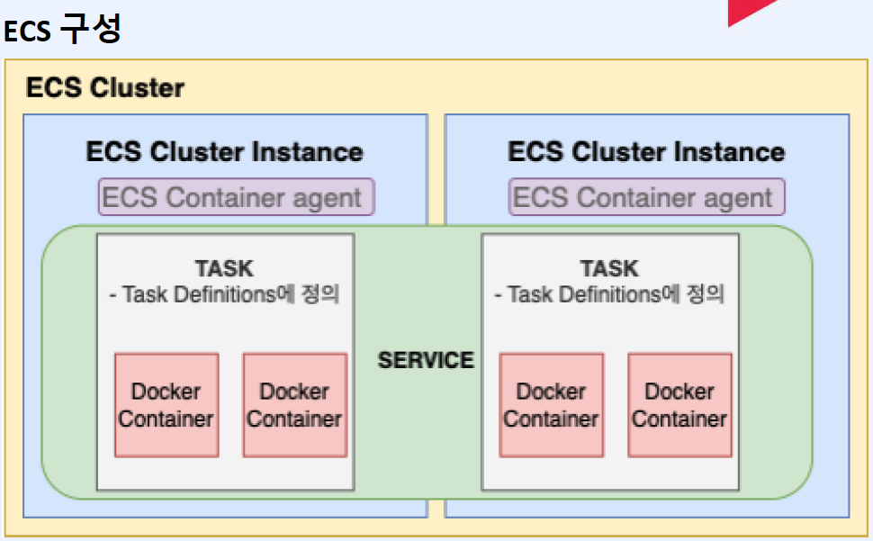
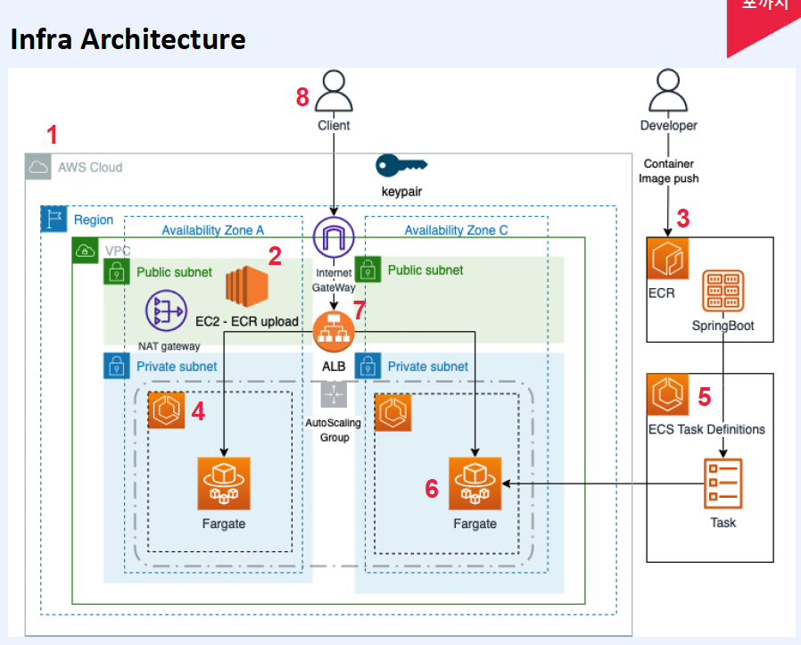

# Ch05. 클라우드 기반 서비스 운영 - Amazon
- [1. Amazon 컨테이너 서비스 이해(ECR, ECS)](#ch05-01-amazon-컨테인-서비스-이해---ecr-ecs)
- [2. Amazon ECR 리포지토리 운영 실습](#ch05-02-amazon-ecr-리포지토리-운영-실습)
- [3. Amazon ECS 기반 컨테이너 애플리케이션 배포 실습](#ch05-03-amazon-ecs-기반-컨테이터-애플리케이션-배포-실습)
- [4. Amazon Fargate 이해](#ch05-04-amazon-fargate-이해)
- [5. Amazon Fargate로 컨테이너 애플리케이션 배포 실습](#ch05-05-amazon-fargate로-컨테이너-애플리케이션-배포-실습)
- [6. Amazon 리소스 삭제](#ch05-06-amazon-리소스-삭제)
- [7. LAB: 현업중심의 Amazon 컨테이너 서비스를 이용한 컨테이너 빌드에서 배포까지 - 문제](#ch05-07-lab-현업중심의-amazon-컨테이너-서비스를-이용한-컨테이너-빌드에서-배포까지---문제_1)
- [8. LAB: 현업중심의 Amazon 컨테이너 서비스를 이용한 컨테이너 빌드에서 배포까지 - 답안 & 해설](#ch05-08-lab-현업중심의-amazon-컨테이너-서비스를-이용한-컨테이너-빌드에서-배포까지---답안-n-해설)


---------------------------------------------------------------------------------------------------------------------------
# Ch05-01. Amazon 컨테인 서비스 이해 - ECR, ECS
## 컨테이너 서비스란?
- 소프트웨어 응용 프로그램을 실행하기 위한 가상화 기술
- 컨테이너는 애플리케이션에 해당하는 모든 종속성을 패키징 및 실행할 수 있는 독립적인 단위
- Docker, Container.d
- 주요 특징
> - 확장성, 유연성, 일관성, 이식성
## ECR 란? - Amazon Elastic Container Registry
- AWS에서 제공하는 관리형 컨테이너 이미지 저장소
- 특징
> - 비공개, 공개 저장소 - AWS 자격증명 및 권한 모델
> - 컨테이너 이미지 업로드
> - 버전관리
> - ECS, EKS 에서 사용
## ECS 란? - Amazon Elastic Container Service
- 컨테이너 오케스트레이션 서비스(Container Orchestration Service)
- ECS는 컨테이너를 실행하고 관리하기 위환 완전 관리형 서비스를 제공
- 주요 기능
> - 컨테이너 인스턴스 확장, 관리
> - 컨테이너 자동화/모니터링, 장애복구
> - 단일 EC2 인스턴스 방식과 AWS Fargate 라는 서버리스 방식 2개로 실행가능
> - AWS 다른 서비스와 연계가능
## ECS 주요 개념
- ECS Cluster Architecure
- Task & Task Definition
- Service



---------------------------------------------------------------------------------------------------------------------------
# Ch05-02. Amazon ECR 리포지토리 운영 실습
## ECR 실습 순서
- EC2 Instance - keypair(developer.pem)
> - sg: ssh, springboot port 생성
> - default VPC, default Public Subnet A-zone
> - EC2 Instance: t2.micro, AMI - Amazon Linux 2 AMI(HVM) - Kernel 5.10, SSD Volume Type
- Docker install 
- aws cli
- aws configure
- Public Repository
> public springboot, Linux, x86-64
```sh
sudo su
yum install docker -y
systemctl enable --now docker
usermod -aG docker ec2-user
exit
docker version # (20.10.23)

curl "https://awscli.amazonaws.com/awscli-exe-linux-x86_64.zip" -o "awscliv2.zip"
unzip awscliv2.zip
sudo ./aws/install
sudo ./aws/install --bin-dir /usr/local/bin --install-dir /usr/local/aws-cli --update

aws configure
# ap-north-east2
# access key/pw
# json
aws configure list
cat ./aws/~

# Public Repository 생성
```
## 컨테이너 빌드
- git install(yum)
- [Spring Sample Code 다운로드](https://github.com/azjaehyun/fc-study/tree/main/chapter-4/spring-boot-thymeleaf-tour)
- 코드 리뷰
- Dockerfile 설명
- ECR push
- ECR pull
- Docker run Test
- 부록 - Docker Multi-platform images - docker buildx 소개 (intel chip, mac m1,2 chip)
> docker buildx build --platform linux/amd64,linux/arn64 -t nginx:latest
```sh
sudo su
yum install git
git clone https://github.com/azjaehyun/fc-study.git
# ec2, local
# cd spring-boot-thymeleaf-tour
# idea .
# localhost:8080
cat Dockerfile
docker build -t spring-boot-thymeleaf-tour
docker run -p 8080:8080 spring-boot-thymeleaf-tour
# PubIP:8080
aws ecr-public get-login-password --region us-east-1|docker login --username AWS --password-stdin public.ecr.aws/~~~
dokcer tag springboot:latest public.ecr.aws/~~~/springboot:latest
docker push public.ecr.aws/~~~/springboot:latest
```
> ECR Push 0.2$


---------------------------------------------------------------------------------------------------------------------------
# Ch05-03. Amazon ECS 기반 컨테이터 애플리케이션 배포 실습
## ECS 실습 순서
- ECS Cluster 생성: ecs-dev
> - default vpc, public subnet
> - sg: http-secure-grp
- IAM 역할 생성
> - elastic container service task 생성
> - CloudWatchLogsFullAccess
> - AmazonEC2ContainerRegistryFullAccess
- Task 등록: ecs-nginx
- Service 생성: ecs-nginx-service
- ALB Target Group 생성
- ALB 생성
- nginx 서비스 확인
## ALB 란? Application Load Balancer
- 트래픽 부산
- 사용자 인증, 보안향상
> - SSL 인증서, HTTPS
- 애플리케이션 밀착 모니터링
> - Cloud Watch 연동 (로드 밸런서 성능 지표, 경고)
- 타겟 기반 라우팅
- 경로 기반 라우팅
```sh
# ECS Cluster 생성 - developer
# ECS 검색 > 클러스터 > 클러스터 생성
# > 이름: ecs-dev
# > default vpc
# > Subnet: a,c
# > ns: ecs-dev (서비스 그룹 지정)
# > 인프라: Amazon Ec2 Instance
# > 새 ASG 생성
# > Amazon Linux2, m5.large
# > 최소/최대: 1/2
# > developer.pem
# CloudFormation
# > CREATE COMPLETE

# 보안그룹
# > http-secure-grp, default VPC, 80:Anywhere

# IAM 역할 생성
# > 역할 > 역할 만들기 > AWS 서비스 > 다른 AWS 서비스의 사용 사례 (Elastic Container Service Task)
# > 다음 > CloudWatchLogsFullAccess > AmazonEC2ContainerRegistryFullAccess > 다음 > 이름: ecs-task-rule

# Task 등록
# > 태스크 정의 > 새 태스크 생성
# > nginx-task
# > nginx nginx:latest
# > 80 nginx-80-tcp HTTP > 다음
# > Amazon EC2 인스턴스
# > 1CPU 1GB
# > ecs-task-rule
# > ecs-task-rule > 다음
# > 생성
# > 태스크 정의 : ACTIVE

# 서비스 생성
# > 클러스터 > 서비스 > 생성
# > 배포구성 > (패밀리) nginx-task > (서비스 이름) nginx-service > 서비스 연결 켜기 > ns: esc-dev
# > 네트워크 > a,c 체크 > 기존 보안 그룹: http-secure-grp
# > 생성

# nginx-service check
# > 상태 및 지표 
# > 태스크
# > 태스크 id 클릭 > 프라이빗 IP(ECS Cluster 안)

# ALB Target Group 생성
# EC2 > 로드 밸런싱 > 대상그룹 > Create Target Group
# > IP addresss > (name) nginx-alb-tg > 80 Port > Default VPC > Health / > Next
# > Default VPC > 172.31.0. (Private IP) > Include as pending below > create target group

# ALB 생성
# > Create Loadbalncer > ALB Create
# > (name) nginx-alb > internet-facing > IPv4 > default VPC > Subnet a,c Check > http-secure-grp > (Listener) nginx-alb-tg > Create load balncer
# # > Provisioning > Active
# ALB 클릭 후 > DNS로 접속
```
> 한달기준 37$ (EC2 m5.large, ALB)


---------------------------------------------------------------------------------------------------------------------------
# Ch05-04. Amazon Fargate 이해 
## AWS Fargate
- 컨테이너 오케스트레이션 서비스
- 주요 특징
> - 서버리스 컨테이너 실행
> - 자원 관리
> - 확장성
> - 보안
> - 비용
## AWS Fargate VS. ECS 차이점
- 둘 다 컨테이너 오케스트레이션 서비스
- ECS: EC2 인스턴스 안에 컨테이너 배포 모델
- Fargate: 서버리스 컨테이너 배포 모델
- 주요 차이점
> - 배포 모델
> - 인프라 관리
> - 자원 할당
> - 청구 모델
> - 사용 요구 사항


---------------------------------------------------------------------------------------------------------------------------
# Ch05-05. Amazon Fargate로 컨테이너 애플리케이션 배포 실습
## Fargate 실습 순서
- ECS Cluster 생성: ecs-far
> - default vpc, public subnet
> - http-secure-grp(기존)
- IAM 역할: ecs-task-rule(기존)
- Task 등록: nginx-far-task
- Service 생성: nginx-far-service
- ALB Target Group 생성
- ALB 생성
- nginx 서비스 확인 
## 실습
```sh
# ECS Cluster 생성
# 클러스터 > 클러스터 생성 > ecs-fargate > default vpc > subnet a,c > ecs-fargate > AWS Faragte(기존 체크)
# > 생성
# > CloudFormation 확인 > CREATE_COMPLETE

# Task 등록
# ECS > 태스크 정의 > 새 태스크 정의
# > nginx-fargate-task > nginx nginx:latest > 80 > 다음
# > AWS Fargate > Linux/X86_64 > 1 CPU 2Gib > ecs-task-rule
# > 로그 수집 사용 > Amazon CloudWatch > 다음 
# > 생성

# Service 등록
# 클러스터 > 서비스 > 생성
# > (패밀리) nginx-fargate-task > nginx-fargate-service > 서비스 연결 켜기 > default vpc > subnet a,c > http-secure-grp > 퍼블릭 IP
# > 생성
# > 서비스 > nginx-fargate-service > 태스크 > 태스크 ID 클릭 > 퍼블릭 IP 확인

# ALB Target Group 생성
# EC2 > 로드 밸런서 > ALB Target Group > IP add > nginx-fargate-alb-tg > default vpc > Health: / > Next
# > 172.31.~ (Private IP) 80 > Include as pending below > Create Target Group

# ALB
# ALB Create > nginx-fargate-alb > internet-facing > default vpc > subnet a,c > http-secure-sg > nginx-fargate-alb-tg > Create LB
# > View LoadBalancer 
# # > Privisioning > Active

# ALB nginx-fargate 
# > DNS 확인 후 접속

# ! EC2 Instance에 없다, 서버리스
# ! 클러스터 > 서비스 > 태스크 > 로그 확인 가능
# ! CloudWatch 에서도 확인 가능
```
> 한달 비용 $2


---------------------------------------------------------------------------------------------------------------------------
# Ch05-06. Amazon 리소스 삭제
## 리소스 삭제 순서
- ALB Group 삭제, ALB 삭제
- ECS Service 삭제
- ECS Cluster 삭제
- ECR 삭제(OPT)
## 실습
```sh
# 로드 밸런서 
# > 로브 밸런서 > 삭제
# > 대상그룹 > 삭제

# ECS
# 클러스터 > 서비스 > 서비스 삭제
# 클러스터 > 클러스터 삭제

# ECR 삭제 (OPT)
``` 


---------------------------------------------------------------------------------------------------------------------------
# Ch05-07. LAB 현업중심의 Amazon 컨테이너 서비스를 이용한 컨테이너 빌드에서 배포까지 - 문제_1 
## LAB 문재
- public vpc
- public, private subnet 각각 2개
- public subnet에 ec2-server 생성
- Private subnet에 Fargate 구성
- SpringBoot 소스 ECR에 업로드
> - Private ECR
- Task 생성 - port 8080
- Service 생성
- 모니터링 로깅 - log 확인
- ALB Target Group 생성
- ALB 생성
- 서비스 확인
## LAB naming
- VPC 자동생성 이용: ecs-prac
- Private subnet에 Fargate 구성: ecs-far-lab
- Public ec2 instance name: ec2-user
- docker, git, aws cli 설치 및 aws configure 설정
- SpringBoot
> - repo name: spring-ecr
- ECS cluster name: spring-ecs
- Task 생성: ecs-farlab-task
- Service 생성: ecs-farlab-service
- 모니터링 로깅
- ALB Target Group 생성: ecs-farlab-alb-tg
- ALB 생성: ecs-farlab-alb
- 서비스확인
> http://alb-add:8080 # IP & DNS





---------------------------------------------------------------------------------------------------------------------------
# Ch05-08. LAB 현업중심의 Amazon 컨테이너 서비스를 이용한 컨테이너 빌드에서 배포까지 - 답안 N 해설
## 답안
- [해설](https://github.com/azjaehyun/fc-study/tree/main/chapter-4/lab-guide)
### Infra
```txt
- VPC 자동생성 이용
  • name prefixName : ecs-prac
  • Subnet
    - public-subnet-a   : 20.0.0.0/24 (256)
    - public-subnet-c   : 20.0.1.0/24 (256)
    - private-subnet-a  : 20.0.8.0/24 (256)
    - private-subnet-c  : 20.0.9.0/24 (256) 
    > public-a/c public 체크후 IPv4 자동 활성화 설정
- Public ec2 instance name
  • name : ec2-ecr
- docker, git, aws-cli 설치 및 aws configure 활성화
- SpringBoot 소스 EC2서버에서 ECR에 업로드
  • repo name : spring-ecr
- Private subnet에 Fargate cluster 구성 
  • name : ecs-far-lab
- ECS cluster name 
  • name :spring-ecs 
- Task 생성 
  • name : ecs-farlab-task
- Service 생성 : ecs-farlab-service
- ALB Target Group 생성 : ecs-farlab-alb-tg
- ALB 생성 : ecs-farlab-alb
```
### Step1
```txt
인프라 생성 (vpc등 마법사 이용)
  - vpc  
  - public subnet2 
  - private subnet 2
  - RT(routing table) 
  - 네트워크 acl 
  - IG(internet gateway) 
  - NG(nat gateway) 
  - EIP(탄력적ip) 
  - 보안그룹 생성
    - ecs-ssh-security-grp ( 22, 8080 port )
    # - ssh-security-grp ( 22 port )
    # - http-secure-grp ( 80 port )
    # - springboot-security-grp ( 8080 port )
```
### Step 2
```txt
ec2 instance 생성 - 접속할 키페어는 developer
  : Instance Type 
   - EC2 instance : t2.micro  , AMI - Amazon Linux 2 AMI (HVM) - Kernel 5.10, SSD Volume Type
```
### Step 3
```txt
ec2 instance 필요한 Library 설치
- docker 설치
  : command ( 설치 명령어 )
    sudo su
    yum install -y docker
    systemctl enable --now docker
    usermod -aG docker ec2-user
    exit // sudo logout
    exit // ec2 server logout
    // 다시 ec2-user 로그인후
    docker version

- git install
  : yum install git

- aws cli
  : aws cli 설치
    curl "https://awscli.amazonaws.com/awscli-exe-linux-x86_64.zip" -o "awscliv2.zip"
    unzip awscliv2.zip
    sudo ./aws/install --bin-dir /usr/local/bin --install-dir /usr/local/aws-cli --update
    aws --version

- aws configure 설정
  : aws configure (accesskey, secretkey , region 설정)
    - accesskey : 본인 accesskey
    - secretkey : 본인 secretkey
    - region : ap-northeast-2
    - output : json
    
- springboot sample code download
  : git clone https://github.com/azjaehyun/fc-study.git
    cd ./fc-study/chapter-4/spring-boot-thymeleaf-tour
  : docker build  
    docker build -t spring-ecr:latest
  : ecr upload  
    docker tag spring-ecr:latest {yourECRaddress}/spring-ecr:latest
    docker puth {yourECRaddress}/spring-ecr:latest
```
### Step 4, 5, 6, 7, 8
```txt
ECS fargate cluster 생성 ( private subnet에 생성)
IAM 생성 (ecs-task-rule)
 - clip4 - ECS 기반 컨테이너 애플리케이선 배포 실습 참조 

ecs task 생성

ecs service 생성 ( private subnet에 생성 )

- application load balancer target group 생성
- application load balnacer 생성 ( public subnet에 생성 )

http://{application-load-balancer}:8080
서비스 확인
```