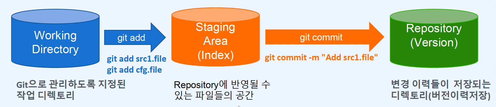
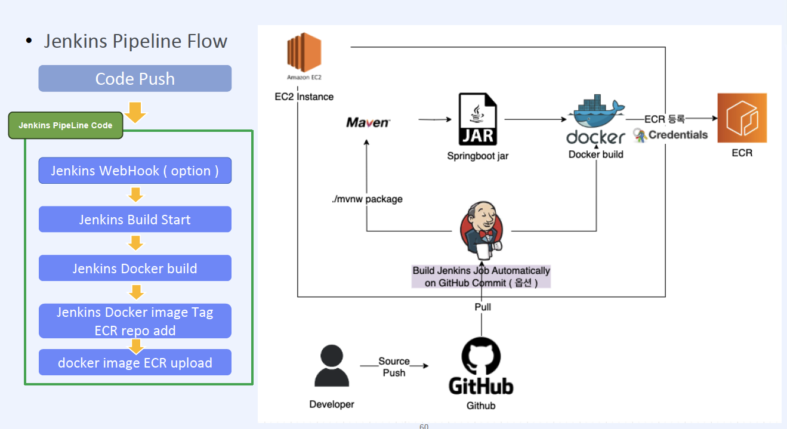

# Ch06. 백엔드 개발자를 위한 빌드자동화 - Jenkins
- [ch06-01. Git을 이용한 소스코드 버전관리](#ch06-01-git을-이용한-소스코드-버전관리)
- [ch06-02. Git Branch를 통한 협업 개발하기](#ch06-02-git-branch를-통한-협업-개발하기)
- [ch06-03. Jenkins 프로그램 소개 및 설치하기](#ch06-03-jenkins-프로그램-소개-및-설치하기)
- [ch06-04. Git 연동을 위한 Jenkins 환경설정](#ch06-04-git-연동을-위한-jenkins-환경설정)
- [ch06-05. Jenkins 파이프라인을 이용한 컨테이너 빌드](#ch06-05-jenkins-파이프라인을-이용한-컨테이너-빌드)
- [ch06-06-01. Jenins Slack Webhook 연동하기(1)](#ch06-06-01-jenkins-slack-webhook-연동하기)
- [ch06-06-02. Jenins Slack Webhook 연동하기(2)](#ch06-06-02-jenkins-slack-webhook-연동하기-2)
- [ch06-07. 실전 빌드하기 Source push - container build - ecr upload](#ch06-07-실전-빌드하기-source-push---container-build---ecr에-업로드-flow-arch-설명)
- [ch06-08. LAB - git 코드 업로드부터 컨테이너 빌드까지 - CI 구축하기](#ch06-08-lab--git-코드-업로드-부터-컨테이너-빌드까지---ci-구축하기)


---------------------------------------------------------------------------------------------------------------------------
# Ch06-01. Git을 이용한 소스코드 버전관리
## Git을 이용한 소스코드 버전관리
- Git과 GitHub
- Git 설치
- Git 기본 명령어
- Git 브랜치로 버전관리
## Git과 GitHub
- Git
> - 2005년 리누스 토발즈가 리눅스 커널 프로젝트 개발을 위해 만든 분산관리 툴
> - 코드의 원본이나 변경 내역을 저장하는 형상관리(Configuration Management)툴
> - 버전관리
- GitHub
> - Git을 관리해주는 웹 호스팅 서비스
> - 참고도서 
> > - [Pro Git](https://git-scm.com/book/ko/v2)
> > - [알잘딱깔센GitHub](https://paullabworkspace.notion.site/Notion-PDF-QR-14164df574d84fffb7debe61b40ea432)
## Git 설치
- Windows
- Mac (기본설치)
- Linux
> - Ubuntu: apt update & apt install -y git
> - Redhat: yum install -y git
## Git 기본 구성
- Git 사용자 정보 설정
> - git은 누가 커밋했는지 확인하기 위해 사용자정보(email 주소와 이름)을 설정
> - 설정파일의 위치
> > - git 기본 환경 구성: /etc/gitconfig (3)
> > - 유저별 설정: HOME_DIR/.gitconfig (2)
> > - 작업 디렉토리별 구성: SOURCE_DIR/.git/config (1)
> - 유저별 설정
```sh
git config --global user.name "<id>"
git config --global user.email "<email>"
cat ~/.gitconfig
```
## Git 사용하기(1)
- Git 기본 명령어
> - 레포지토리 초기화: git init
> - Git Repository나 Staging Are에 추가되지 않아햐 하는 파일 정리: .gitignore
> - Working directory에 있는 파일을 Staging Area로 옮기는 명령: git add
> - Git repository의 브랜치, 추적중인 파일과 변경된 파일 등의 현재 상태 확인: git status
> - Staing Area에 있는 파일을 Repository에 저장: git add
> - Repository의 commit된 로그 확인: git log
> - 웨킹 디렉토리, 스테이지 영역, 리포지토리 사이의 변경사항 확인: git diff



## Git 사용하기(2)
- Git 브랜치 관리 명령어
- 브랜치를 사용하여 가지를 만들어 독립적으로 개발하거나 병합
> - 브랜치 리스트 확인(현재 사용중인 브랜치: *master): git branch
> - 브랜치 생성: git branch <branch_name>
> - 브랜치 삭제: git branch -d <branch_name>
> - 브랜치 이름 변경: git branch -m <branch_name> 
> - 브랜치 바꾸기: git checkout <branch_name>
> - 브랜치들의 커밋 상태 보기: git log --oneline --decorate --graph --all
> - 브랜치 병합: git merge <other_branch>

## 실습
```sh
######################################
# 1.Git 환경 구성
# git 사용자 정보 등록
git config --global user.name "GIT계정"
git config --global user.email "메일주소"
cat ~/.gitconfig

##############################
mkdir ~/fastcampus
cd fastcampus/

# 현재 작업디렉토리를 Git Repository 로 만들기
# init 명령 실행하면 현재 상태가 master 브랜치로 설정됨
git init
ls -al
ls .git


# 누가 수정했는지 기록 필요. 수정자의 계정정보 등록(github 계정으로 등록하는것이 좋아요)
git config --global user.name "GIT계정"
git config --global user.email "메일주소"
cat .git/config


#2 Git Repository나 Staging Area에 추가되지 않아야 하는 파일 정의
#  .gitignore 파일만들기(gitignore.io)
cat > .gitignore
*.class
.gitignore
<생략>

ls -a


#3 Working directory에 있는 파일을 Staging Area로 옮기는 명령 : git add
#4 Git repository의 브랜치, 추적중인 파일과 변경된 파일 등의 현재 상태 확인: git status
echo "code1" > src1.file
echo "data" > data.file
git status

git add *.file
git status


echo "config" > cfg.file
git status


# working dir: data.file, cfg.file, src1.file   stage area:
git rm --cached data.file src1.file
git status

# 원하는 파일만 선택해서 add
# working dir: data.file,  cfg.file   stage area: src1.file
git add -i
4 - 3(src1.file) - <enter> - q
git status


#5 Staging Area에 있는 파일을 Repository에 저장(버전기록): git commit
# git commit -> vi로 상세 커밋메시지 기록(첫줄: 변경내용 요약,두번재줄:공백, 세번째줄: 변경사항 자세히)
# git commit -m "message"  -> 한줄 커밋 메시지 기록
# git commit -a -m "message"

#6 Repository의 commit 이력을 조회: git log
# git log : 상세내용까지 모두 출력
# git log --oneline : 간단하게 한라인으로 ID와 메시지만
# git log --oneline --decorate --graph : 브랜치 정보를 포함하여 출력
# # working dir: data.file, cfg.file   stage area:     repository : src1.file
git commit -m "Add files(src1.file)"
git status

git add data.file
git commit
#Add data.file
#
#-contents
# data

git log
git log --oneline
git log --oneline --decorate --graph
git log --oneline --decorate --graph --all

cat >> src1.file
code2

git status
git add src1.file
git commit -m "Append code2"
git log --oneline

# 특정 파일의 로그만 확인
git log src1.file

#7 커밋된 파일들의 변경사항이 있는 파일에 대해 차이점 확인
# 마지막 커밋 상태와 현재 워킹 디렉토리를 비교해서 파일들의 변경사항을 출력
echo "code3" > src1.file
git diff
warning: in the working copy of 'src1.file', LF will be replaced by CRLF the next time Git touches it
diff --git a/src1.file b/src1.file
index 0a50039..6f9c4f0 100644
--- a/src1.file
+++ b/src1.file
@@ -1,2 +1 @@
-code1
-code2
+code3

# 특정 커밋의 ID로 상태와 현재 워킹 디렉토리 비교해서
git log --oneline
git diff 47a7f78

cd ..

####################################################################
# branch 관리 실습
# 브랜치 리스트 확인(현재 사용중인 브랜치 :   *master) :  git branch
# 브랜치 생성 : git branch branch_name
# 브랜치 삭제 : git branch -d branch_name
# 브랜치 이름 변경: git branch -m branch_name
# 브랜치 바꾸기: git checkout 브랜치이름
# 두 브랜치의 커밋 상태 차이 보기 : git log [-p] branch1.. branch2
# 브랜치들의 커밋 상태 보기: git log --decorate --graph --oneline --all
# 각 브랜치의 현재 상태 비교: git diff
# 브랜치 병합(브랜치1에서 작업한 내용을 master로 병합하려한다.). master에서: git merge other_branch

mkdir branch-test
cd branch-test/

# git init 명령으로 초기화 하면 기본브랜치인 master가 생기고 현재 작업브랜치가 된다.
git init
git branch

echo "code1" > src1.file
git add src1.file
git commit -m "Create src1.file on master"
git log --oneline


# develop 브랜치 만들기
# develop 브랜치로 이동(master,develop는 동일상태)
git branch develop
git branch
  develop
* master

# develop 브랜치로 이동해서 src1.txt를 수정
git checkout develop
echo "code2" >> src1.file
cat src1.file
git commit -a -m "Added code2 to src1.file on develop"


# developer에서 release 브랜치 생성후 data.file을 생성
git branch release
git branch
git checkout release

echo "data" > data.file
git add data.file
git commit -m "Create data.file on release"

# developer 릴리즈로 이동후 병합(merge)
git checkout develop
ls
# 아직은 src1.file 만 보입니다. 병합하면 data.file 보여야합니다.
# 현재 브랜치(develop)에 release를 병합(merge)
git merge release
ls
   data.file  src1.file

# develop에서 src1 을 수정
vi src1.file
  codeX
  code2
git add .
git commit -m "Modify src1.file on develop"


#  master 에서 병합 - 같은 파일의 동일 라인에 대한 수정으로 충돌 발생
git checkout master
git merge develop
cat src1.file
cat data.file

# 두개 브랜치에서 동일한 내용을 다르게 수정했다면?
# Hotfix 브랜치를 만들고 동일 내용 수정해본다.
git branch hotfix
git checkout hotfix
vi src1.file
  code100
  code2
git commit -a -m "Bug fix src1.file"

#master 에서 도일 내용 수정
git checkout master
vi src1.file
  code200
  code2
git commit -a -m "Bug fix src1.file"

# 병합
git merge hotfix
Auto-merging src1.file
CONFLICT (content): Merge conflict in src1.file
Automatic merge failed; fix conflicts and then commit the result.

#머지 실패(충돌)시는 편집기로 소스파일을 열면 어디서 출동 발생했는지 표시. 
# 수정후 저장하면 그 내용을 사요
git status
vi src1.file
#<<<<<<< HEAD
code200
=======
code100
#>>>>>>> hotfix
code2

이후 git add src1.file, git commit 실행
git add src1.file
git commit -m "Merge src1.file"
```


---------------------------------------------------------------------------------------------------------------------------
# Ch06-02. Git Branch를 통한 협업 개발하기
## Git을 이용한 소스코드 버전관리
- Git 브랜치 Model
- GitHub 가입
- GitHub Repository 관리
## Git 브랜치 모델
운용 모델에서는 크게 나눠 4가지 종류의 브랜치를 이용하여 개발을 진행
- Main Branch
> - master: 배포 가능한 상태만을 관리
> - develop: 통합 브랜치의 역할을 하며, 평소에는 이 브랜치에서 개발을 진행
- Feature Branch
> - 새로운 기능 개발, 버그 수정이 필요할때에 'develop' 브랜치로부터 분기
- Realease Bracnh
> - 버그를 수정하거나 새로운 기능을 포함한 상태로 정상동작 확인
- Hotfix Branch
> - 배포한 버전에 긴급하게 수정을 해야 할 필요가 있을 경우, 'master' 브랜치에서 분기하는 브랜치
## Git과 GitHub
- GitHub
> git 저장소를 관리해주는 웹 호스팅 서비스
## GitHub 계정 만들기
- GitHub 계정 만들기
## GitHub 공개 Repository 만들기
- GitHub 신규 Repository 만들기
## Git Branch를 통한 협업 개발하기
- README.md
> - Git Repository의 최상위 페이지로 Markdown 문법으로 작성
> - [치트시트](https://www.markdownguide.org/cheat-sheet/)
- GitHub 관리 명령어
> - remote repository를 로컬 저장소와 연결
> > git remote add [alias-name] [github_url]
> - 마스터 브랜치 업로드 
> > git push -u [alias-name] <bracnh_name>
> - GitHub Repository master 브랜치에서 다운로드
> > git clone [github_url]
## 실습
```sh
###########################################
#1. Repository 생성
# devops-lab

# 생성 후 로컬 레파지토리(devops-lab)와 깃허브 레파지토리 연결하기
mkdir devops-lab
cd devops-lab

echo "# devops-lab" >> README.md
git init
git add README.md
git commit -m "first commit"
git branch -M main
git remote add origin https://github.com/fastcampus-developer1/devops-lab.git
git push -u origin main

echo "code1 " > src1.file
git add src1.file
git commit -m "Create src1.file"
git push -u origin main 

# repository 삭제


##########################################
# 2. repository 운영
# GitHub repository 만들어 사용
# devops-for-backend-developers 
git clone <repository>
cd devops-for-back-end-developers 

mkdir sources
cd sources
echo "code" > src.file
git add .
git commit -m "Create src.file"
git push 

######################################
#3. GitHub desktop
```


---------------------------------------------------------------------------------------------------------------------------
# Ch06-03. Jenkins 프로그램 소개 및 설치하기
## Jenkins 프로그램 소개 및 설치하기
- CICD
- Jenkins 설치
## 애플리케이션 운영방식
- 클라우드 인스턴스를 이용한 애플리케이션 운영
> AWS RDS, PetClinic App
- 컨테이너 애플리케이션 운영
> Mysql8.0, PetClinic Container Build & Operattion
## CICD 기반의 자동화 배포 및 운영
- 자동 빌드와 자동 배포 서비스 운영
> Mysql, PetClinic > Git, Docker > Jenkins
## Jenkins 개요
- Jenkins 란?
소프트웨어 구축, 테스트, 전달 및 배포와 관련된 모든 종류의 작업을 자동화하는데 사용할 수 있는 오픈 소스 자동화 서버로 
Docker 또는 JRE가 설치된 모든환경에서 실행.  
젠킨스는 다양한 플러그인들을 조합하여 일을 처리하는 Pipeline을 통해 CI/CD Pipeline을 구축
- CICD
> - CI(Continuous Integration, 지속적인 통합)
> > 어플리케이션의 새로운 코드 변경사항이 정기적으로 빌드 및 테스트되어 공유 레포지토리에 통합하는 것
> - CD(Continuous Deploy, Development, 지속적인 서비스 제공 혹은 지속적인 배포)
> > 개발자의 변경사항이 레포지토리를 넘어 프로턱션 환경까지 릴리즈 되는것
## Amazon EC2에 Jenkins 설치하기
- Jenkins Server 구성 - 인프라
> - EC2
> > - name: jenkins-server
> > - AMI: Amazon Linux2(Kernel 5.10)
> > - Instance: t2.medium
> - VPC: default, 2a, sg(all trafic)
> - Storage: 50Gib(Gp3)
- Jenkins Server 구성 - 서비스
> docker, jenkins(Container기반) 설치 
> > cf, jenkins는 Docker or JRE기반 설치 가능
## 실습
```sh
#01. 인스턴스 만들기

#02. docker  설치
sudo -i
yum install docker -y 
systemctl enable --now docker
systemdtl status docker
docker version


# docker 관리자 만들기
usermod -aG docker ec2-user
id ec2-user
exit

# Docker command 자동완성 구성
sudo curl https://raw.githubusercontent.com/docker/docker-ce/master/components/cli/contrib/completion/bash/docker \
  -o /etc/bash_completion.d/docker.sh
exit

# XShell로 다시 로그인 :  ec2-user
docker version


# 03 Jenkins 설치
## Install Suggested Plugins
docker run -d --name jenkins_prod \
  -p 8080:8080 -p 50000:50000 \
   -v /var/run/docker.sock:/var/run/docker.sock \
   --user root   jenkins/jenkins:latest
docker exec -it jenkins_prod /bin/bash

apt-get update && \
    apt-get -y install apt-transport-https \
      ca-certificates \
      curl \
      gnupg2 \
      jq \
      software-properties-common && \
    curl -fsSL https://download.docker.com/linux/$(. /etc/os-release; echo "$ID")/gpg > /tmp/dkey; apt-key add /tmp/dkey && \
    add-apt-repository \
      "deb [arch=amd64] https://download.docker.com/linux/$(. /etc/os-release; echo "$ID") \
      $(lsb_release -cs) \
      stable" && \
   apt-get update && \
   apt-get -y install docker-ce

# jenkins_prod 컨테이너에서 jenkins-server에서 동작중인 데몬을 호출해서 사용가능한지 확인
docker ps


# jenkins_prod 컨테이너에서 docker 명령어 실행 가능한지 TEST
git clone https://github.com/237summit/lab-test.git
cd lab-test
docker build -t nodejs .
docker run -d --name web -p 80:8080 nodejs
docker ps
exit

# jenkins-server 에서 nodejs 컨테이너 확인 후 삭제하기
docker ps
docker rm -f web

# 젠킨스에서 프로젝트를 생성해서 컨테이너 빌드 및 운영 TEST
## new Item > appjs-test FreeStyle Project > Build Steps (Execute Shell)
```
> jenkins안에서 docker-ce (No-daemon) or docker client로 docker만 설치  
> `docker in docker 방식` -v /var/run/docker.sock:/var/run/docker.sock


---------------------------------------------------------------------------------------------------------------------------
# Ch06-04. Git 연동을 위한 Jenkins 환경설정
- Jenkins pipeline 이란?
- Git 연동을 위한 Jenkins 환경설정
## Jenkins Pipeline: 깃 연동
Repository > Deploy
> CI tool
## Jenkins Pipeline Script란?
- Pipeline DSL 코드로 워크로드 정의
- Job을 수동으로 설치할 때 반복되는 생성, 버전관리 등의 유지보수의 어려움 대응 - 코드로 운영
> - pipeline: 파이프라인 구문의 시작/종료
> - section
> > - agent: 블록의 최상단에 기록, jenkins 실행자를 전체 파이프라인에 사용(any), 특정 stage에 사용(none)할지 설정
> > - stage: pipeline에는 하나 이상의 stage를 포함.
> > > - steps 하위 항목이 Jenkins 플러그인(sh)으로 실행되어 명령어 실행
> - Directives: 파이프라인의 config 설정 값
> > - enviroment: 변수값
> > - tool: 자동 설치나 Path에 추가할 도구를 정의
> > - parameter

## git 연동을 위한 Jenkins 파이프라인 구성: 수동빌드
```sh
git clone https://~.git
cd spring-petclinic
./mvnw package
target/petclinic-~.jar

java -jar target/~.jar
http://jenkins-serer's_EIP:8080/
```
## git 연동을 위한 Jenkins 파이프라인 구성: 자동빌드
- Jenkins Project 만들기
> - 새로운 Item 만들기
> - Pipleline
- Configure
> - Git: petclinic build
> - Pipeline: pipeline script
- 빌드 진행
- 콘솔 로그보기
- 아카이브 링크 확인
### 실습
```sh
# Jenkins를 이용한 자동빌드
# item name: petclinic

#설명 : 1. GIT: petclinic build

# Pipeline : pipeline script
# Jenkins 설치시 추천 플러그인 설치하면 git 관련된 플러그인이 포함되어 있음
# Checkout 스테이지에서 git source 다운로드
# Build 스테이지에서 sh 플러그인을 통해 mvnw  실행
# Build 작업 완료후 생성된 jar 파일을 아카이브아키펙트로 전달 
pipeline {
    agent any
        stages {
            
            stage('Checkout') {
                steps {
                    git branch: 'main', url:'https://github.com/237summit/petclinic.git'
                }
            }
            
            stage('Build') {
                steps {
                    sh "./mvnw  clean package"
                }
            
            post {
                success {
                    archiveArtifacts 'target/*.jar'
                }
            }
        }
    }
}

# 빌드 진행 :  [지금 빌드]
# 콘솔 로그 보기
# POST : 아카이브아티팩트 링크 확인
```


---------------------------------------------------------------------------------------------------------------------------
# Ch06-05. Jenkins 파이프라인을 이용한 컨테이너 빌드
- 도커 플러그인 설치
- Pipeline을 이용한 컨테이너 빌드
## Jenkins Pipeline을 이용한 Docker 연동
- 플러그인 설치
> - Jenkins 관리 > [System Configuration] > Plugins > [Available package] - `docker pipeline` 검색후 선택 > Install
> > jenkins 재시작
- Pipeline script 구성 후 컨테이너 빌드
## 실습
```sh
# 1. 컨테이너를 빌드할 소스코드에서  Dockerfile 이 있는지 확인
github - Dockerfile

# 2. Jenkins 빌드 자동화 구성
# 설명
1. GIT: petclinic build -> jar
2. Jenkins 컨테이너 빌드 자동화 구성

# Jenkins pipeline script
pipeline {
    agent any
    stages {
        stage('Checkout') {
            steps {
                git branch: 'main', url: 'https://github.com/237summit/petclinic.git'
            }
        }
        stage('Build') {
            steps {
                sh './mvnw clean package'
            }
        }
        stage('Docker Image Build') {
            steps {
                script {
                    docker.build("petclinic:v${BUILD_ID}")
                }
            }
        }
    }
}


#3. jenkins-server 에서 docker 명령으로 컨테이너 이미지 빌드 결과 확인
docker images petclinic:v2
docker run -d --name pet -p 80:8080 petclinic:v2
docker ps
docker logs -f  pet   # 라이브러리 설치가 완료될때 까지 기다린후 연결 TEST

# 웹브라우저로 접속
http://jenkins-server's_EIP

```


---------------------------------------------------------------------------------------------------------------------------
# Ch06-06-01. Jenkins Slack Webhook 연동하기
- Slack의 워크스페이스와 채널 생성
- 젠킨스에 슬랙 플러그인 설치 및 구성
- Jenkins Pipeline 이용해 Slack 연동
## Jenkins Slack Webhook 연동하기
- Slack 이란?
> Slack은 채널 기반 메세징 플랫폼입니다. Slack 워크스페이스는 사람들이 협업하고 모든 소프트웨어 도구와 서비스를 연결하며 작업을 수행하는데 필요한 정보를 찾을 수 있는 장소
- Jenkins Slack 연동
> Jenkins에서 Pipeline script를 동작할때 성공 및 실패 여부를 슬랙을 통해 노티가능
- Slack과 Jenkins 연동하기
> - 슬랙 워크스페이스 생성 > 채널 생성
> - 채널에 Jenkins 연동: Jenkins에서 Slack 채널에 연동할 수 있도록 권한 할당
> > - 통합 > 앱 추가 > jenkins 검색 후 설치
> > > 웹 브라우저 실행되면 - 슬랙에 추가 > 채널선택
> - Jenkins 관리
> > - 플러그인 설치: `slack notification`
> > - 시스템 구성 - slack (Credntial)
> > - petclinic 프로젝트에 pipeline script로 slack 노티 구성
## 실습
```sh
1. Jenkins에 slack pipeline연동
# (1) Slack의 워크스페이스와 채널 생성
## Workspace: test-smlee, Channel: #devops app test, #cicd
## 채널에 jenkins 연동 
## > #cicd `▿` > 통합 > 앱 추가 > jenkins CI
# (2) 젠킨스에 슬랙 플러그인 설치
## 'slack notification' > 관리 > 글로벌 Slack Notifier 설정 (팀 하위 도메인 / 통합 토큰 자격증명ID)
# (3) 젠킨스에 슬랙 로그인 정보와 채널정보 추가
# (4) Pipeline script에 추가
# 설명: 3. 빌드 성공 유무에 따라 slack noti를 전송
# pipeline script: 
pipeline {
    agent any
    stages {
        stage('Checkout') {
            steps {
                git branch: 'main', url: 'https://github.com/237summit/petclinic.git'
            }
        }
        stage('Build') {
            steps {
                sh './mvnw clean package'
            }
        }
        stage('Docker Image Build') {
            steps {
                script {
                    docker.build("petclinic:v${BUILD_ID}")
                }
            }
        }
    }
    post { 
        success { 
            slackSend(tokenCredentialId: 'slack-token'
                , channel: '#cicd'
                , color: 'good'
                , message: "빌드성공")
        }
        failure { 
            slackSend(tokenCredentialId: 'slack-token'
                , channel: '#cicd'
                , color: 'danger'
                , message: "빌드실패")
        }
    }
}
```


---------------------------------------------------------------------------------------------------------------------------
# Ch06-06-02. Jenkins Slack Webhook 연동하기 (2)
## 학습내용
- AWS
> - ECR 정책 생성
> - 사용자 콘솔 액세스키 생성
> - Amazon ECR 생성
- Jenkins
> - Plugin: AWS Credentials, Pipeline: AWS Steps
> - Credential: 사용자 콘솔 액세스키 등록
> - 프로젝트 구성: pipeline script 구성

## Amazon ECR 구성
- 빌드된 컨테이너 이미지가 로컬이 아닌 Amazon ECR에 저장
- AWS: ECR ROLE 생성, 액세스키 생성, ECR 생성
- Jenkins: Plugin, Jenkins-server(aws cli 설치), 프로젝트 구성


## AWS 구성
> - `AmazonEC2ContainerRegisterPowerUser`, 이름: 'ecr-registry-full-access'
> > developer 계정에 대한 권한
> - 사용자 콘솔 액세스키 생성
> > CLI
> - Amazon ECR 생성
> > 프라이빗, name: petclinic
## Jenkins 구성
> - Plugin 설치: AWS Credential(CloudBees AWS Credentials), Pipeline: AWS Steps
> > Jenkins-Server: aws cli 설치
> - Credential 등록: AWS 사용자 콘솔 액세스키 등록(aws-login)
> > 관리 > Security > System > Global credentials > 'Add Credential'
> > > AWS Credentials(ID/DESC: aws-login, Access Key Id/Secret Access Key) > Create
> - Jenkins 프로젝트 구성: pipeline 구성

## 실습
```sh
################################################################
2. Jenkins에서 빌드한 컨테이너를 Amazon ECR에 Push
# (1) AWS role, 사용자 access key 생성
     신뢰 엔터티(AWS 계정) - ecr-registry-full-access: AmazonEC2ContainerRegistryPowerUser 전체 액세스 권한

# (2) Amazon ECR 생성
# (3) 젠킨스에 플러그인 설치 및 credentials 등록
#     Plugin 설치 : AWS Credentials, Pipeline: AWS Steps
#     aws credentials  등록:  aws-login

#     Jenkins-Server:  aws cli  설치
docker exec -it jenkins_prod /bin/bash

curl "https://awscli.amazonaws.com/awscli-exe-linux-x86_64.zip" -o "awscliv2.zip"
unzip awscliv2.zip
./aws/install
aws --version
exit

# (4) Pipeline script에 추가
#  설명
1. GIT: petclinic build -> jar
2. 컨테이너 빌드 후 ECR에 push

# pipeline script:
pipeline {
    agent any
    environment {
       ECR_REPO = "계정ID.dkr.ecr.ap-northeast-2.amazonaws.com"
       AWS_CREDENTIALS="aws-login"
       ECR_NAME = "petclinic" // ecr 이름
       REGION = "ap-northeast-2" // region 이름
       IAM_ROLE_NAME = "arn:aws:iam::계정ID:role/ecr-registry-full-access"
       ROLE_ACCOUNT = "developer"
    }

    stages {
        stage('Checkout') {
            steps {
                git branch: 'main', url: 'https://github.com/GIT계정/petclinic.git'
            }
        }
        stage('Build') {
            steps {
                sh './mvnw clean package'
            }
        }
        stage('ECR Upload') {
            steps{
                script{
                    try {                       
                        withAWS(region: "${REGION}",credentials: "${AWS_CREDENTIALS}", role: "${IAM_ROLE_NAME}", roleAccount: "${ROLE_ACCOUNT}", externalId: 'externalId') {
                            sh 'aws ecr get-login-password --region ${REGION} | docker login --username AWS --password-stdin  ${ECR_REPO}'
                            sh 'docker build -t ${ECR_NAME} .'
                            sh 'docker tag ${ECR_NAME}:latest ${ECR_REPO}/${ECR_NAME}:v$BUILD_NUMBER'
                            sh 'docker push ${ECR_REPO}/${ECR_NAME}:v$BUILD_NUMBER'
                            sh 'docker rmi ${ECR_REPO}/${ECR_NAME}:v$BUILD_NUMBER'
                
                        }
                    }
                    catch(error){
                        print(error)
                        currentBuild.result = 'FAILURE'
                    } 
                }
            }
            post {
                success {
                    echo "The ECR Upload stage successfully."
                }
                failure {
                    echo "The ECR Upload stage failed."
                }
            }
        }
    }
    post { 
        success { 
            slackSend(tokenCredentialId: 'slack-token'
                , channel: '#cicd'
                , color: 'good'
                , message: "빌드성공")
        }
        failure { 
            slackSend(tokenCredentialId: 'slack-token'
                , channel: '#cicd'
                , color: 'danger'
                , message: "빌드실패")
        }
    }
}
```


---------------------------------------------------------------------------------------------------------------------------
# Ch06-07. 실전 빌드하기: source push - container build - ecr에 업로드 (FLOW arch 설명)
- Jenkins Pipeline Flow
> - Jenkins WebHook
> > Build Jenkins Job Automatically on GitHub Commit(OPT)
- 

## Jenkins Pipeline 작업 순서
- IAM - Policy, Rule 생성 for ECR UPLOAD
- ECR Repo 생성 - 'spring-petclinic'
- AWS Credential 등록
> - 액새스키 생성
> - jenkins credential 등록
- pipeline 코드 리뷰 - [Jenkins Pipeline 공식 가이드](https://www.jenkins.io/doc/book/pipeline/)
- pipeline job 등록
- Jenkins Webhook Trigger - Auto JobExecute(선택)
> - LB 생성 - github webhook url 등록 필요 (주의 - public ip는 사용불가)
## 실습
- spring-petclinic (fc-study/chapter-5/lab-project) 
> Jenkins Webhook, JenkinsBuild, Docker image tag, ECR Push, Slack 연동
> - IAM: Policy('ecr-upload'), Role('ecr-upload-role')
> - ECR: Pri('spring-petclinic')
> - AWS Cred: AccessKey, Jenkins Cred('aws-credentials-ga')
> - Jenkins Pipeline: 'chapter-5-job-test'
> - Slack Channel: 'spring-petclinic-slack'
> - Git Token: 'jenkins-webhook-token'
> - LB: jenkins-ec2-server-tg, 'jenkins-ec2-server-alb'
> -
```sh
# IAM - Policy, Rule 생성
## 정책 > 정책 생성 > JSON (ecr:*, CloudWatch Logs:제한적 쓰기, Elastic Container Register:전체 액세스 권한) > name: 'ecr-upload' > 정책 생성
{
    "Version": "2012-10-17",
    "Statement": [
        {
            "Sid": "VisualEditor0",
            "Effect": "Allow",
            "Action": [
                "logs:CreateLogStream",
                "ecr:*",
                "logs:PutLogEvents"
            ],
            "Resource": "*"
        }
    ]
}
## 역할 > 역할 만들기 > AWS 계정 > ecr-upload 선택 > 'ecr-upload-role'

# ECR Repo 생성 
## Private: 'spring-petclinic'

# AWS Credential 등록
## IAM > 사용자 > 보안자격증명 > CLI > 'aws-accesskey'

# Jenkins에 Credential 등록하기
## Credentials > System > Global credentials > Add credentials
## > AWS Credentials (ID/DESC:'<aws-credentials-jh>', Access Key ID/Secret Access Key: ~)

# Pipeline 코드 리뷰
## Jenkins Pipeline 생성 - 'chapter-5-job-test'
### git clone
### build
### Dockerfile build & AWS ECR Upload
### Slack push
pipeline {
    
    agent any
    environment {
       ECR_REPO = "<~.dkr.ecr.ap-northeast-2.amazonaws.com>"  // ecr repository uri
       AWS_CREDENTIALS="<jenkins aws credentials>" // aws credentialsId 
       ECR_NAME = "<ecr-repo name: spring-petclinic>" // ecr 이름
       REGION = "ap-northeast-2" // region 이름
       GIT_REPO = "<https://github.com/azjaehyun/fc-study.git>" // clone git 이름
       SLACK_CHANNER = "<spring-petclinic-slack>" // slack channer 이름
       IAM_ROLE_NAME = "<arn:aws:iam::~:role/ecr-upload-role>" // aws cli  ecr 사용시 사용
       ROLE_ACCOUNT = "<developer>" // 계정 이름
    }

    stages {

        stage('Git Clone') {
            steps {
                dir("app") {
                    git branch: 'main',  credentialsId: 'azjaehyun', url: "${GIT_REPO}"
                }
            }
        }

        stage('Maven Build') {
            steps{
                dir("app/chapter-5/lab-project"){
                    sh '''
                    chmod +x mvnw
                    ./mvnw package -DskipTests
                    '''
                }  
            }
        }

        stage('ECR Upload') {
            steps{
                script{
                    dir("app/chapter-5/lab-project") {
                        try {                       
                            withAWS(region: "${REGION}",credentials: "${AWS_CREDENTIALS}", role: "${IAM_ROLE_NAME}", roleAccount: "${ROLE_ACCOUNT}", externalId: 'externalId') {
                                sh 'aws ecr get-login-password --region ${REGION} | docker login --username AWS --password-stdin  ${ECR_REPO}'
                                sh 'docker build -t ${ECR_NAME} .'
                                sh 'docker tag ${ECR_NAME}:latest ${ECR_REPO}/${ECR_NAME}:$BUILD_NUMBER'
                                sh 'docker push ${ECR_REPO}/${ECR_NAME}:$BUILD_NUMBER'
                                sh 'docker rmi ${ECR_REPO}/${ECR_NAME}:$BUILD_NUMBER'
                        
                            }
                        }
                        catch(error){
                            print(error)
                            currentBuild.result = 'FAILURE'
                        } 
                    }
                }
            }
            post {
                success {
                    echo "The ECR Upload stage successfully."
                }
                failure {
                    echo "The ECR Upload stage failed."
                }
            }
        }
    }

    post {
        success {
            slackSend (
                channel: "${SLACK_CHANNER}", 
                color: '#00FF00', 
                message: """
                    SUCCESS: Job ${env.JOB_NAME} [${env.BUILD_NUMBER}]
                    [ECR_NAME : ${ECR_NAME}]
                """
                )
            }
        failure {
            slackSend (
                channel: "${SLACK_CHANNER}", 
                color: '#FF0000', 
                message: "FAIL: Job ${env.JOB_NAME} [${env.BUILD_NUMBER}]  [ECR_NAME : ${ECR_NAME}]"
            )
        }
    }
}

# Jenkins Webhook Trigger - 현업에서는 잘안쓰고 수동으로함
## Developer - Source Push -> GitHub( Github setting Webhook 등록) -> http://{your_jenkins_domain}/github-webhook/
### 주의 퍼블릭 IP 등록불가, LB 또는 Domain 사용
## EC2 > 로드밸런서 > 대상그룹 > IP, name: 'jenkins-ec2-server-tg', HTTP: 80 or 8080 > ec PUB IP or Pri IP [Pri]
## LB > 'jenkins-ec2-server-alb' > 인터넷 경계 > sub a,c > http-secure-grp > jenkins-ec2-server-tg > 생성
## Github Webhook 설정
### Token 생성 ('jenkins-webhook-token', [`admin:repo_hook`,workflow, write:packages, delete:packages, admin:org, admin:public_key, admin:org_hook])
### git project > Settings > Webhooks > Add Webhook > Payload URL: <http://LB DNS/github-webhook/> (주의, 뒤에 '/' 들어가야함), Secret: <git token>
### Jenkins > item > 구성 > Build Trigger > GitHub hook trigger for GITScm pollings 체크

# Test
docker logs -f <con_id>
git add/commit
## Jenkins, ECR 확인

# Slack 연동
## Jenkins 관리 > Workspace, Credential(Secret text: token) > channel
## 지금빌드 TEST
## Slack, ECR 확인


##############Jenkins 안만들었을 경우
# Jenkins 컨테이너 - 플러그인 포함하여 빌드하기
mkdir jenkins-build
cd jenkins-build

cat > Dockerfile
FROM jenkins/jenkins:2.387.2
#FROM jenkins/jenkins:latest

USER root

# docker in docker install
RUN apt-get update && \
    apt-get -y install apt-transport-https \
      ca-certificates \
      curl \
      gnupg2 \
      jq \
      software-properties-common && \
    curl -fsSL https://download.docker.com/linux/$(. /etc/os-release; echo "$ID")/gpg > /tmp/dkey; apt-key add /tmp/dkey && \
    add-apt-repository \
      "deb [arch=amd64] https://download.docker.com/linux/$(. /etc/os-release; echo "$ID") \
      $(lsb_release -cs) \
      stable" && \
   apt-get update && \
   apt-get -y install docker-ce
   
RUN groupadd -f docker
RUN usermod -aG docker jenkins

#aws cli install
RUN curl "https://awscli.amazonaws.com/awscli-exe-linux-x86_64.zip" -o "awscliv2.zip"
RUN unzip awscliv2.zip
RUN ./aws/install

LABEL maintainer="azjaehyun@gmail.com"
ENV JENKINS_USER admin
ENV JENKINS_PASS admin
ENV JAVA_OPTS -Djenkins.install.runSetupWizard=true
RUN jenkins-plugin-cli \
    --plugins \
    git \
    workflow-aggregator \
    blueocean \
    docker-plugin \
    ant \
    gradle \
    pipeline-aws \
    pipeline-build-step \
    pipeline-github-lib \
    pipeline-rest-api \
    pipeline-stage-view \
    timestamper \
    aws-credentials \
    file-operations \
    branch-api \
    workflow-support \
    pam-auth \
    ldap \
    email-ext \
    matrix-auth \
    ws-cleanup \
    resource-disposer \
    antisamy-markup-formatter \
    build-timeout \
    nodejs \
    slack:664.vc9a_90f8b_c24a_ 

# Jenkins-ci:latest 컨테이너 빌드
docker build -t jenkins-ci .
docker images

# Docker-in Docker 로 Jenkins 실행 후 로그인 인증서 확인
docker run --name jenkins -d \
    -v /var/run/docker.sock:/var/run/docker.sock \
    -p 80:8080 jenkins-cli

#Jankins Admin login password 확인
docker logs jenkins

# 원격접속 -
```


---------------------------------------------------------------------------------------------------------------------------
# Ch06-08. LAB- git 코드 업로드 부터 컨테이너 빌드까지 - CI 구축하기
## 문제: 빌드한 젠킨스 컨테이너로 git 코드 업로드부터 컨테이너 빌드 구성
1. Jenkins 컨테이너 이미지 빌드
- Jenkins 플러그인을 포함한 컨테이너 이미지 빌드 후 jenkins 실행
- chapter-5/build 디렉토리에 있는 Dockerfile을 이용해 jenkins 컨테이너 빌드
- docker build -t jenkins-plugin:2.419 .
2. Petclinic 소스코드 clone 후 자신의 Github에 소스코드 push
- git clone petclinic.git
- mv petclinic spring-petclinic
3. Jenkins 통해 pet-clinic 컨테이너 이미지 빌드 후 Amazon ECR에 Push
- AWS 구성: 액세스키, role('ecr-full-access'::AmazonEC2ContainerRegistryPowerUser'), ECR('spring-petclinic')
- 젠킨스 구성: slack-token, aws credentials('aws-login-token'), item('spring-petclinic')